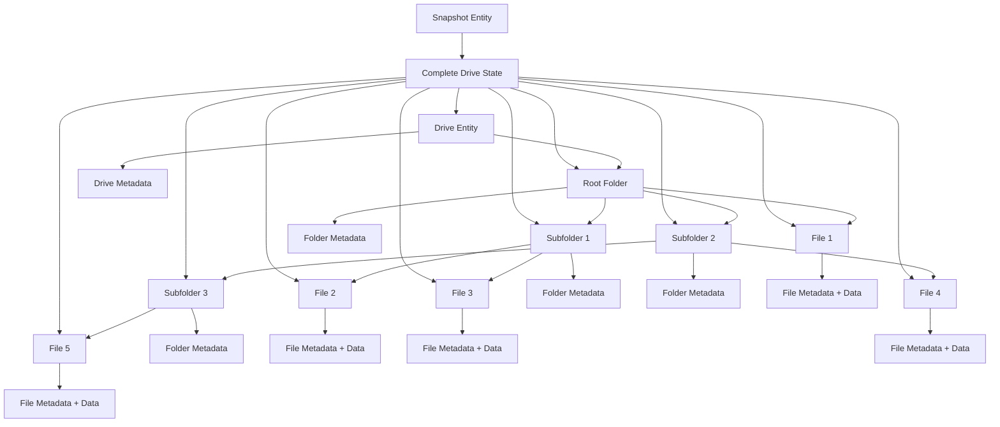
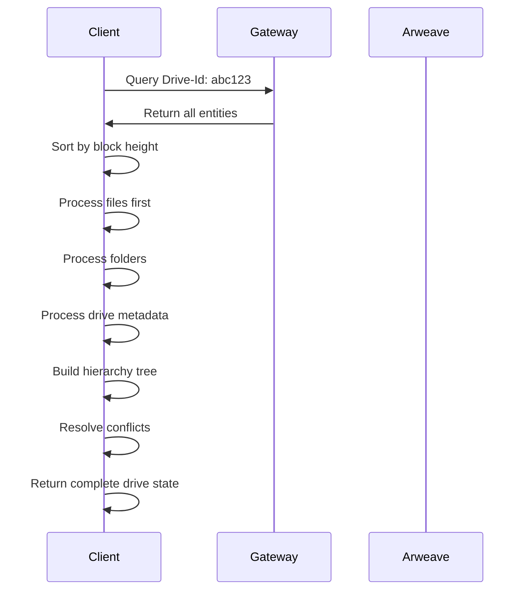

Because of Arweave's permanent and immutable nature, traditional file structure operations such as renaming and moving files or folders cannot be accomplished by simply updating on-chain data. ArFS works around this by defining an append-only transaction data model based on the metadata tags found in the Arweave [Transaction Headers.](https://docs.arweave.org/developers/server/http-api#transaction-format)

This model uses a bottom-up reference method, which avoids race conditions in file system updates. Each file contains metadata that refers to the parent folder, and each folder contains metadata that refers to its parent drive. A top-down data model would require the parent model (i.e. a folder) to store references to its children.

These defined entities allow the state of the drive to be constructed by a client to look and feel like a file system:

- Drive Entities contain folders and files
- Folder Entities contain other folders or files
- File Entities contain both the file data and metadata
- Snapshot entities contain a state rollups of all entities' (such as drive, folder, file and snapshot) metadata within a drive

## Entity Relationships

The following diagram shows the high level relationships between drive, folder, and file entities, and their associated data. More detailed information about each Entity Type can be found [here](/learn/arfs/entity-types).



As you can see, each file and folder contains metadata which points to both the parent folder and the parent drive. The drive entity contains metadata about itself, but not the child contents. So clients must build drive states from the lowest level and work their way up.

## Metadata Format

Metadata stored in any Arweave transaction tag will be defined in the following manner:

```json
{ "name": "Example-Tag", "value": "example-data" }
```

Metadata stored in the Transaction Data Payload will follow JSON formatting like below:

```json
{
  "exampleField": "exampleData"
}
```

Fields with a `?` suffix are optional.

```json
{
  "name": "My Project",
  "description": "This is a sample project.",
  "version?": "1.0.0",
  "author?": "John Doe"
}
```

Enumerated field values (those which must adhere to certain values) are defined in the format "value 1 | value 2".

All UUIDs used for Entity-Ids are based on the [Universally Unique Identifier](https://en.wikipedia.org/wiki/Universally_unique_identifier) standard.

There are no requirements to list ArFS tags in any specific order.

## Building Drive State

To construct the current state of a drive, clients must:

1. **Query for all entities** associated with a specific `Drive-Id`
2. **Sort by block height** to establish chronological order
3. **Process entities bottom-up** starting with files and folders
4. **Build the hierarchy** by following parent-child relationships
5. **Handle conflicts** by using the most recent entity version

### Example Drive State Construction



## Entity Lifecycle

Each ArFS entity follows a specific lifecycle pattern:

### Creation

1. Generate unique UUID for entity
2. Create metadata transaction with required tags
3. For files: create separate data transaction
4. Upload to Arweave network

### Updates

1. Create new entity with same ID
2. Update metadata as needed
3. Upload new transaction
4. Client processes both versions and uses latest

### Deletion

1. Mark entity as hidden (`isHidden: true`)
2. Upload new transaction
3. Entity remains in history but hidden from UI

## Data Integrity

ArFS ensures data integrity through:

- **Immutable transactions** - Once uploaded, data cannot be modified
- **Cryptographic signatures** - All transactions are signed by the owner
- **Version tracking** - Multiple versions of entities can exist
- **Conflict resolution** - Clients use block height and timestamps to resolve conflicts

## Performance Considerations

For large drives, consider these optimization strategies:

- **Use snapshots** for quick state reconstruction
- **Implement caching** for frequently accessed data
- **Batch operations** when possible
- **Query by date ranges** to limit data transfer

## Next Steps

Now that you understand the ArFS data model, learn how to work with it:

- [Privacy & Encryption](/build/advanced/arfs/privacy) - Secure your data with private drives
- [Creating Drives](/build/advanced/arfs/creating-drives) - Start building with ArFS
- [Reading Data](/build/advanced/arfs/reading-data) - Query and retrieve your data
