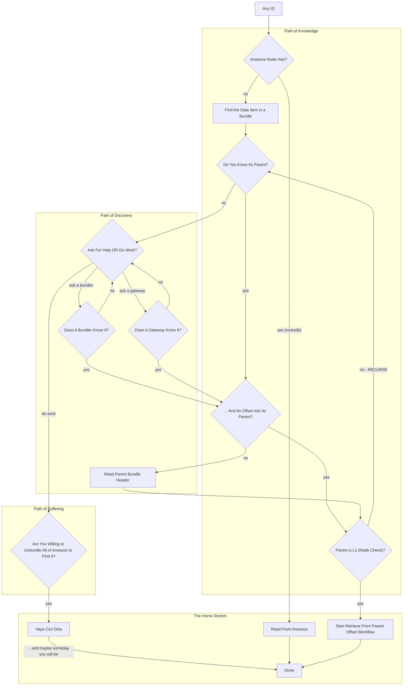

If you have **an Arweave ID** and you can’t retrieve the bytes you expect, it’s usually because the ID is a **data item** that lives inside an **ANS-104 bundle**, not a base-layer (L1) transaction.

This guide turns that situation into a deterministic workflow: try the cheapest paths first (cache/local), then climb the bundle ancestry (parent/offset), and only then consider brute-force options.

<Callout type="info">
  **Audience:** Developers, gateway operators, and infra maintainers. If your
  only goal is “download the bytes”, start with the “Home Stretch” and stop
  when it works.
</Callout>

## Quickstart (try these first)

If any of these work, you’re done:

1. Fetch from a gateway: `https://<gateway>/<id>`
2. Try the raw endpoint: `https://<gateway>/raw/<id>`
3. If you have a manifest ID and a path, fetch: `https://<gateway>/<manifest-id>/<path>`
4. Try using the [Wayfinder Protocol](learn/wayfinder/) or [Wayfinder App](https://wayfinder.ar.io)

For basic usage and examples, see [Fetch Data (via REST API)](/build/access/fetch-data).

## Definitions

- **ID (TXID)**: Could be an **L1 transaction ID** or a **data item ID**.
- **Bundle / parent**: A data item can be included in a bundle; that bundle is its **parent**.
- **Offset**: The byte offset of a child item’s payload within the parent’s data stream (used for efficient retrieval).
- **“L1”**: A base-layer Arweave transaction on the blockweave.

## The Decision Flow




## Step 1: Does a node already have it?

If you operate an Arweave node or gateway and you’re checking **local availability**:

- **Yes (local hit)**: read/serve the bytes and stop.
- **No**: treat the ID as potentially bundled and move to bundle discovery.

<Callout type="warning">
  If you’re not operating a node, skip this and go directly to “Bundle Hunt”.
</Callout>

## Step 2: Bundle Hunt (assume it’s a data item)

When an ID doesn’t behave like an L1 transaction, it’s often a **data item ID**. The fastest way forward is to find:

- the **root/parent transaction ID** that actually lands on-chain (L1), and
- the child’s **offset** within that parent.

### Path of Knowledge: you know the parent (and maybe offset)

If you uploaded the data yourself, look for upload receipts/logs from your uploader or bundler that mention a **bundle/root TX**.

If you have the **parent** but not the **offset**, jump to “Read the Parent Bundle Header”.

### Shortcut: let an ar.io gateway tell you the parent + offset

On gateways that index bundles and expose data-item metadata, a `HEAD` request can return the bundle ancestry as response headers (for example `x-root-tx-id` and `x-data-offset`).

```bash
curl -sI -L https://<gateway>/tx/<id>
```

If you get a root transaction ID + offset from headers, proceed to “Retrieve From Parent Offset Workflow”.

<Callout type="info">
  Wayfinder’s `ChunkDataRetrievalStrategy` uses this kind of metadata to
  retrieve bundled items efficiently (and can do the chunk math for you). See
  [Wayfinder Data Retrieval Strategies](/sdks/wayfinder/wayfinder-core/data-retrieval-strategies).
</Callout>

```ts
import { createWayfinderClient, ChunkDataRetrievalStrategy } from "@ar.io/wayfinder-core";

const id = "<any-tx-or-data-item-id>";

const wayfinder = createWayfinderClient({
  dataRetrievalStrategy: new ChunkDataRetrievalStrategy(),
});

const response = await wayfinder.request(`ar://${id}`);
const bytes = await response.arrayBuffer();
```

## Read the Parent Bundle Header (find the offset)

If you know a **candidate parent bundle**, you can read its **bundle header** to find:

- whether the parent is an L1 transaction, and
- the exact **offset** for your child ID within that parent.

Once you have an offset:

- **If the parent is L1**: proceed to “Retrieve From Parent Offset Workflow”.
- **If the parent is not L1**: the parent itself is a data item inside another parent — recurse upward using the same process.

For background on bundle structure, see [ANS-104 Bundles](/learn/ans-104-bundles).

## Ask for Help (bundlers and gateways)

If you don’t know the parent at all, the quickest “discovery” method is often social/infrastructure knowledge:

- **Ask the bundler** that accepted the upload whether it knows the root TX and offset.
- **Ask a gateway node** (especially one that indexed the relevant bundle stream) whether it can resolve parent/offset for the ID.

If either provides parent + offset, return to “Retrieve From Parent Offset Workflow”.

## Retrieve From Parent Offset Workflow (the deterministic endgame)

Once you have **(parent, offset)**, the remaining work is mechanical:

1. Ensure the parent is an **L1** transaction (or keep recursing until it is).
2. Retrieve bytes starting from the computed offset (chunk-based retrieval is preferred for reliability on large data).

If you can, prefer using **Wayfinder** (or your gateway’s chunk APIs) rather than hand-rolling offset math and slicing.

## Path of Suffering (brute force)

If you have:

- no parent,
- no offset,
- no indexing gateway to ask,
- and no bundler metadata,

then the only remaining option is exhaustive reconstruction: scanning and unbundling at scale until you find the item.

Vaya con Dios.
