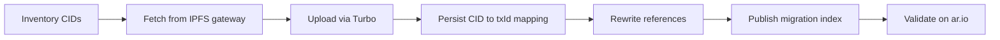

import { Callout } from "fumadocs-ui/components/callout";
import { Steps, Step } from "fumadocs-ui/components/steps";
import { Card, Cards } from "fumadocs-ui/components/card";
import { Database, Upload, Tag, Shield, Globe, FileText } from "lucide-react";

If you have thousands, or hundreds of thousands, of IPFS pins and want **permanent, pay-once storage**, Arweave via ar.io is a strong fit. Unlike pinning services that require ongoing fees, data uploaded to Arweave is stored permanently with a single upfront payment.

This guide walks through a **custom programmatic migration** using the [Turbo SDK](/sdks/turbo-sdk). It applies to any file set pinned on IPFS, with NFT collections as a concrete example.

## Why Use a Custom Migration?

IPFS migrations are usually project-specific. Your CIDs may represent raw files, directories, NFT assets, metadata JSON, application bundles, or a mix of all of them. You may also need custom tagging, retry behavior, validation rules, metadata rewrites, or contract-specific URL formats.

For that reason, a custom script is usually the most flexible approach. With modern LLM-assisted development, generating and adapting a migration script for your exact CID inventory, metadata schema, and validation requirements is often faster than forcing a generic tool to fit your project.

Useful docs to combine for a custom migration:

- [Advanced Uploading with Turbo](/build/upload/advanced-uploading-with-turbo): authentication, uploads, and payment
- [Tagging](/build/upload/tagging): metadata and discoverability
- [Manifests](/build/upload/manifests): organizing collections under path-based routing
- [Receipts](/build/upload/receipts): audit trail for uploads
- [Storing NFTs on ar.io](/build/guides/storing-nfts): NFT asset and metadata upload patterns
- ArDrive CLI also supports IPFS CID tagging for some workflows, but most large migrations benefit from a custom Turbo SDK script so you can control batching, retries, metadata rewrites, and validation.

This guide connects those pieces into a migration workflow.

## When to Use a Custom Migration

| Scenario | Recommended approach |
| --- | --- |
| A few dozen files | Manual upload via [Turbo SDK](/sdks/turbo-sdk) or [console.ar.io](https://console.ar.io) |
| Hundreds to millions of CIDs | Custom migration script (this guide) |
| NFT collection with linked metadata | Custom script + metadata rewrite (see [NFT example](#nft-collection-example) below) |
| Ongoing ingestion pipeline | Build a reusable worker that fetches from IPFS and uploads to Turbo |

<Callout type="info">
  For full control over tagging, provenance, and reference rewriting, a custom script is usually the most flexible option.
</Callout>

## Migration Architecture

At a high level, every migration follows the same pipeline:



<Steps>
  <Step>
    ### Inventory your CIDs

    Export your pin list from your pinning provider (Pinata, NFT.Storage, a self-hosted node, etc.) into a simple format:

    ```json
    [
      { "cid": "bafybeig...", "path": "images/0.png", "contentType": "image/png" },
      { "cid": "bafkreif...", "path": "metadata/0.json", "contentType": "application/json" }
    ]
    ```

    Or use a newline-delimited file of CIDs if you have no path metadata:

    ```
    bafybeig...
    bafkreif...
    ```

    Deduplicate CIDs before starting. For file CIDs, the same CID should resolve to the same content bytes, so you only need to upload each unique file CID once.
  </Step>

  <Step>
    ### Fetch bytes from IPFS

    Retrieve each CID through a reliable IPFS gateway or your own node:

    ```javascript
    const IPFS_GATEWAY = 'https://ipfs.io/ipfs';

    async function fetchFromIpfs(cid) {
      const response = await fetch(`${IPFS_GATEWAY}/${cid}`, {
        redirect: 'follow',
      });

      if (!response.ok) {
        throw new Error(`Failed to fetch ${cid}: ${response.status}`);
      }

      const buffer = Buffer.from(await response.arrayBuffer());
      const contentType =
        response.headers.get('content-type') ?? 'application/octet-stream';

      return { buffer, contentType };
    }
    ```

    <Callout type="warning">
      **Gateway reliability:** Public gateways can rate-limit or go offline. For large migrations, use your own IPFS node or a dedicated gateway from your pinning provider. Retry failed fetches with exponential backoff.
    </Callout>
  </Step>

  <Step>
    ### Upload to Arweave via Turbo

    Authenticate with the Turbo SDK and upload each file. Tag every upload with provenance metadata so you can trace it back to its IPFS origin.

    ```javascript
    import { TurboFactory } from '@ardrive/turbo-sdk';
    import fs from 'fs';

    const jwk = JSON.parse(fs.readFileSync('./wallet.json', 'utf-8'));
    const turbo = TurboFactory.authenticated({
      privateKey: jwk,
      token: 'arweave',
    });

    async function uploadToArweave(cid, buffer, contentType, projectTag) {
      const result = await turbo.upload({
        data: buffer,
        dataItemOpts: {
          tags: [
            { name: 'Content-Type', value: contentType },
            { name: 'App-Name', value: projectTag },
            { name: 'Source-Protocol', value: 'ipfs' },
            { name: 'Source-CID', value: cid },
          ],
        },
      });

      return result.id;
    }
    ```

    See [Tagging best practices](#tagging-for-provenance) below for recommended tags.
  </Step>

  <Step>
    ### Persist the CID-to-txId mapping

    Write results to an append-only state file after every upload. This is your migration ledger and lets you resume after failures.

    ```json
    {
      "cid": "bafybeig...",
      "txId": "Xj9k2Lm8Pq3Rn5Tv7Wz1Yb4Dc6Fg8Hj0Kl2Mn4Pq6Rs8",
      "contentType": "image/png",
      "bytes": 48291,
      "status": "success",
      "uploadedAt": "2026-05-27T12:00:00Z"
    }
    ```

    Store this mapping durably, on disk at minimum, and ideally backed up. You will need it to rewrite references and to audit the migration.
  </Step>

  <Step>
    ### Rewrite references

    Update any documents, metadata, or application configs that point at `ipfs://` URIs to use Arweave references instead. For broad compatibility today, use gateway URLs in fields that external platforms must fetch immediately, and keep `ar://` references where your application, contract, or metadata consumers support them. The mapping file from the previous step drives this rewrite pass.
  </Step>

  <Step>
    ### Publish a migration index

    After the main upload pass, create a JSON index that links every original CID to its Arweave transaction ID. This gives your team and downstream users a durable lookup table for audits, support, and future migrations.
  </Step>

  <Step>
    ### Validate

    Fetch each uploaded transaction from an ar.io gateway or via [Wayfinder](/build/access/wayfinder) and compare it with what you fetched from IPFS. Retain [Turbo receipts](/build/upload/receipts) for audit purposes.
  </Step>
</Steps>

## Running Migrations at Scale

For collections in the **tens or hundreds of thousands**, treat the migration as a long-running batch job.

### Cost estimation

Before starting, estimate total upload cost:

1. Sum the byte size of all unique CIDs in your inventory.
2. Use the [pricing calculator](https://console.ar.io/calculator) or `turbo.getFiatEstimateForBytes()` from the SDK.
3. Purchase sufficient [Turbo Credits](/build/upload/turbo-credits) before beginning.

<Callout type="info">
  Uploads under **105 KiB are free** and do not require a prior top-up. For large migrations this is negligible, but worth knowing for small metadata files.
</Callout>

### Concurrency and rate limits

- Start with **low concurrency** (3–5 parallel uploads) and increase gradually while monitoring for errors.
- IPFS gateways and Turbo both have rate limits. Separate fetch concurrency from upload concurrency.
- Use exponential backoff on transient failures (HTTP 429, 502, network timeouts).

### Checkpointing and resume

- Skip CIDs that already appear in your state file with `status: "success"`.
- Write state **after each successful upload**, not in batches. If the process crashes, you lose at most one item.
- Log failures separately so you can retry them in a second pass.

### Handling edge cases

| Issue | What to do |
| --- | --- |
| Duplicate CIDs | Upload once, reuse the same txId in your mapping |
| Missing/unavailable CID | Log as failed, retry later; do not block the entire run |
| Unknown content type | Default to `application/octet-stream`; inspect bytes if needed |
| Very large files | Stream via `turbo.uploadFile` with `fileStreamFactory` instead of buffering entirely in memory |
| DagPB / directory CIDs | Resolve to individual file CIDs first; directory CIDs are not uploadable as a single blob |

## Tagging for Provenance

Every migrated upload should include tags that make the data discoverable and traceable:

| Tag | Purpose |
| --- | --- |
| `Content-Type` | Required: tells gateways how to serve the data |
| `App-Name` | Identifies your project (e.g. `MyCollection-Migration-v1`) |
| `Source-Protocol` | Set to `ipfs` to mark migrated content |
| `Source-CID` | The original IPFS CID, useful for provenance and GraphQL queries |
| `Migration-Date` | ISO timestamp of when the upload occurred |
| `Collection-Name` | Optional: groups uploads from the same project |

<Callout type="info">
  **Why tag the original CID?** Storing the source CID on each Arweave transaction lets you query your migrated data via [GraphQL](/build/access/find-data), correlate uploads back to IPFS origins, and support provenance checks without relying on an external mapping file alone.
</Callout>

<Callout type="info">
  **IPFS-specific tags:** Some ArDrive CLI workflows support adding an `IPFS-Add` tag to public uploads, which may be useful where bridge-aware infrastructure recognizes that tag. For large custom migrations, the Turbo SDK pattern above is usually a better fit because you can choose your own tag names, preserve richer migration state, and adapt the script to your data model.
</Callout>

See the full [Tagging guide](/build/upload/tagging) for tag size limits and best practices.

## Publish a Migration Index

Your append-only state file is operational state. Once migration is complete, publish a clean migration index that others can use without reading your job logs.

```json
{
  "type": "ipfs-to-arweave-migration",
  "version": "1.0.0",
  "project": "MyProject",
  "createdAt": "2026-05-27T12:00:00Z",
  "items": [
    {
      "cid": "bafybeig...",
      "txId": "Xj9k2Lm8Pq3Rn5Tv7Wz1Yb4Dc6Fg8Hj0Kl2Mn4Pq6Rs8",
      "gatewayUrl": "https://arweave.net/Xj9k2Lm8Pq3Rn5Tv7Wz1Yb4Dc6Fg8Hj0Kl2Mn4Pq6Rs8",
      "arUri": "ar://Xj9k2Lm8Pq3Rn5Tv7Wz1Yb4Dc6Fg8Hj0Kl2Mn4Pq6Rs8",
      "contentType": "image/png",
      "bytes": 48291
    }
  ]
}
```

Upload the index with Turbo and tag it so it can be discovered later:

```javascript
const migrationIndex = JSON.parse(fs.readFileSync('./migration-index.json', 'utf-8'));

const indexUpload = await turbo.upload({
  data: Buffer.from(JSON.stringify(migrationIndex)),
  dataItemOpts: {
    tags: [
      { name: 'Content-Type', value: 'application/json' },
      { name: 'App-Name', value: PROJECT_TAG },
      { name: 'Data-Type', value: 'IPFS-Migration-Index' },
      { name: 'Source-Protocol', value: 'ipfs' },
    ],
  },
});

console.log(`Migration index: https://arweave.net/${indexUpload.id}`);
console.log(`Migration index: ar://${indexUpload.id}`);
```

## Complete Script Skeleton

This skeleton ties the pipeline together. Extend it with your own retry logic, logging, and concurrency controls.

<Callout type="warning">
  **Memory usage:** This example buffers each fetched CID in memory before uploading. That keeps the script compact, but it is best for small or medium-sized files. For large media files, stream to disk first and upload with `turbo.uploadFile` so concurrent workers do not hold many large buffers in memory.
</Callout>

```javascript
import { TurboFactory } from '@ardrive/turbo-sdk';
import fs from 'fs';
import path from 'path';

const IPFS_GATEWAY = process.env.IPFS_GATEWAY ?? 'https://ipfs.io/ipfs';
const STATE_FILE = './migration-state.jsonl';
const CONCURRENCY = 5;
const PROJECT_TAG = 'MyProject-Migration-v1';

const jwk = JSON.parse(fs.readFileSync('./wallet.json', 'utf-8'));
const turbo = TurboFactory.authenticated({ privateKey: jwk, token: 'arweave' });

const inventory = JSON.parse(fs.readFileSync('./cids.json', 'utf-8'));
const completed = new Set(
  fs.existsSync(STATE_FILE)
    ? fs.readFileSync(STATE_FILE, 'utf-8')
        .trim()
        .split('\n')
        .filter(Boolean)
        .map((line) => JSON.parse(line))
        .filter((r) => r.status === 'success')
        .map((r) => r.cid)
    : [],
);

function appendState(record) {
  fs.appendFileSync(STATE_FILE, JSON.stringify(record) + '\n');
}

async function fetchFromIpfs(cid) {
  const response = await fetch(`${IPFS_GATEWAY}/${cid}`, { redirect: 'follow' });
  if (!response.ok) throw new Error(`Fetch failed: ${response.status}`);
  const buffer = Buffer.from(await response.arrayBuffer());
  const contentType = response.headers.get('content-type') ?? 'application/octet-stream';
  return { buffer, contentType };
}

async function migrateOne({ cid, contentType: declaredType }) {
  if (completed.has(cid)) {
    console.log(`Skipping ${cid} (already migrated)`);
    return;
  }

  try {
    const { buffer, contentType } = await fetchFromIpfs(cid);
    const result = await turbo.upload({
      data: buffer,
      dataItemOpts: {
        tags: [
          { name: 'Content-Type', value: declaredType ?? contentType },
          { name: 'App-Name', value: PROJECT_TAG },
          { name: 'Source-Protocol', value: 'ipfs' },
          { name: 'Source-CID', value: cid },
          { name: 'Migration-Date', value: new Date().toISOString() },
        ],
      },
    });

    appendState({
      cid,
      txId: result.id,
      contentType: declaredType ?? contentType,
      bytes: buffer.length,
      status: 'success',
      uploadedAt: new Date().toISOString(),
    });

    console.log(`Migrated ${cid} → ar://${result.id}`);
  } catch (error) {
    appendState({
      cid,
      status: 'failed',
      error: error.message,
      failedAt: new Date().toISOString(),
    });
    console.error(`Failed ${cid}:`, error.message);
  }
}

async function runPool(items, fn, concurrency) {
  const queue = [...items];
  const workers = Array.from({ length: concurrency }, async () => {
    while (queue.length > 0) {
      const item = queue.shift();
      if (item) await fn(item);
    }
  });
  await Promise.all(workers);
}

await runPool(inventory, migrateOne, CONCURRENCY);
console.log('Migration complete. Review migration-state.jsonl for results.');
```

## NFT Collection Example

NFT collections are a common migration target because metadata JSON files typically reference images via `ipfs://` URIs. The workflow has an extra rewrite step.

<Steps>
  <Step>
    ### Separate assets from metadata

    Split your inventory into two groups:

    - **Assets**: images, animations, and other media files
    - **Metadata**: JSON files containing `name`, `description`, `image`, `attributes`, etc.

    Upload assets first so you have transaction IDs to reference in metadata.
  </Step>

  <Step>
    ### Upload assets and build the mapping

    Run the migration script on all asset CIDs. Your state file now maps each image CID to an Arweave transaction ID.
  </Step>

  <Step>
    ### Rewrite metadata references

    For each metadata JSON, replace `ipfs://` URIs with Arweave references using your mapping. Because `ar://` is not yet universally supported by NFT marketplaces and wallets, the most robust current approach is to use gateway URLs for widely consumed fields like `image`, while also keeping `ar://` values in additional fields for applications that support them.

    ```javascript
    const GATEWAY_URL = 'https://arweave.net';

    function getArweaveReferences(uri, cidToTxId) {
      if (!uri.startsWith('ipfs://')) return uri;

      const cid = uri.replace('ipfs://', '').split('/')[0];
      const txId = cidToTxId[cid];

      if (!txId) {
        console.warn(`No mapping for CID: ${cid}`);
        return uri;
      }

      return {
        gatewayUrl: `${GATEWAY_URL}/${txId}`,
        arUri: `ar://${txId}`,
      };
    }

    function rewriteMetadata(metadata, cidToTxId) {
      const rewritten = { ...metadata };

      for (const field of ['image', 'animation_url', 'external_url']) {
        if (rewritten[field]) {
          const references = getArweaveReferences(rewritten[field], cidToTxId);

          if (typeof references === 'string') continue;

          rewritten[field] = references.gatewayUrl;
          rewritten[`${field}_ar`] = references.arUri;
        }
      }

      return rewritten;
    }
    ```

    <Callout type="info">
      **Use both where practical.** Gateway URLs have the broadest compatibility today. `ar://` URIs are more future-proof and can resolve through [Wayfinder](/build/access/wayfinder), but adoption is still growing. Keeping both gives downstream consumers a stable HTTP URL now and a protocol-native reference for clients that support it.
    </Callout>
  </Step>

  <Step>
    ### Upload rewritten metadata

    Upload each rewritten metadata JSON via Turbo. Tag with the same provenance tags plus the token identifier if applicable.

    For large collections (100+ tokens), consider uploading metadata as a [manifest](/build/upload/manifests) so your smart contract can use a single base URI. Use an HTTP gateway base URI when you need maximum marketplace compatibility, and keep the `ar://` manifest URI documented for clients that support it:

    ```solidity
    string private constant MANIFEST_ID = "your-manifest-transaction-id";
    string private constant GATEWAY = "https://arweave.net/";

    function tokenURI(uint256 tokenId) public view returns (string memory) {
        return string(abi.encodePacked(GATEWAY, MANIFEST_ID, "/", tokenId.toString(), ".json"));
    }
    ```

    See [Storing NFTs on ar.io](/build/guides/storing-nfts) for the full manifest workflow.
  </Step>

  <Step>
    ### Update onchain references

    If NFTs are already minted with `ipfs://` token URIs, updating onchain metadata requires a contract-specific approach (owner update functions, redeployment, or a new base URI if your contract supports it). Plan this step before migrating.
  </Step>
</Steps>

## Validation

After migration, verify a sample of uploads and ideally all failed items from your retry pass. A size check is a useful first pass; for stronger validation, compare hashes or the full buffers:

```javascript
async function validateUpload(txId, expectedBuffer) {
  const response = await fetch(`https://turbo-gateway.com/${txId}`);
  if (!response.ok) throw new Error(`Gateway fetch failed: ${response.status}`);

  const actual = Buffer.from(await response.arrayBuffer());

  if (actual.length !== expectedBuffer.length) {
    throw new Error(`Size mismatch: expected ${expectedBuffer.length}, got ${actual.length}`);
  }

  if (!actual.equals(expectedBuffer)) {
    throw new Error(`Content mismatch for ${txId}`);
  }

  console.log(`Validated ar://${txId} (${actual.length} bytes)`);
}
```

For production workloads, [Wayfinder](/build/access/wayfinder) can add cryptographic verification for clients that support it.

## Next Steps

<Cards>
  <Card
    href="/build/upload/advanced-uploading-with-turbo"
    title="Advanced Uploading with Turbo"
    description="Authentication, payment options, and upload methods"
    icon={<Upload className="w-8 h-8" />}
  />
  <Card
    href="/build/upload/tagging"
    title="Tagging"
    description="Metadata tags for discoverability and organization"
    icon={<Tag className="w-8 h-8" />}
  />
  <Card
    href="/build/upload/manifests"
    title="Manifests"
    description="Organize collections with path-based routing"
    icon={<FileText className="w-8 h-8" />}
  />
  <Card
    href="/build/upload/receipts"
    title="Receipts"
    description="Audit trail and provenance for uploads"
    icon={<Shield className="w-8 h-8" />}
  />
  <Card
    href="/build/guides/storing-nfts"
    title="Storing NFTs"
    description="Complete NFT asset and metadata upload guide"
    icon={<Database className="w-8 h-8" />}
  />
  <Card
    href="/build/access/wayfinder"
    title="Wayfinder"
    description="Decentralized, verified data access via ar://"
    icon={<Globe className="w-8 h-8" />}
  />
</Cards>
