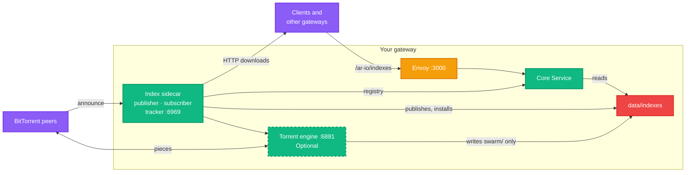
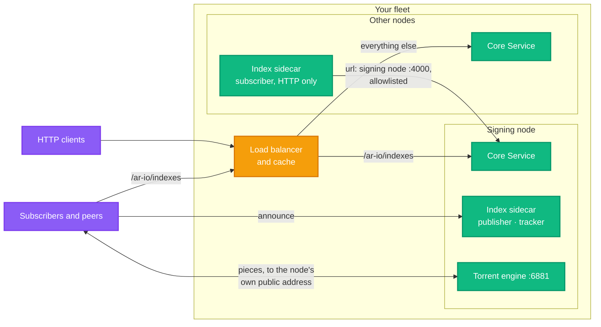

import { Step, Steps } from "fumadocs-ui/components/steps";
import { Callout } from "fumadocs-ui/components/callout";
import { Tabs, Tab } from "fumadocs-ui/components/tabs";
import { Card, Cards } from "fumadocs-ui/components/card";
import { BookOpen, Search, Settings, Zap } from "lucide-react";

To serve a data item, your gateway first has to find which Arweave transaction holds it, and where inside that transaction it sits. [CDB64 indexes](/build/run-a-gateway/manage/cdb64) answer that locally. **Index Sharing** keeps those indexes fresh by letting gateways share them: one gateway publishes its indexes, others subscribe, and every file is signed and checked before it is used. Bands move over HTTP, and, with the optional torrent engine, peer to peer over BitTorrent.

For how it works and why it can be trusted, see [Index Sharing](/learn/gateways/index-sharing) in Learn.

<Callout type="info">
  **Release Requirement**: Index Sharing is available from gateway Release 84.
  Both your gateway and the publisher you subscribe to must be on Release 84
  or later.
</Callout>

Index Sharing runs in an optional sidecar container, `index-swarm`, beside your gateway; its scripts, compose profiles and settings all use that name. Two scripts in the gateway repository do the work, run from the gateway's directory (where `.env` and `docker-compose.yaml` are). They need only Docker, since they run in the core image:

- `./tools/index-swarm-setup` edits `.env` and, with `--restart`, restarts what the changes need.
- `./tools/index-swarm-status` checks that everything works and says how to fix what doesn't.

## HTTP or BitTorrent?

Decide this first; you can change it later by running the setup script again.

| | HTTP only | With BitTorrent (`--torrent`) |
| --- | --- | --- |
| First download | From the publisher's HTTP routes, through its rate limits and x402. Can take hours | From peers first, unmetered; the publisher's HTTP routes are the fallback |
| Ports to open | None | 6881, TCP and UDP |
| You upload | Nothing | You seed what you install to other gateways, capped at 10 MB/s and 100 GB a day by default |
| Extra memory | About 60 MB (the sidecar) | About 250 MB (the sidecar and the torrent engine), plus the files it seeds mapped into memory: the kernel can reclaim those pages, but they count against a container memory limit |

BitTorrent is the better default when you can open a port: your first pull is faster and free, and each gateway that seeds makes the next one's faster. Choose HTTP only if you can't open a port or don't want to upload.

What runs on your gateway once it is set up. The torrent engine, dashed, is there only with `--torrent`; the tracker only answers when you publish:



## Subscribe to a Publisher

Subscribing is what most operators want: your gateway downloads a publisher's index bands, verifies them, and answers lookups from them.

### Prerequisites

- A running ar.io gateway on Release 84 or later, with Docker, and a checkout of the gateway repository at that release (the scripts live in `tools/`)
- About 27 GB (25 GiB) of free disk for the bands (the set turbo-gateway.com publishes is about 21 GB). This is on top of what your gateway already uses, and it doesn't change the gateway's minimum requirements
- For BitTorrent: port 6881, TCP and UDP, open to the internet

<Steps>
<Step>
### Choose a Publisher

A publisher is identified by its **gateway wallet**, not its URL. Your gateway looks the wallet up in the gateway registry to learn where to fetch from and which key must have signed.

The turbo-gateway.com gateway publishes a root transaction index spanning block 0 to the chain tip, with offsets. It covers the bundles turbo-gateway.com has indexed, so it is densest for recent data:

```text
34LYvMptiDvBP5sqfh1oAd6Q4qFsy4PWaZ1HTFmML7h5
```

To see whether another gateway publishes, check its `/ar-io/info` for an `indexes` entry (`curl -s https://<gateway>/ar-io/info | jq .indexes`), and take its wallet from the registry.

</Step>

<Step>
### Run the Setup Script

See what it would change first, then run it for real:

```bash
./tools/index-swarm-setup --subscribe 34LYvMptiDvBP5sqfh1oAd6Q4qFsy4PWaZ1HTFmML7h5 --torrent --dry-run
./tools/index-swarm-setup --subscribe 34LYvMptiDvBP5sqfh1oAd6Q4qFsy4PWaZ1HTFmML7h5 --torrent --restart
```

This subscribes to the publisher's root transaction index, points your gateway at the installed bands, puts `cdb` right after `db` in the lookup order, generates the torrent engine's password, and restarts only what needs it, by service name. Leave out `--torrent` to move bands over HTTP only.

</Step>

<Step>
### Open the Peer Port

With `--torrent`, open port **6881, TCP and UDP**, to the internet. Peers connect in on it. See [Firewalls and Docker ports](#firewalls-and-docker-ports) before relying on a host firewall.

</Step>

<Step>
### Check It

```bash
./tools/index-swarm-status
```

Each line says `ok`, `WARN` or `FAIL`, and every problem comes with the fix. When it says `All good`, your gateway is answering root transaction lookups from the installed bands.

</Step>
</Steps>

Bands arrive newest heights first, because most lookups are for recent data. A first pull of a full index takes minutes to hours. After that, new bands from the publisher install, and replace the ones they supersede, by themselves; the gateway loads each within 30 seconds, without a restart.

### What to Expect

The status script's `CDB64 lookups ... found X of Y` line shows how many root transaction lookups the installed bands answered. Don't expect every lookup to hit. A publisher's index covers the bundles it indexed, densest for recent data, and the tip band is rebuilt periodically, so the newest items aren't in it yet. A miss costs nothing: your gateway falls back to its usual lookup order. Following more than one publisher widens coverage.

<Callout type="warning">
  **The first download can take hours over HTTP.** Publishers meter their
  index files with the same rate limits and
  [x402 payments](/build/run-a-gateway/manage/x402-setup) as any data. With
  BitTorrent, bands come from peers first, and peers are not metered; the
  publisher's HTTP routes are the fallback. Downloads resume where they
  stopped, so nothing is lost if your gateway restarts part way through.
</Callout>

## Publish Your Indexes

Any registered gateway can publish. Other gateways then find it in the registry and subscribe by its wallet.

Publishing is for gateways that already build root transaction indexes. The sidecar publishes the bands you put in place; it doesn't build them, and there is no automatic export yet. The turbo-gateway.com gateway, for example, builds its bands from its own database and rebuilds the tip band daily.

### Prerequisites

- A gateway **registered** in the gateway registry, reachable at its registered URL, on Release 84 or later. The routes that serve bands live in the gateway, not the sidecar
- Its registered **observer key**, which signs what it publishes
- Index bands to offer: [partitioned CDB64 indexes](/build/run-a-gateway/manage/cdb64#partitioned-indexes)
- For BitTorrent: ports 6881 (TCP and UDP) and 6969 (TCP) open to the internet, and this node's public IP

<Steps>
<Step>
### Put Your Bands in Place

Each band is one partitioned CDB64 index in its own directory:

```text
data/indexes/published/root-tx-index/<band>/manifest.json
```

For example, from what your gateway has indexed in its local database (see [Generating Custom Indexes](/build/run-a-gateway/manage/cdb64#generating-custom-indexes) for other sources):

```bash
./tools/export-sqlite-to-cdb64 --partitioned \
  --output-dir data/indexes/published/root-tx-index/band-tip.tmp
```

This tool runs on the host, so unlike the setup scripts it needs Node.js 20 and `yarn install` in the checkout.

Build a band under a name ending in `.tmp`, then rename it into place, so it is never published half-written. Give each band a `heightRange` in its manifest, so subscribers can install the newest heights first:

```bash
m=data/indexes/published/root-tx-index/band-tip.tmp/manifest.json
jq '.metadata = ((.metadata // {}) + {heightRange: [1950000, null]})' "$m" > "$m.new" && mv "$m.new" "$m"
mv data/indexes/published/root-tx-index/band-tip.tmp data/indexes/published/root-tx-index/band-tip
```

</Step>

<Step>
### Set the Signing Key

Set your gateway's wallet:

```bash
AR_IO_WALLET=<your gateway wallet>
```

The sidecar signs with your registered observer key. Set **one** of these, not both:

<Tabs items={["Private key", "Keypair file"]}>
<Tab value="Private key">
```bash
OBSERVER_PRIVATE_KEY=<base58 observer private key>
```
</Tab>
<Tab value="Keypair file">
```bash
# Host path of the observer keypair file; only this file is mounted
INDEX_SWARM_OBSERVER_KEYPAIR_FILE=/path/to/observer-keypair.json
```
</Tab>
</Tabs>

The setup script refuses to publish, and writes nothing, until the key and `AR_IO_WALLET` are set.

<Callout type="warning">
  Don't use your observer key in a wallet that signs messages for dApps. The
  sidecar's signatures can't be confused with Solana transactions, but a
  wallet asked to sign an arbitrary message could produce one.
</Callout>

</Step>

<Step>
### Run the Setup Script

```bash
./tools/index-swarm-setup --publish --torrent --public-host <this node's public IP> --restart
```

`--public-host` is where peers reach this node's torrent engine and its tracker. The first scan reads and hashes every file once, which takes a few minutes for tens of gigabytes.

</Step>

<Step>
### Open the Ports

With `--torrent`, open **6881 (TCP and UDP)** for peers and **6969 (TCP)** for the tracker, to the internet.

</Step>

<Step>
### Check What You Publish

```bash
./tools/index-swarm-status
curl -s https://<your-gateway>/ar-io/indexes | jq '{sequence, publisher, bands: [.indexes[].bands[].id]}'
curl -s https://<your-gateway>/ar-io/info | jq .indexes
```

</Step>
</Steps>

A gateway can do both: pass `--subscribe` and `--publish` together.

To replace a band, publish the new one under a fresh id with `"supersedes": "<old band id>"` in its manifest's `metadata`. The old band is withdrawn and removed after a grace period. Subscribers keep serving the old band until the new one has installed, so they never lose a lookup.

If you run more than one node behind a load balancer, read [Publishing from a fleet](#publishing-from-a-fleet) before anyone subscribes.

## The Setup and Status Scripts

### `index-swarm-setup`

The script edits `.env` and nothing else, unless given `--restart`.

| Flag | Effect |
| --- | --- |
| `--subscribe <wallet>` | Adds the publisher to `INDEX_SWARM_SUBSCRIBE`. Repeatable; existing entries are kept. Sets `INDEX_SWARM_MAX_DISK_BYTES` to 25 GiB if unset. Puts `data/indexes/installed/root-tx-index` first in `CDB64_ROOT_TX_INDEX_SOURCES`, keeping what was there (or, if unset, the shipped default), and moves `cdb` right after `db` in `ROOT_TX_LOOKUP_ORDER` (if unset: `db,cdb,gateways,graphql`) |
| `--publish` | Adds `root-tx-index` to `INDEX_SWARM_PUBLISH`. Refuses, writing nothing, without a registered key or `AR_IO_WALLET`. With `--torrent` and a public host, sets `INDEX_SWARM_TRACKERS` to this node's tracker |
| `--torrent` | Generates `INDEX_SWARM_ENGINE_AUTH` if unset (`swarm:` and 48 random hex characters; never printed) |
| `--public-host <addr>` | With `--torrent`: sets `INDEX_SWARM_ENGINE_PUBLIC_HOST` |
| `--engine-port <n>` | With `--torrent`: sets `INDEX_SWARM_ENGINE_PORT` (default 6881) |
| `--max-disk-gib <n>` | With `--subscribe`: sets `INDEX_SWARM_MAX_DISK_BYTES` |
| `--no-gateway` | Leaves `CDB64_ROOT_TX_INDEX_SOURCES` and `ROOT_TX_LOOKUP_ORDER` alone |
| `--dry-run` | Shows the changes and writes nothing |
| `--restart` | Then recreates what needs it: the gateway only when those two settings differ from what it runs with, then the sidecar (and the engine, with torrents), by service name, with the compose files the running gateway was started with |
| `--env-file <path>` | A file other than `.env`, relative to the gateway's directory |

It is idempotent: a second run changes only what is missing, so it is also how to add a publisher or turn on torrents later. It never replaces a value it cannot parse or a password it did not write; it stops and says what to fix. Before writing, it copies `.env` to `.env.bak-index-swarm-<time>`, readable only by its owner, since it holds secrets. It warns when an explicit `ROOT_TX_LOOKUP_ORDER` keeps `hyperbeam`, which fails unless you run the `hb` profile, but does not remove it.

`INDEX_SWARM_ENGINE_AUTH` alone turns the torrent engine on: with a password set, `INDEX_SWARM_ENGINE_URL` defaults to the engine in the compose file. Set the URL only for an engine you run some other way.

### `index-swarm-status`

The status script is read-only. It runs inside the sidecar, so it sees exactly what the sidecar sees, and checks:

- that the sidecar is up and the gateway's release is new enough
- per publisher: the sequence accepted and its age, any `signature_failed`, `replayed` or `verify_failed`, and failed downloads
- installed bands and their size; that the gateway reads the installed directory, has every band loaded, and sends lookups to them
- publishing: the document served, its expiry, and how many bands seed
- the torrent engine: that it answers, whether any peer has connected in (so a closed port shows), and the day's upload against the budget

It exits `1` when a check fails, so it can run from cron or a health script.

## Doing It by Hand

What the setup script writes, if you would rather edit `.env` yourself:

```bash
INDEX_SWARM_SUBSCRIBE='[{"publisher":"34LYvMptiDvBP5sqfh1oAd6Q4qFsy4PWaZ1HTFmML7h5","name":"root-tx-index"}]'
INDEX_SWARM_MAX_DISK_BYTES=26843545600   # 25 GiB; size it to what the publisher offers
CDB64_ROOT_TX_INDEX_SOURCES=data/indexes/installed/root-tx-index,resources/cdb64-root-tx-index-non-ao-non-redstone-with-content-type-to-height-1820000,resources/cdb64-root-tx-index-non-ao-non-redstone-without-content-type-to-height-1820000,resources/cdb64-root-tx-index-ao-to-height-1820000
ROOT_TX_LOOKUP_ORDER=db,cdb,gateways,graphql
INDEX_SWARM_ENGINE_AUTH=swarm:<generated>   # only for BitTorrent: at least 16 characters, e.g. openssl rand -hex 24
```

The installed bands go **first** in `CDB64_ROOT_TX_INDEX_SOURCES`, so a fresh band answers before the older shipped indexes. The three `resources/` entries are the shipped default; keep them to go on searching them, or leave them off, since each lookup against them fetches from Arweave and a subscribed set that covers the whole chain makes them redundant.

`ROOT_TX_LOOKUP_ORDER` matters most. By default, `cdb` is asked last, after every network source, so your gateway would barely use the bands it downloaded. Drop `hyperbeam` unless you run the `hb` profile.

Then restart by service name, with the same `-f` files your gateway was started with:

```bash
docker compose up -d --no-deps core
docker compose --profile index-swarm --profile index-swarm-torrent \
  up -d --no-deps index-swarm-engine-init index-swarm-engine index-swarm
```

Without BitTorrent, leave out the `index-swarm-torrent` profile and the two engine services. Name the services as shown: a bare `docker compose up` also starts or recreates every default service, including your observer.

## Firewalls and Docker Ports

The torrent engine publishes only its peer port, `INDEX_SWARM_ENGINE_PORT` (6881, TCP and UDP). The sidecar also publishes the tracker port, `INDEX_SWARM_TRACKER_PORT` (6969, TCP), on every node, but only a node that publishes torrents listens on it; a subscriber needn't open it. The engine's Web API is never published.

The engine is kept away from the rest of the gateway, because the peers and trackers it talks to are chosen by other gateways. It runs on its own Docker network, shared only with the sidecar, so it can't reach the gateway, the observer, ClickHouse or anything else on the node's network. Its IP filter refuses private, loopback, link-local and carrier-grade NAT addresses for peers, trackers and WebSeeds. It can write only its own download and configuration directories; the bands your gateway serves are mounted read-only.

Ports that Docker publishes are forwarded before the host's `INPUT` chain sees them, so a host firewall such as ufw neither blocks nor protects them. Open them wherever traffic reaches the host (a cloud security group or router, for example). To restrict them on the host, filter where Docker forwards: with Docker's default iptables backend, in the `DOCKER-USER` chain; with its nftables backend, which has no `DOCKER-USER`, in a chain of your own table on the `forward` hook, at a priority before Docker's.

## Bounding Upload

Seeding is free to peers but not to you: every byte is your upload, and a peer can fetch the bands again and again. Every node that runs the engine seeds, subscribers included, so two limits apply to every node, with defaults:

| Variable | Default | Effect |
| --- | --- | --- |
| `INDEX_SWARM_UPLOAD_LIMIT_BYTES_PER_SEC` | `10000000` (10 MB/s) | Caps the engine's upload rate. `0` is unlimited |
| `INDEX_SWARM_UPLOAD_DAILY_LIMIT_BYTES` | `100000000000` (100 GB) | Caps upload per UTC day. Once spent, seeding is throttled to 1 KiB/s until the next UTC day. Downloads and the HTTP routes are unaffected. `0` is no budget |

A large publisher should raise both. The engine's memory also grows with the bytes it seeds: it maps the files, and mapped pages count against a container memory limit.

## Publishing from a Fleet

A large gateway is often several nodes behind an HTTP load balancer, and only one of them holds the observer key and signs.



For BitTorrent:

1. **One node publishes and seeds.** The signing node, the one `/ar-io/indexes` is sent to, runs the engine and the tracker. The other nodes need neither.
2. **The peer port reaches that node directly.** BitTorrent is not HTTP, so the load balancer can't carry it. Publish `INDEX_SWARM_ENGINE_PORT` (TCP and UDP) on the node's own public address, make sure the internet reaches it there (Docker-published ports bypass the host firewall; see [Firewalls and Docker ports](#firewalls-and-docker-ports) to restrict them), and set `INDEX_SWARM_ENGINE_PUBLIC_HOST` (`--public-host`) to that address. Otherwise the tracker lists the engine under the host of its tracker URL, which for a fleet is the load balancer.
3. **The tracker, one of two ways:**
   - Directly: publish `INDEX_SWARM_TRACKER_PORT` on the same address and announce to `http://<that address>:6969/announce` in `INDEX_SWARM_TRACKERS`.
   - Through the load balancer: route `/announce` to the signing node's tracker port, uncached, with `proxy_set_header X-Forwarded-For $proxy_add_x_forwarded_for;`, and list the proxies' addresses in `INDEX_SWARM_TRACKER_TRUSTED_PROXIES`. Otherwise every peer appears at the proxy's address, the tracker's per-address limits throttle them together, and it hands out an address nobody can connect to.
4. **The `.torrent` and WebSeed routes** are under `/ar-io/indexes`, so the [NGINX block](#behind-nginx) for that prefix already covers them.

### Rate Limiting and x402 in a Fleet

Nothing extra to configure. The rate limiter and x402 apply to the byte routes (files by name, by digest, and the WebSeed) the same way they apply to data. The publication and the `.torrent` files are free. Peer-to-peer transfer and tracker announces never reach the gateway at all; the upload budget bounds them instead. Because `/ar-io/indexes` goes to one node, all metering happens there, so per-address limits stay consistent even if your nodes don't share a rate limiter.

### Giving the Other Nodes the Index

If your other nodes answer lookups from their own disk, they need the bands installed too. Subscribe each one over HTTP to your own publication, pointed at the publishing node directly:

```bash
INDEX_SWARM_SUBSCRIBE='[{"publisher":"<your gateway wallet>","name":"root-tx-index","url":"http://<publishing node>:4000"}]'
```

`url` only changes where the publication and files are fetched from. The signature is still checked against your registered observer key, so an internal address is safe. Then add those nodes' addresses to `RATE_LIMITER_IPS_AND_CIDRS_ALLOWLIST` on the publishing node, so they aren't rate-limited or asked to pay (the allowlist applies when the rate limiter is on). They don't need a torrent engine: between nodes on one network, HTTP is simpler.

Subscribers behind NAT still work: they reach the publisher's engine, and a reachable subscriber can be reached back.

## Behind NGINX

Most gateways run NGINX in front, and many cache. The index routes are built to be correct through a cache without special configuration: errors are never cacheable, and when your gateway meters, the files it serves are marked `private`. Two things are still worth setting:

- Forward the client IP with `X-Forwarded-For`, as the [quick start](/build/run-a-gateway/quick-start) configuration does, so each subscriber gets its own rate limit.
- **If you run more than one node**, send `/ar-io/indexes` to the node that holds the observer key. Only that node signs.

The torrent routes, `/ar-io/indexes/torrents/` and `/ar-io/indexes/webseed/`, sit under the same prefix, so the same rules cover them. See [Advanced NGINX Caching](/build/run-a-gateway/manage/nginx-caching#index-sharing) for a complete location block.

## Monitoring

`./tools/index-swarm-status` covers the day-to-day checks. The sidecar also serves Prometheus metrics on port `9101` inside its container. The ones worth watching:

| Metric | What it tells you |
| --- | --- |
| `index_subscription_manifest_age_seconds` | How old each publisher's latest publication is. **Alarm if it climbs past a day**: the publisher has gone quiet. |
| `index_swarm_installed_bands` | How many bands are live |
| `index_subscription_total{result}` | Outcomes of each poll. `signature_failed` should always be zero. `transport_fallback` means a torrent was not used and the band came over HTTP |
| `index_subscription_bytes_total{transport}` | Bytes fetched over `http` or `torrent`: how much the swarm carries |
| `index_swarm_engine_available` | `1` while the torrent engine answers. Absent when none is configured |
| `index_swarm_upload_today_bytes`, `index_swarm_upload_throttled` | Seeding today against the daily budget; `1` means it is spent and seeding is throttled until the next UTC day |
| `index_publish_total{result}` | On a publisher: `published`, `unchanged` or `failed` |
| `index_publish_seeding_bands` | On a publisher: bands handed to the engine. Below `index_publish_bands` means some are offered over HTTP only |

On the gateway, `indexes_requests_total{route,status}` shows who is downloading from you, by route (`publication`, `file`, `blob`, `torrent`, `webseed`), including `402` and `429` from your rate limits.

## Troubleshooting

Run `./tools/index-swarm-status` first: it names most problems and their fix.

**Nothing installs, and the logs show `402` or `429`.** The publisher is rate-limiting you. It is expected on a first download over HTTP: each poll picks up where the last stopped. Turn on BitTorrent, ask the publisher to raise your limits, or wait.

**Bands installed, but lookups still go to the network.** Check `ROOT_TX_LOOKUP_ORDER` puts `cdb` right after `db`, and that `CDB64_ROOT_TX_INDEX_SOURCES` starts with `data/indexes/installed/root-tx-index`. Both need a gateway restart; `./tools/index-swarm-setup --restart` does it.

**No peer has connected in.** Port 6881 is closed somewhere between the internet and the engine. Bands still arrive over HTTP, and you still download from peers, but nobody can download from you.

**The engine refuses the sidecar.** Check `INDEX_SWARM_ENGINE_AUTH`. The sidecar does not retry a failed login, because the engine bans an address after five.

**`Publication was signed by an unregistered key`.** The publication you fetched was not signed by the observer key registered for that wallet. Check the publisher's registry record; if it just changed keys, it can take up to an hour to reach your gateway's registry view.

**`Set OBSERVER_KEYPAIR_PATH or OBSERVER_PRIVATE_KEY, not both`.** On a publisher, `OBSERVER_PRIVATE_KEY` and `INDEX_SWARM_OBSERVER_KEYPAIR_FILE` are both set (inside the sidecar, `INDEX_SWARM_OBSERVER_KEYPAIR_FILE` becomes `OBSERVER_KEYPAIR_PATH`). Keep one.

**`Gateway is too old to load installed index bands`.** Upgrade the gateway to Release 84 or later. The sidecar notices the upgrade by itself.

## Turning It Off

Stopping the sidecar changes nothing your gateway serves: installed bands stay loaded, and published bands stay served from the last publication written.

```bash
docker compose --profile index-swarm stop index-swarm
docker compose --profile index-swarm rm -f index-swarm
```

With the torrent engine, also stop and remove `index-swarm-engine` and `index-swarm-engine-init` (profile `index-swarm-torrent`), then delete `data/indexes/swarm/`, `data/indexes/torrents/` and `data/index-swarm-engine/`. Remove `INDEX_SWARM_ENGINE_AUTH` from `.env` too: while it is set, the sidecar expects the engine and warns that it is not answering.

- **On a subscriber**, restore your previous `CDB64_ROOT_TX_INDEX_SOURCES` and restart the gateway, then delete `data/indexes/installed/`. In that order, so the gateway is no longer holding the files open.
- **On a publisher**, delete `data/indexes/published/publication.json`. The gateway stops serving the routes on its next request, without a restart. The band directories can then go too.

## Related

<Cards>
  <Card
    title="Index Sharing Explained"
    description="How bands move between gateways, and why a subscriber doesn't have to trust the publisher's server or its peers"
    href="/learn/gateways/index-sharing"
    icon={<BookOpen className="w-8 h-8" />}
  />
  <Card
    title="CDB64 Root Transaction Index"
    description="The index format your gateway loads, and building your own bands"
    href="/build/run-a-gateway/manage/cdb64"
    icon={<Search className="w-8 h-8" />}
  />
  <Card
    title="Environment Variables"
    description="Every Index Sharing setting"
    href="/build/run-a-gateway/manage/environment-variables#index-sharing"
    icon={<Settings className="w-8 h-8" />}
  />
  <Card
    title="Reading Shared Indexes"
    description="For client and app developers: verify a publication and look up an ID without a gateway's help"
    href="/build/advanced/index-publications"
    icon={<Zap className="w-8 h-8" />}
  />
</Cards>
