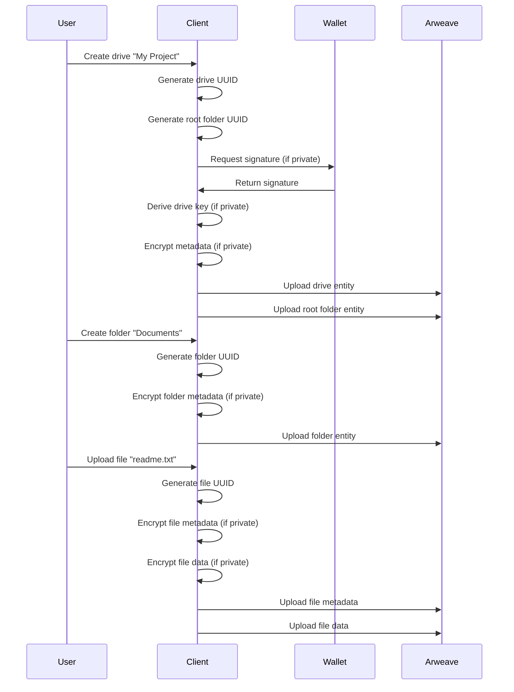

# Creating Drives

To properly create a new drive, two new entities need to be created: a new Drive entity and a new Folder entity to serve as the root folder of that drive.

## New Drive Entity

- The user must specify a `name` of the drive which is stored within the Drive Entity's metadata JSON.
- ArDrive generates a new unique uuidv4 for the drive entity's `Drive-Id`.
- ArDrive also generates a new unique uuidv4 for the drive entity's `rootFolderId`, which will refer to the `Folder-Id` of the new folder entity that will be created.
  - This `rootFolderId` is stored within the Drive Entity's metadata JSON.
- Drive Entity Metadata transactions must have `Entity-Type: "drive"`.
- ArDrive will that the current local system time as seconds since Unix epoch for the Drive Entity's `Unix-Time`.
- The Drive Entity's `Drive-Privacy` must also be set to `public` or `private` in order for its subfolders and files to have the correct security settings.
- If the drive is private:
  - Its `Cipher` tag must be filled out with the correct encryption algorithm (currently `AES256-GCM`).
  - Its `Cipher-IV` tag must be filled out with the generated Initialization Vector for the private drive.
  - The ArFS client must derive the Drive Key and encrypt the Drive Entity's metadata JSON using the assigned `Cipher` and `Cipher-IV`.

## New Root Folder Entity

- The `name` of the drive and folder entities must be the same.
  - This `name` is stored within the Folder Entity's metadata JSON.
- The Folder Entity's `Folder-Id` must match the `rootFolderId` previously created for the Drive Entity.
- The Folder Entity's `Drive-Id` must match the `Drive-Id` previously created for the Drive Entity.
- The Folder Entity must not include a `Parent-Folder-Id` tag.
  - This is how it is determined to be the root folder for a drive.
- Folder Entity metadata transactions must have `Entity-Type: 'folder'`.
- The client gets the user's local time for the `Unix-Time` tag, represented as seconds since Unix Epoch.
- Public folders must have the content type `Content-Type: "application/json"`.
- If the folder is private
  - Its `Cipher` tag must be filled out with the correct encryption algorithm (currently `AES256-GCM`).
  - Its `Cipher-IV` tag must be filled out with the generated Initialization Vector for the private folder.
  - Its content type must be `Content-Type: "application/octet-stream"`.
  - The ArFS client must encrypt the Drive Entity's metadata JSON using the assigned `Cipher` and `Cipher-IV`.

## Creating Files

Files in ArFS require two separate transactions:

1. **File Metadata Transaction** - Contains file information and references
2. **File Data Transaction** - Contains the actual file data

### File Metadata Transaction

```json
ArFS: "0.15",
Cipher?: "AES256-GCM",
Cipher-IV?: "<12 byte initialization vector as Base64>",
Content-Type: "<application/json | application/octet-stream>",
Drive-Id: "<drive uuid>",
Entity-Type: "file",
File-Id: "<uuid>",
Parent-Folder-Id: "<parent folder uuid>",
Unix-Time: "<seconds since unix epoch>"

Metadata JSON {
    "name": "<user defined file name with extension>",
    "size": <computed file size - int>,
    "lastModifiedDate": <timestamp for OS reported time of file's last modified date represented as milliseconds since unix epoch - int>,
    "dataTxId": "<transaction id of stored data>",
    "dataContentType": "<the mime type of the data associated with this file entity>",
    "isHidden": false,
    "pinnedDataOwner": "<the address of the original owner of the data where the file is pointing to>"
}
```

### File Data Transaction

```json
Cipher?: "AES256-GCM",
Cipher-IV?: "<12 byte initialization vector as Base64>",
Content-Type: "<file mime-type | application/octet-stream>",
{ File Data - Encrypted if private }
```

## Creating Folders

Folders are simpler than files as they only require a metadata transaction:

```json
ArFS: "0.15",
Cipher?: "AES256-GCM",
Cipher-IV?: "<12 byte initialization vector as Base64>",
Content-Type: "<application/json | application/octet-stream>",
Drive-Id: "<drive uuid>",
Entity-Type: "folder",
Folder-Id: "<uuid>",
Parent-Folder-Id?: "<parent folder uuid>",
Unix-Time: "<seconds since unix epoch>"

Metadata JSON {
    "name": "<user defined folder name>",
    "isHidden": false
}
```

## Creating Snapshots

Snapshots provide a way to quickly synchronize drive state by rolling up all metadata into a single transaction:

```json
ArFS: "0.15",
Drive-Id: "<drive uuid that this snapshot is associated with>",
Entity-Type: "snapshot",
Snapshot-Id: "<uuid of this snapshot entity>",
Content-Type: "<application/json>",
Block-Start: "<the minimum block height from which transactions were searched for in this snapshot>",
Block-End: "<the maximum block height from which transactions were searched for in this snapshot>",
Data-Start: "<the first block in which transaction data was found in this snapshot>",
Data-End: "<the last block in which transaction was found in this snapshot>",
Unix-Time: "<seconds since unix epoch>"
```

## Implementation Example

Here's a practical example of creating a complete drive structure:



## Best Practices

### Naming Conventions

- Use descriptive names for drives, folders, and files
- Avoid special characters that might cause issues
- Keep names under 255 characters
- Use consistent casing

### Organization

- Create logical folder structures
- Use meaningful folder names
- Implement proper versioning
- Document your structure

### Performance

- Batch operations when possible
- Use efficient queries
- Implement caching
- Consider file sizes

### Security

- Use strong passwords for private drives
- Implement proper key management
- Follow encryption best practices
- Regular security audits

## Error Handling

When creating ArFS entities, handle these common scenarios:

### Transaction Failures

- Implement retry logic for failed uploads
- Validate data before uploading
- Check transaction confirmation status

### Validation Errors

- Verify required tags are present
- Check data format compliance
- Validate UUID formats

### Network Issues

- Implement timeout handling
- Provide user feedback
- Graceful degradation

## Next Steps

Now that you know how to create ArFS entities, learn how to work with them:

- [Reading Data](/build/upload/arfs/reading-data) - Query and retrieve your ArFS data
- [Privacy & Encryption](/build/upload/arfs/privacy) - Secure your data with private drives
- [Upgrading Private Drives](/build/upload/arfs/upgrading-drives) - Update legacy drives to v0.15
