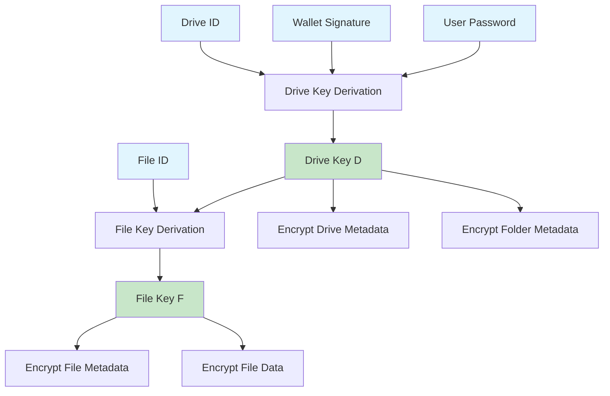
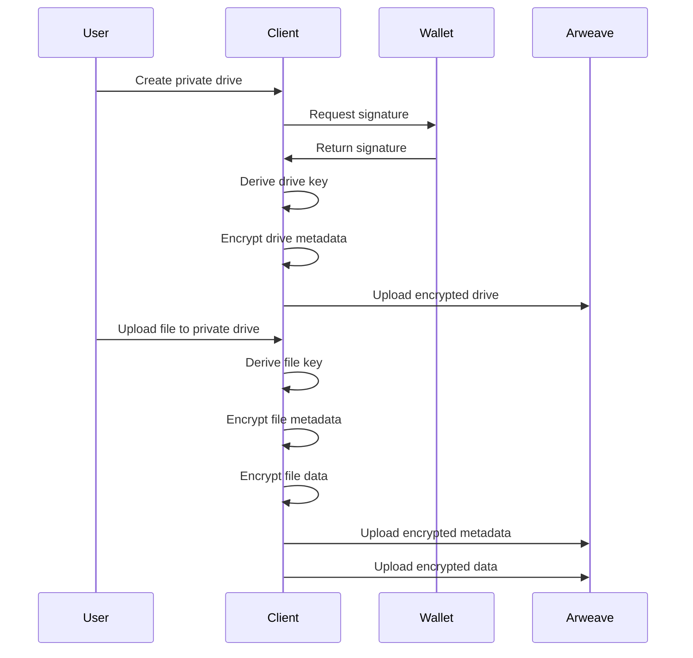
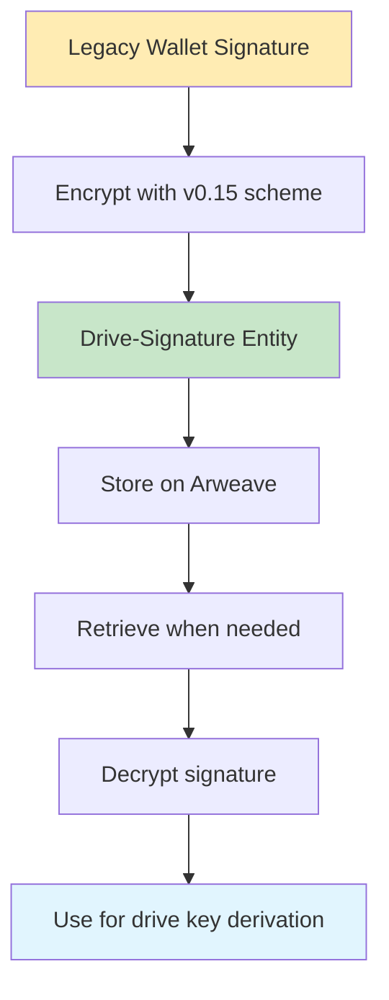

The Arweave blockweave is inherently public. But with apps that use ArFS, like ArDrive, your private data never leaves your computer without using military grade (and [quantum resistant](https://blog.boot.dev/cryptography/is-aes-256-quantum-resistant/#:~:text=Symmetric%20encryption%2C%20or%20more%20specifically,key%20sizes%20are%20large%20enough)) encryption. This privacy layer is applied at the Drive level, and users determine whether a Drive is public or private when they first create it. Private drives must follow the ArFS privacy model.

With ArDrive specifically, every file within a Private Drive is symmetrically encrypted using [AES-256-GCM](https://iopscience.iop.org/article/10.1088/1742-6596/1019/1/012008/pdf) (for small files and metadata transactions) or [AES-256-CTR](https://xilinx.github.io/Vitis_Libraries/security/2020.1/guide_L1/internals/ctr.html) (for large files, over 100MiB). Every Private drive has a master "Drive Key" which uses a combination of the user's Arweave wallet signature, a user defined drive password, and a unique drive identifier ([uuidv4](https://en.wikipedia.org/wiki/Universally_unique_identifier)). Each file has its own "File Key" derived from the "Drive Key". This allows for single files to be shared without exposing access to the other files within the Drive.

Once a file is encrypted and stored on Arweave, it is locked forever and can only be decrypted using its file key.

**NOTE**: Usable encryption standards are not limited to AES-256-GCM or AES-256-CTR. Any Encryption method may be used so long as it is clearly indicated in the `cipher` tag.

## Deriving Keys

Private drives have a global drive key, `D`, and multiple file keys `F`, for encryption. This enables a drive to have as many uniquely encrypted files as needed. One key is used for all versions of a single file (since new file versions use the same File-Id)

`D` is used for encrypting both Drive and Folder metadata, while `F` is used for encrypting File metadata and the actual stored data. Having these different keys, `D` and `F`, allows a user to share specific files without revealing the contents of their entire drive.

`D` is derived using HKDF-SHA256 with an [unsalted](<https://en.wikipedia.org/wiki/Salt_(cryptography)>) RSA-PSS signature of the drive's id and a user provided password.

`F` is also derived using HKDF-SHA256 with the drive key and the file's id.



Other wallets (like [ArConnect](https://www.arconnect.io/)) integrate with this Key Derivation protocol just exposing an API to collect a signature from a given Arweave Wallet in order to get the SHA-256 signature needed for the [HKDF](https://en.wikipedia.org/wiki/HKDF) to derive the Drive Key.

An example implementation, using Dart, is available [here](https://github.com/ardriveapp/ardrive-web/blob/187b3fb30808bda452123c2b18931c898df6a3fb/docs/private_drive_kdf_reference.dart), with a Typescript implementation [here](https://github.com/ardriveapp/ardrive-core-js/blob/f19da30efd30a4370be53c9b07834eae764f8535/src/utils/crypto.ts).

## Private Drives

Drives can store either public or private data. This is indicated by the `Drive-Privacy` tag in the Drive entity metadata.

```
Drive-Privacy: "<public | private>"
```

If a Drive entity is private, an additional tag `Drive-Auth-Mode` must also be used to indicate how the Drive Key is derived. ArDrive clients currently leverage a secure password along with the Arweave Wallet private key signature to derive the global Drive Key.

```
Drive-Auth-Mode?: 'password'
```

On every encrypted Drive Entity, a `Cipher` tag must be specified, along with the public parameters for decrypting the data. This is done by specifying the parameter with a `Cipher-*` tag. eg. `Cipher-IV`. If the parameter is byte data, it must be encoded as Base64 in the tag.

ArDrive clients currently leverage AES256-GCM for all symmetric encryption, which requires a Cipher Initialization Vector consisting of 12 random bytes.

```
Cipher?: "AES256-GCM"
Cipher-IV?: "<12 byte initialization vector as Base64>"
```

Additionally, all encrypted transactions must have the `Content-Type` tag `application/octet-stream` as opposed to `application/json`

Private Drive Entities and their corresponding Root Folder Entities will both use these keys and ciphers generated to symmetrically encrypt the JSON files that are included in the transaction. This ensures that only the Drive Owner (and whomever the keys have been shared with) can open the drive, discover the root folder, and continue to load the rest of the children in the drive.

## Private Files

When a file is uploaded to a private drive, it by default also becomes private and leverages the same drive keys used for its parent drive. Each unique file in a drive will get its own set of file keys based off of that file's unique `FileId`. If a single file gets a new version, its `File-Id` will be reused, effectively leveraging the same File Key for all versions in that file's history.

These file keys can be shared by the drive's owner as needed.

Private File entities have both its metadata and data transactions encrypted using the same File Key, ensuring all facets of the data is truly private. As such, both the file's metadata and data transactions must both have a unique `Cipher-IV` and `Cipher` tag:

```
Cipher?: "AES256-GCM"
Cipher-IV?: "<12 byte initialization vector as Base64>"
```

Just like drives, private files must have the `Content-Type` tag set as `application/octet-stream` in both its metadata and data transactions:

```
Content-Type: "application/octet-stream"
```

## Encryption Process

Here's how the encryption process works for private drives:



## Security Best Practices

When working with private drives, follow these security guidelines:

### Password Management

- Use strong, unique passwords for each drive
- Consider using a password manager
- Never share passwords in plain text

### Key Storage

- Never store drive keys in plain text
- Use secure key derivation functions
- Implement proper key rotation if needed

### Access Control

- Share file keys only with authorized users
- Implement proper access logging
- Regularly audit drive access

### Data Handling

- Encrypt data before transmission
- Use secure communication channels
- Implement proper error handling

## Drive Signature (ArFS v0.15)

ArFS v0.15 introduces a new `Drive-Signature` entity type to help bridge signature derivation schemes across ArFS versions. This is particularly important for maintaining access to private drives created with older wallet signing methods.

The drive signature entity stores an encrypted version of the pre-v0.15 wallet signature that's necessary for deriving the drive key. This allows continued access to historical drive contents while using modern wallet signing APIs.



## Next Steps

Ready to implement privacy in your ArFS applications?

- [Creating Private Drives](/build/upload/arfs/creating-drives) - Learn how to create secure drives
- [Upgrading Private Drives](/build/upload/arfs/upgrading-drives) - Update legacy drives to v0.15
- [Reading Data](/build/upload/arfs/reading-data) - Query and decrypt your private data
