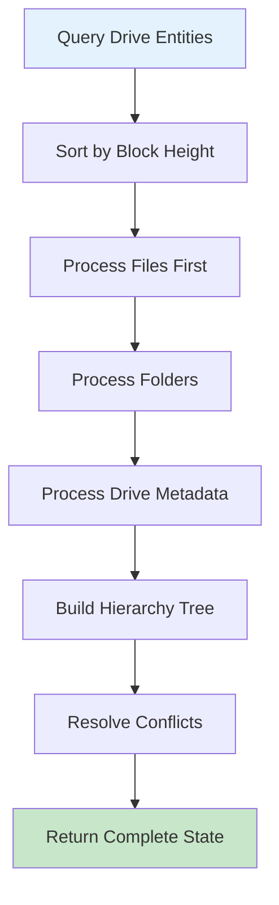
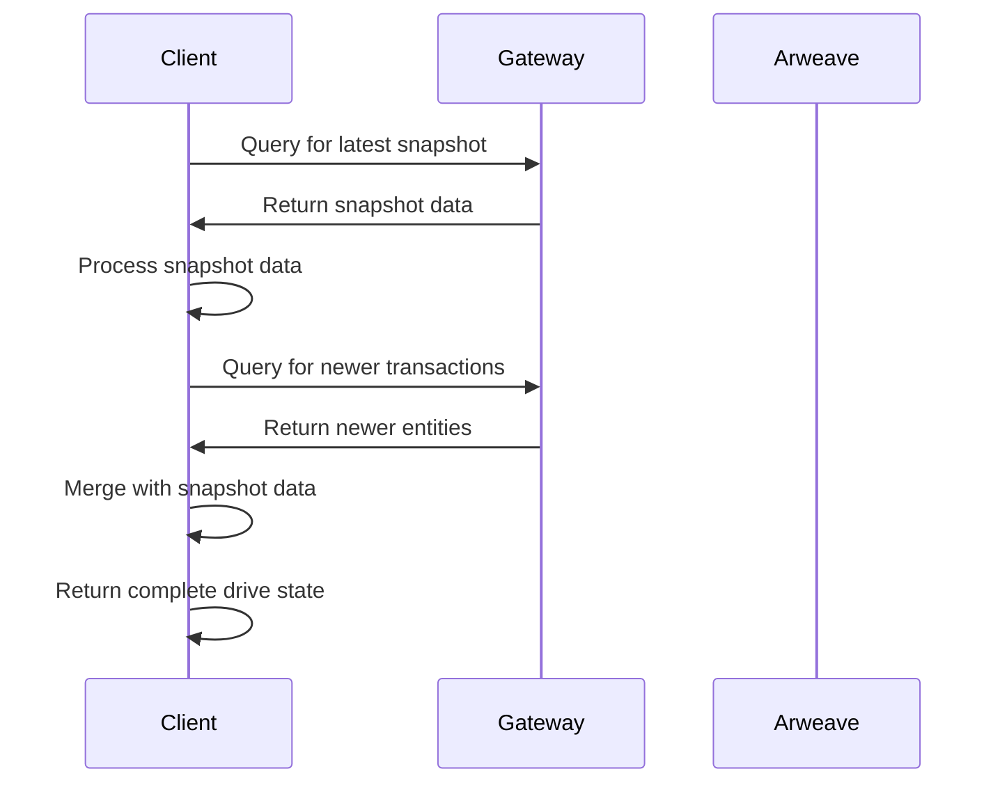

# Reading ArFS Data

Clients can perform read operations to create a timeline of entity write transactions which can then be replayed to construct the Drive state. This is done by querying an Arweave GraphQL index for the user's respective transactions. [Arweave GraphQL Guide](https://gql-guide.vercel.app/) can provide more information on how to use Arweave GraphQL. If no GraphQL index is available, drive state can only be generated by downloading and inspecting all transactions made by the user's wallet.

This timeline of transactions should be grouped by the block number of each transaction. At every step of the timeline, the client can check if the entity was written by an authorized user. This also conveniently enables the client to surface a trusted entity version history to the user.

To determine the owner of a Drive, clients must check for who created the first Drive Entity transaction using that `Drive-Id`. Until a trusted permissions or ACL system is put in place, any transaction in a drive created by any wallet other than the one who created the first Drive Entity transaction could be considered spam.

The `Unix-Time` defined on each transaction should be reserved for tie-breaking same entity updates in the same block and should not be trusted as the source of truth for entity write ordering. This is unimportant for single owner drives but is crucial for multi-owner drives with updateable permissions (currently undefined in this spec) as a malicious user could fake the `Unix-Time` to modify the drive timeline for other users.

- Drives that have been updated many times can have a long entity timeline which can be a performance bottleneck. To avoid this, clients can cache the drive state locally and sync updates to the file system by only querying for entities in blocks higher than the last time they checked.
- Not checking for Drive Ownership could result in seeing incorrect drive state and GraphQL queries.

## Folder/File Paths

ArweaveFS does not store folder or file paths along with entities as these paths will need to be updated whenever the parent folder name changes which can require many updates for deeply nested file systems. Instead, folder/file paths are left for the client to generate from the folder/file names.

## Folder View Queries

Clients that want to provide users with a quick view of a single folder can simply query for an entity timeline for a particular folder by its id. Clients with multi-owner permissions will additionally have to query for the folder's parent drive entity for permission based filtering of the timeline.

## Basic Query Patterns

### Query All Drive Entities

```graphql
query {
  transactions(
    tags: [
      { name: "ArFS", values: ["0.15"] }
      { name: "Entity-Type", values: ["drive"] }
      { name: "Drive-Id", values: ["your-drive-id"] }
    ]
  ) {
    edges {
      node {
        id
        block {
          height
          timestamp
        }
        tags {
          name
          value
        }
      }
    }
  }
}
```

### Query Folder Contents

```graphql
query ($parentFolderId: String!) {
  transactions(
    tags: [
      { name: "ArFS", values: ["0.15"] }
      { name: "Parent-Folder-Id", values: [$parentFolderId] }
    ]
  ) {
    edges {
      node {
        id
        block {
          height
          timestamp
        }
        tags {
          name
          value
        }
      }
    }
  }
}
```

### Query File Entities

```graphql
query ($fileId: String!) {
  transactions(
    tags: [
      { name: "ArFS", values: ["0.15"] }
      { name: "Entity-Type", values: ["file"] }
      { name: "File-Id", values: [$fileId] }
    ]
  ) {
    edges {
      node {
        id
        block {
          height
          timestamp
        }
        tags {
          name
          value
        }
      }
    }
  }
}
```

## Building Drive State

The process of building drive state involves several steps:



### Step-by-Step Process

1. **Query for all entities** associated with a specific `Drive-Id`
2. **Sort by block height** to establish chronological order
3. **Process entities bottom-up** starting with files and folders
4. **Build the hierarchy** by following parent-child relationships
5. **Handle conflicts** by using the most recent entity version

### Example Implementation

```javascript
async function buildDriveState(driveId) {
  // Query all entities for the drive
  const entities = await queryDriveEntities(driveId);

  // Sort by block height
  entities.sort((a, b) => a.block.height - b.block.height);

  // Process entities
  const driveState = {
    drive: null,
    folders: new Map(),
    files: new Map(),
  };

  for (const entity of entities) {
    const entityType = getTagValue(entity.tags, "Entity-Type");

    switch (entityType) {
      case "drive":
        driveState.drive = processDriveEntity(entity);
        break;
      case "folder":
        driveState.folders.set(
          getTagValue(entity.tags, "Folder-Id"),
          processFolderEntity(entity)
        );
        break;
      case "file":
        driveState.files.set(
          getTagValue(entity.tags, "File-Id"),
          processFileEntity(entity)
        );
        break;
    }
  }

  return driveState;
}
```

## Using Snapshots

For large drives, snapshots can significantly improve performance:



### Snapshot Query

```graphql
query ($driveId: String!) {
  transactions(
    tags: [
      { name: "ArFS", values: ["0.15"] }
      { name: "Entity-Type", values: ["snapshot"] }
      { name: "Drive-Id", values: [$driveId] }
    ]
    sort: HEIGHT_DESC
    first: 1
  ) {
    edges {
      node {
        id
        block {
          height
          timestamp
        }
        tags {
          name
          value
        }
      }
    }
  }
}
```

## Performance Optimization

### Caching Strategies

- **Local caching** - Store frequently accessed data locally
- **Incremental updates** - Only fetch new transactions since last sync
- **Snapshot usage** - Use snapshots for large drives
- **Batch queries** - Combine multiple queries when possible

### Query Optimization

- **Use specific tags** - Narrow down queries with relevant tags
- **Limit results** - Use pagination for large result sets
- **Filter by date** - Query specific time ranges
- **Index utilization** - Leverage GraphQL indexes effectively

## Error Handling

### Common Issues

- **Network timeouts** - Implement retry logic
- **Invalid data** - Validate entity structure
- **Missing entities** - Handle incomplete data gracefully
- **Decryption errors** - Proper error handling for private data

### Best Practices

- **Validate ownership** - Check drive ownership before processing
- **Handle conflicts** - Resolve entity version conflicts
- **Graceful degradation** - Provide fallbacks for missing data
- **User feedback** - Inform users of sync status

## Security Considerations

### Data Validation

- **Verify signatures** - Check transaction signatures
- **Validate ownership** - Ensure drive ownership
- **Check timestamps** - Validate entity timestamps
- **Sanitize data** - Clean user-provided data

### Privacy Protection

- **Decrypt carefully** - Handle private data securely
- **Key management** - Protect encryption keys
- **Access control** - Implement proper permissions
- **Audit logging** - Track data access

## Next Steps

Now that you understand how to read ArFS data, explore these related topics:

- [Privacy & Encryption](/build/upload/arfs/privacy) - Secure your data with private drives
- [Upgrading Private Drives](/build/upload/arfs/upgrading-drives) - Update legacy drives to v0.15
- [Creating Drives](/build/upload/arfs/creating-drives) - Start building with ArFS
