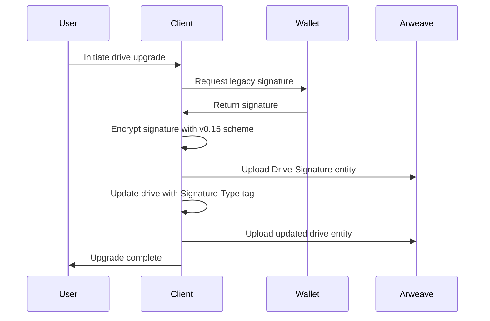
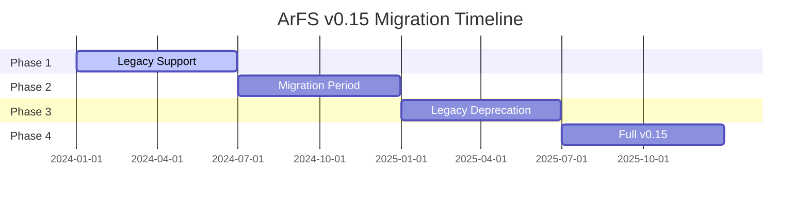

# Upgrading Private Drives

## Overview

[Private drives](/learn/arfs/privacy#private-drives) rely on a combination of user-set password and a wallet signature for encryption and decryption. [Wander](https://www.wander.app/), formerly ArConnect, is a popular Arweave wallet that is deprecating its `signature()` method in favor of `signDataItem()` or `signMessage()`. In order to preserve access to private drive contents that were secured via drive keys created via 'signature()', ArFS v0.15 introduces a new drive key derivation scheme that both utilizes the modern signing APIs and bridges historical drive keys for usage with it.

Because private drive entities exist on chain and their encryption cannot be altered, an upgrade is required to allow continued access to "V1" private drives. This upgrade essentially takes a signature from the drive owner wallet, encrypts it using the required signature structure for V2 private drives, and places it on Arweave as a new "Drive-Signature" entity. This allows the signature to be fetched and decrypted using the latest methods before using it to decrypt the private drive in the V1 format.

<Tip title="Deprecation Period">
The below instructions for upgrading a private drive will work during the deprecation period for the `signature()` method from Wanter. Once this period is over, and `signature()` loses all support, additional steps will be required to obtain the correct signature format to decrypt V1 private drives in order to upgrade them.

There is, at this time, no set date for when the deprecation period will end.

</Tip>

## The Upgrade Process

The upgrade process involves creating a new `Drive-Signature` entity that contains an encrypted version of the legacy signature needed to decrypt the private drive.



### Drive-Signature Entity

The `Drive-Signature` entity stores the encrypted legacy signature:

```json
ArFS: "0.15",
Entity-Type: "drive-signature",
Signature-Format: "1",
Cipher?: "AES256-GCM",
Cipher-IV: "<12 byte initialization vector as Base64>"
{data: <Encrypted type 1 signature>}
```

### Updated Drive Entity

The drive entity is updated with a new `Signature-Type` tag:

```json
ArFS: "0.15",
Cipher?: "AES256-GCM",
Cipher-IV?: "<12 byte initialization vector as Base64>",
Content-Type: "<application/json | application/octet-stream>",
Drive-Id: "<uuid>",
Drive-Privacy: "<public | private>",
Drive-Auth-Mode?: "password",
Entity-Type: "drive",
Signature-Type?: "1",
Unix-Time: "<seconds since unix epoch>"

Metadata JSON {
    "name": "<user defined drive name>",
    "rootFolderId": "<uuid of the drive root folder>",
    "isHidden": false
}
```

## Using ArDrive

The upgrade process has been made simple by using the [ArDrive app](https://app.ardrive.io/).

### Step 1: Log into ArDrive

If the connected wallet has V1 private drives that need to be updated, a banner will appear at the top of the screen.

**TODO: Add mermaid diagram showing upgrade banner**

### Step 2: Click "Update Now!"

This will open a modal listing the drives that need to be updated, and linking to more information about the upgrade process.

**TODO: Add mermaid diagram showing upgrade modal**

### Step 3: Click "Update"

The process of upgrading the private drives will begin, and involve signing messages depending on how many drives are being upgraded. When the process is complete, a new modal will appear listing the drives that have been successfully updated.

**TODO: Add mermaid diagram showing upgrade complete**

## Manual Upgrade Process

If you need to upgrade drives programmatically, here's the process:

### 1. Identify V1 Drives

Query for drives that don't have the `Signature-Type` tag:

```graphql
query {
  transactions(
    tags: [
      { name: "ArFS", values: ["0.15"] }
      { name: "Entity-Type", values: ["drive"] }
      { name: "Drive-Privacy", values: ["private"] }
    ]
  ) {
    edges {
      node {
        id
        tags {
          name
          value
        }
      }
    }
  }
}
```

### 2. Create Drive-Signature Entity

```javascript
async function createDriveSignature(driveId, legacySignature) {
  // Encrypt the legacy signature
  const encryptedSignature = await encryptSignature(legacySignature);

  // Create the drive signature entity
  const driveSignature = {
    data: encryptedSignature,
    tags: [
      { name: "ArFS", value: "0.15" },
      { name: "Entity-Type", value: "drive-signature" },
      { name: "Signature-Format", value: "1" },
      { name: "Cipher", value: "AES256-GCM" },
      { name: "Cipher-IV", value: cipherIV },
    ],
  };

  // Upload to Arweave
  return await uploadTransaction(driveSignature);
}
```

### 3. Update Drive Entity

```javascript
async function updateDriveEntity(driveId) {
  // Get existing drive entity
  const driveEntity = await getDriveEntity(driveId);

  // Add Signature-Type tag
  const updatedTags = [
    ...driveEntity.tags,
    { name: "Signature-Type", value: "1" },
  ];

  // Create updated drive entity
  const updatedDrive = {
    data: driveEntity.data,
    tags: updatedTags,
  };

  // Upload to Arweave
  return await uploadTransaction(updatedDrive);
}
```

## Verification

After upgrading, verify the process was successful:

### Check Drive-Signature Entity

```graphql
query ($driveId: String!) {
  transactions(
    tags: [
      { name: "ArFS", values: ["0.15"] }
      { name: "Entity-Type", values: ["drive-signature"] }
      { name: "Drive-Id", values: [$driveId] }
    ]
  ) {
    edges {
      node {
        id
        block {
          height
          timestamp
        }
        tags {
          name
          value
        }
      }
    }
  }
}
```

### Check Updated Drive Entity

```graphql
query ($driveId: String!) {
  transactions(
    tags: [
      { name: "ArFS", values: ["0.15"] }
      { name: "Entity-Type", values: ["drive"] }
      { name: "Drive-Id", values: [$driveId] }
      { name: "Signature-Type", values: ["1"] }
    ]
  ) {
    edges {
      node {
        id
        block {
          height
          timestamp
        }
        tags {
          name
          value
        }
      }
    }
  }
}
```

## Troubleshooting

### Common Issues

- **Signature not found** - Ensure the wallet supports the required signing methods
- **Encryption errors** - Verify the encryption parameters are correct
- **Upload failures** - Check network connectivity and retry
- **Permission denied** - Ensure you own the drive being upgraded

### Error Handling

```javascript
async function upgradeDrive(driveId) {
  try {
    // Get legacy signature
    const legacySignature = await getLegacySignature(driveId);

    // Create drive signature entity
    await createDriveSignature(driveId, legacySignature);

    // Update drive entity
    await updateDriveEntity(driveId);

    console.log("Drive upgraded successfully");
  } catch (error) {
    console.error("Upgrade failed:", error);
    // Handle error appropriately
  }
}
```

## Best Practices

### Before Upgrading

- **Backup your data** - Ensure you have access to your drive contents
- **Test with one drive** - Start with a single drive to verify the process
- **Check wallet compatibility** - Ensure your wallet supports required methods
- **Verify ownership** - Confirm you own the drives being upgraded

### During Upgrading

- **Monitor progress** - Keep track of upgrade status
- **Handle errors gracefully** - Implement proper error handling
- **Batch operations** - Upgrade multiple drives efficiently
- **User feedback** - Provide clear status updates

### After Upgrading

- **Verify functionality** - Test drive access and operations
- **Update clients** - Ensure all clients support v0.15
- **Monitor performance** - Check for any performance issues
- **Document changes** - Keep track of upgraded drives

## Migration Timeline



## Next Steps

After upgrading your drives, explore these related topics:

- [Privacy & Encryption](/build/upload/arfs/privacy) - Understand the new encryption scheme
- [Reading Data](/build/upload/arfs/reading-data) - Query your upgraded drives
- [Creating Drives](/build/upload/arfs/creating-drives) - Create new v0.15 drives
