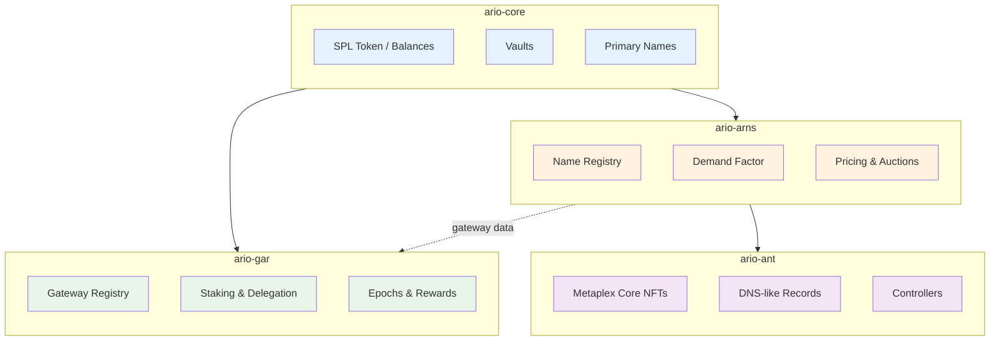

## Ar.io Protocol Architecture

The ar.io protocol operates through four Solana programs (3+1) that work together via cross-program invocation (CPI). This architecture organizes protocol responsibilities into a coordinated set of programs with clear boundaries.

For the deployed Solana mainnet program IDs and ARIO token mint, see [Mainnet Addresses](/learn/token#mainnet-addresses).

## Programs

### ario-core

The core program manages the ARIO SPL Token, vaults, and primary names:

- **SPL Token Operations**: ARIO is a standard SPL Token (6 decimals, 1 ARIO = 1,000,000 mARIO). Transfers, balances, and token accounts follow the SPL Token standard.
- **Vaults**: Time-locked token deposits for various purposes, including ecosystem programs and other protocol-managed incentives.

Other programs (ario-gar, ario-arns) call into ario-core via CPI for all token operations.

### ario-gar (Gateway Address Registry)

Manages the network's gateway infrastructure, staking, delegation, and the epoch reward pipeline:

- **Gateway Registry**: An onchain registry of network gateways. Each gateway is a PDA storing operator address, stake, observer address, settings, and performance stats.
- **Staking & Delegation**: Operator stakes, delegated stakes (separate PDA per gateway-delegator pair), withdrawals, redelegation, and allowlists.
- **Observer Address Uniqueness**: An ObserverLookup PDA enforces that no two gateways share the same observer address.
- **Epoch Pipeline**: A 6-step permissionless pipeline driven by [cranker bots](/learn/oip/epoch-pipeline):
  1. `create_epoch` — Initialize epoch, compute reward rate
  2. `tally_weights` — Batched weight computation
  3. `prescribe_epoch` — Select observers and prescribed names via weighted roulette
  4. `save_observations` — Observers submit pass/fail reports
  5. `distribute_epoch` — Batched reward distribution
  6. `close_epoch` — Reclaim rent from completed epoch accounts
- **Gateway Pruning**: Gateways that repeatedly fail observation are removed from the network and subject to stake slashing.

### ario-arns (ArNS Registry)

Manages the Ar.io Name System — name registration, leasing, pricing, and returned names:

- **Name Registry**: An onchain registry of ArNS domains. Each name is an ArnsRecord PDA storing the owner, ANT mint address, lease type, and expiration.
- **Pricing**: Dynamic pricing via a DemandFactor PDA.
- **Returned Name Auctions**: When a name expires or is released, it enters a Dutch auction.
- **Validation**: Names must meet certain formatting criteria.
- **Cost Simulation**: `get_token_cost` view instruction available via `simulateTransaction` for fee estimation.

### ario-ant (Ar.io Name Tokens)

ANTs are [Metaplex Core](https://developers.metaplex.com/core) NFTs that represent ownership of ArNS names:

- **NFT Standard**: Each ANT is a Metaplex Core asset — tradeable on Tensor, Magic Eden, and other NFT marketplaces.
- **DNS-like Records**: Each ANT stores routing records (AntRecord PDAs) mapping undernames to Arweave transaction IDs or IPFS CIDs, with configurable TTL values.
- **Controllers**: Controllers can manage records without holding the NFT itself.
- **Lazy Reconciliation**: When an ANT is transferred via a marketplace (outside the ar.io protocol), controllers are cleared on the next write operation, ensuring the new owner has full control.

## State Model

All protocol state is stored in Solana accounts using Program Derived Addresses (PDAs):

| Account Type | Program | Derivation Seeds | Purpose |
|-------------|---------|-----------------|---------|
| ArioConfig | ario-core | `["config"]` | Global token configuration |
| Vault | ario-core | `["vault", owner, vault_id]` | Time-locked token deposit |
| PrimaryName | ario-core | `["primary_name", name_hash]` | Name → address mapping |
| PrimaryNameReverse | ario-core | `["primary_name_reverse", owner]` | Address → name reverse lookup |
| GatewayRegistry | ario-gar | `["gateway_registry"]` | Zero-copy gateway slot array |
| Gateway | ario-gar | `["gateway", operator]` | Individual gateway state |
| Delegation | ario-gar | `["delegation", gateway, delegator]` | Per-pair delegation |
| Withdrawal | ario-gar | `["withdrawal", owner, id]` | Pending withdrawal |
| ObserverLookup | ario-gar | `["observer_lookup", observer]` | Observer uniqueness check |
| Epoch | ario-gar | `["epoch", epoch_index]` | Epoch state and rewards |
| NameRegistry | ario-arns | `["name_registry"]` | Zero-copy name slot array |
| ArnsRecord | ario-arns | `["arns_record", name_hash]` | Individual name record |
| DemandFactor | ario-arns | `["demand_factor"]` | Current pricing multiplier |
| AntConfig | ario-ant | `["ant_config", mint]` | ANT metadata and settings |
| AntControllers | ario-ant | `["ant_controllers", mint]` | Controller list (max 10) |
| AntRecord | ario-ant | `["ant_record", mint, undername_hash]` | DNS-like routing record |

## Security Model

The protocol relies on a combination of Solana runtime guarantees, deterministic account ownership, and economic incentives:

- **Signer and account checks**: Solana enforces transaction signatures, account ownership, and program execution rules.
- **Program Derived Addresses (PDAs)**: Protocol state lives in deterministic accounts controlled by the relevant ar.io programs.
- **Economic accountability**: Gateway operators stake ARIO, and repeated failure can lead to removal and slashing.
- **Permissionless verification**: Gateway observations and cranking keep network operations open and independently verifiable.
