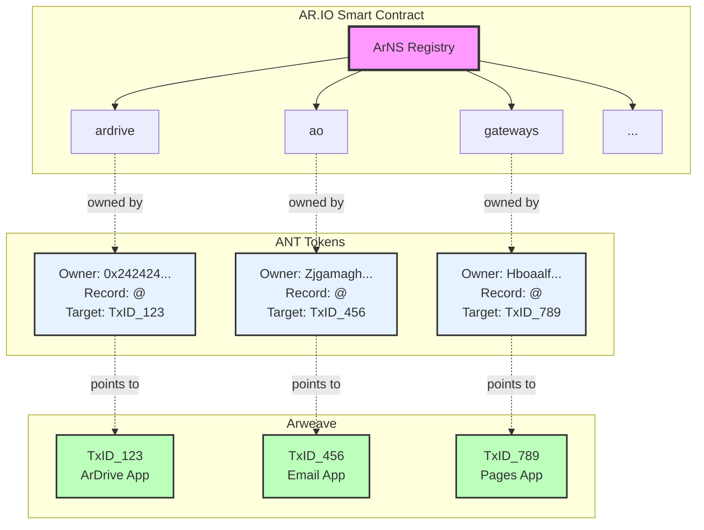
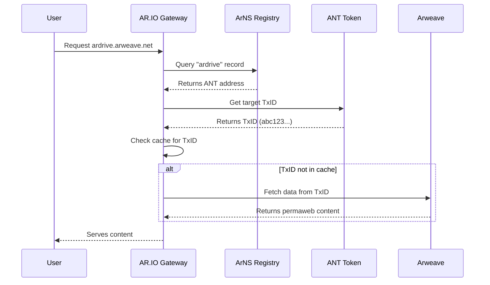

## What is ArNS?

Arweave URLs and transaction IDs are long, difficult to remember, and occasionally miscategorized as spam. The Arweave Name System (ArNS) aims to resolve these problems in a decentralized manner.

ArNS is a **censorship-resistant naming system** stored on Arweave, powered by [ARIO tokens](/token), enabled through [AR.IO gateway](/gateways) domains, and used to connect friendly domain names to permaweb apps, web pages, data, and identities.

It's an open, permissionless, domain name registrar that doesn't rely on a single TLD.

## How ArNS Works

This system works similarly to traditional DNS services, where users can purchase a name in a registry and DNS Name servers resolve these names to IP addresses. The system is flexible and allows users to purchase names permanently or lease them for a defined duration based on their use case.

With ArNS, the registry is stored permanently on Arweave via [AO](/glossary#ao-computer-ao), making it immutable and globally resilient. This also means that apps and infrastructure cannot just read the latest state of the registry but can also check any point in time in the past, creating a "Wayback Machine" of permanent data.

## Name Resolution Process

Users can register a name, like `ardrive`, within the ArNS Registry. Before owning a name, they must create an Arweave Name Token (ANT), an AO Computer based token and open-source protocol used by ArNS to track the ownership and control over the name.

ANTs allow the owner to set a mutable pointer to any type of permaweb data, like a page, app or file, via its Arweave transaction ID.

Each AR.IO gateway acts as an ArNS Name resolver. They fetch the latest state of both the ArNS Registry and its associated ANTs from an AO compute unit (CU) and serve this information rapidly for apps and users.

AR.IO gateways will also resolve that name as one of their own subdomains, e.g., `https://ardrive.arweave.net` and proxy all requests to the associated Arweave transaction ID. This means that ANTs work across all AR.IO gateways that support them: `https://ardrive.ar-io.dev`, `https://ardrive.g8way.io/`, etc.

Users can easily reference these friendly names in their browsers, and other applications and infrastructure can build rich solutions on top of these ArNS primitives.

## Key Benefits

- **Human-readable URLs** instead of complex transaction IDs
- **Censorship-resistant** and decentralized
- **Permanent storage** on Arweave
- **Cross-gateway compatibility** - works on all AR.IO gateways
- **Historical data access** - check any point in time
- **Flexible ownership** - permanent or leased names

## Documentation Sections

- **[Name Registration](/learn/arns/name-registration)** - Learn about registering names, validation rules, and lease management
- **[ANT Tokens](/learn/arns/ant-tokens)** - Understand ownership, control, and interaction permissions
- **[Pricing Model](/learn/arns/pricing-model)** - Explore dynamic pricing, demand factors, and gateway discounts

## Next Steps

Ready to learn how to register names? Explore [Name Registration](/learn/arns/name-registration) to understand the different types of registrations, validation rules, and pricing, or dive into [ANT Tokens](/learn/arns/ant-tokens) to see how ownership and control work.
