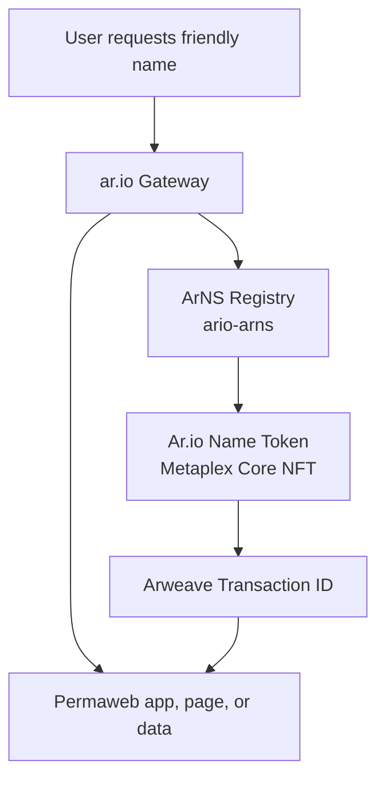
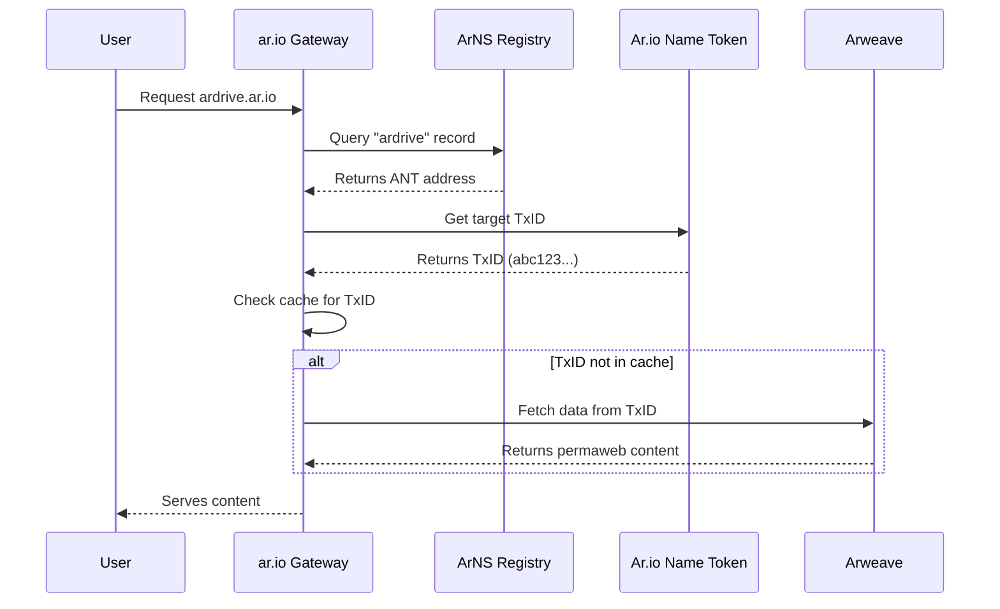

import { Card, Cards } from "fumadocs-ui/components/card";
import { Globe, Key, DollarSign, ShoppingCart } from "lucide-react";

## What is ArNS?

Arweave URLs and transaction IDs are long, difficult to remember, and occasionally categorized as spam. The Ar.io Name System (ArNS) aims to resolve these problems in a decentralized manner.

ArNS is a **censorship-resistant naming system** powered by [ARIO tokens](/learn/token), enabled through [ar.io gateway](/learn/gateways) domains, and used to connect friendly domain names to permaweb apps, web pages, data, and identities.

It's an open, permissionless, domain name registrar that doesn't rely on a single TLD.

## How ArNS Works

This system works similarly to traditional DNS services, where users can purchase a name in a registry and DNS Name servers resolve these names to IP addresses. The system is flexible and allows users to purchase names permanently or lease them for a defined duration based on their use case.

With ArNS, the registry is managed on Solana by the `ario-arns` program, making ownership and registration state globally verifiable. Names are controlled by Ar.io Name Tokens (ANTs), which point to Arweave transaction IDs so gateways can route friendly names to permanent data.

```mermaid
graph TD
    User[User requests friendly name] --> Gateway[ar.io Gateway]
    Gateway --> Registry[ArNS Registry<br/>ario-arns]
    Registry --> ANT[Ar.io Name Token<br/>Metaplex Core NFT]
    ANT --> Target[Arweave Transaction ID]
    Gateway --> Content[Permaweb app, page, or data]
    Target --> Content
```

## Name Resolution

Users can register a name, like `ardrive`, within the ArNS Registry. Ownership is represented by an Ar.io Name Token (ANT), a Metaplex Core NFT on Solana used by ArNS to track control over the name.

ANTs allow the owner to set a mutable pointer to any type of permaweb data, like a page, app or file, via its Arweave transaction ID.

Each ar.io gateway acts as an ArNS name resolver. Gateways fetch the latest state of both the ArNS Registry and associated ANTs from Solana and use that state to route users to the right Arweave transaction.

Ar.io gateways resolve names as gateway subdomains, e.g., `https://ardrive.ar.io`, and proxy requests to the associated Arweave transaction ID. This means an ArNS name can work across ar.io gateways that support ArNS.

Users can easily reference these friendly names in their browsers, and other applications and infrastructure can build rich solutions on top of these ArNS primitives.

```mermaid
sequenceDiagram
    participant User
    participant Gateway as ar.io Gateway
    participant Registry as ArNS Registry
    participant ANT as Ar.io Name Token
    participant Arweave

    User->>Gateway: Request ardrive.ar.io
    Gateway->>Registry: Query "ardrive" record
    Registry-->>Gateway: Returns ANT address
    Gateway->>ANT: Get target TxID
    ANT-->>Gateway: Returns TxID (abc123...)
    Gateway->>Gateway: Check cache for TxID
    alt TxID not in cache
        Gateway->>Arweave: Fetch data from TxID
        Arweave-->>Gateway: Returns permaweb content
    end
    Gateway-->>User: Serves content
```

## Key Benefits

- **Human-readable URLs** instead of complex transaction IDs
- **Censorship-resistant** and decentralized
- **Permanent data routing** to Arweave transaction IDs
- **Cross-gateway compatibility** - works on all ar.io gateways
- **Flexible ownership** - lease names for a defined period or buy them permanently

## Explore ArNS

<Cards>
  <Card
    title="Register ArNS Names"
    description="Learn how to register permanent names and understand validation rules"
    href="/learn/arns/name-registration"
    icon={<Globe className="w-8 h-8" />}
  />
  <Card
    title="Ar.io Name Tokens (ANTs)"
    description="Understand ownership, control, and interaction permissions for names"
    href="/learn/arns/ants"
    icon={<Key className="w-8 h-8" />}
  />
  <Card
    title="Pricing Model"
    description="Explore dynamic pricing, demand factors, and gateway discounts"
    href="/learn/arns/pricing-model"
    icon={<DollarSign className="w-8 h-8" />}
  />
  <Card
    title="Buy ArNS Names"
    description="Start registering names for your permanent applications"
    href="https://arns.ar.io"
    icon={<ShoppingCart className="w-8 h-8" />}
  />
</Cards>
