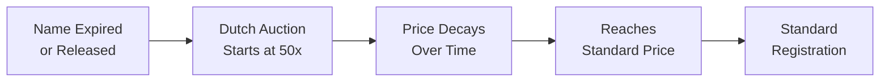

## Overview

When an ArNS name expires or is voluntarily returned to the protocol, it enters a **Returned Name Dutch Auction** before becoming available for standard registration. This mechanism prevents name squatting at expiry and provides fair pricing through a time-decaying premium.

## Dutch Auction Mechanics

Returned names start at a high premium and decay to the base price over a return window:

- **Starting price**: premium above the base registration price
- **Ending price**: standard registration price
- **Decay**: decreases over time until standard pricing resumes



## Revenue Split

When a returned name is purchased during the Dutch auction:

- **50%** goes to the **protocol balance** (funds epoch rewards)
- **50%** goes to the **previous owner** (the ANT holder at the time of return)

This incentivizes name owners to voluntarily release names they no longer need, since they receive half the resale value.

## How Names Enter the Returned Pool

### Lease Expiration
When a leased name's term ends and the grace period elapses without renewal or conversion to permanent ownership, the name enters the returned pool.

### Voluntary Release
Permanent name owners can voluntarily release their name back to the protocol. This places the name in the returned pool.

## Lifecycle

| Phase | Duration | Price | Action |
|-------|----------|-------|--------|
| **Active lease** | As registered | N/A | Name is in use |
| **Grace period** | After expiry | N/A | Owner can renew or convert |
| **Dutch auction** | Return window | Premium → standard price | Anyone can purchase |
| **Standard registration** | Indefinite | Base price | Normal ArNS purchase |

## Querying Returned Names

Use the SDK to check available returned names and their current auction price:

```typescript
const ario = ARIO.mainnet();

// Get all active returned names
const returnedNames = await ario.getArNSReturnedNames({
  limit: 100,
  sortBy: 'endTimestamp',
  sortOrder: 'asc',
});

// Get a specific returned name
const name = await ario.getArNSReturnedName({ name: 'example' });

// Check current cost (includes auction premium)
const cost = await ario.getTokenCost({
  intent: 'Buy-Name',
  name: 'example',
  type: 'permabuy',
});
```
