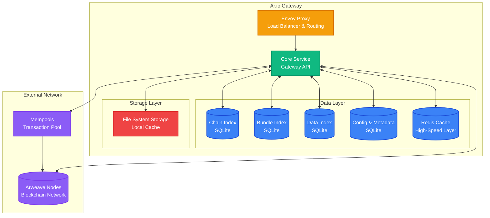

import { Database, Shield, Layers, Server } from 'lucide-react';

Ar.io gateways are sophisticated data access layers built on top of the Arweave network. They transform the raw Arweave blockchain into a performant, reliable, and developer-friendly platform for storing and retrieving data. Gateways act as bridges between applications and the permanent storage capabilities of Arweave.

## Core Technology Stack

Ar.io gateways are built using modern, scalable technologies designed for high-performance data operations:

### Runtime and Language
- **Node.js**: The primary runtime environment for all gateway services
- **TypeScript**: Core services written with flexible interfaces for customization
- **Event-driven architecture**: Enables efficient handling of concurrent operations

### Data Storage
- **SQLite**: Four specialized databases handle different aspects of gateway operations:
  - Chain data indexing
  - Bundle transaction processing  
  - Data item management
  - Configuration and metadata
- **Redis**: High-speed caching layer for frequently accessed data
- **File system storage**: Local caching for frequently accessed data

### Processing Model
- **Worker-based concurrency**: Specialized workers handle different background tasks
- **Event-driven processing**: Loosely coupled components communicate via events
- **Streaming data handling**: Minimizes memory overhead for large data operations

## Key Architectural Decisions

Several important design decisions shape how ar.io gateways operate:

### Data Retrieval Strategy
Ar.io gateways use a sophisticated **hierarchical fallback system** for data retrieval:

1. **Trusted gateways**: Prioritize data from verified, high-performance peers
2. **Ar.io network**: Leverage the broader network of ar.io gateways  
3. **Chunks data items**: Reconstruct data from individual chunks when needed
4. **Transaction data**: Fall back to raw Arweave transaction data

This approach ensures data availability while optimizing for speed and reliability.

### Verification and Trust Model
- **Multi-level cryptographic verification**: Data integrity is verified at multiple points
- **Trust hierarchy**: Cached verified data → trusted cached data → network streams
- **Self-healing mechanisms**: Automatic recovery and re-verification of corrupted data
- **Verification headers**: HTTP headers indicate the verification status of returned data

### Worker Specialization
Different background workers handle specific responsibilities:

- **Block synchronization workers**: Keep the gateway synchronized with Arweave blocks
- **Bundle processing workers**: Handle Layer 2 bundled data items (ANS-104)
- **Data verification workers**: Continuously verify stored data integrity
- **Maintenance workers**: Perform cleanup and optimization tasks

## Scalability and Configuration

Ar.io gateways are designed to scale from small personal deployments to large enterprise installations:

### Modular Architecture
Gateway services can be independently configured or disabled based on operator needs:
- **Data serving**: Serve cached data to applications
- **Data indexing**: Index and process new Arweave data
- **Bundle processing**: Handle Layer 2 bundled transactions
- **ArNS routing**: Provide Arweave Name System resolution

## Core Philosophy: Builder Independence

A fundamental principle of ar.io gateway architecture is **empowering builders to do the things they care about** without relying on any centralized resource to leverage Arweave. This philosophy manifests in several key ways:

### Extensibility Through Modularity
Gateways are designed as extensible platforms that operators can customize through **[Extensions](/build/extensions/)**, sidecar services, and plugin architectures for specialized functionality.

### Data Sovereignty
Operators maintain complete control through **[Data Retrieval](/learn/gateways/data-retrieval)** strategies and **[Data Verification](/learn/gateways/data-verification)** systems that ensure independence from trusted intermediaries.

### Network Resilience
The modular design creates a resilient ecosystem where distributed infrastructure and customizable trust models prevent single points of failure.

This architecture ensures that builders can create powerful applications on Arweave while maintaining independence from any centralized infrastructure or service provider.

## Explore Gateway Capabilities

<Cards>
  <Card 
    title="Data Retrieval" 
    description="Learn how gateways fetch data from multiple sources with hierarchical fallback strategies"
    href="/learn/gateways/data-retrieval"
    icon={<Database className="w-8 h-8" />}
  />
  <Card 
    title="Data Verification" 
    description="Understand how gateways ensure data integrity through cryptographic verification"
    href="/learn/gateways/data-verification"
    icon={<Shield className="w-8 h-8" />}
  />
  <Card 
    title="Run Your Own Gateway" 
    description="Set up and operate your own ar.io gateway to join the network"
    href="/build/run-a-gateway/quick-start"
    icon={<Server className="w-8 h-8" />}
  />
  <Card 
    title="Build Extensions" 
    description="Extend gateway functionality with custom plugins and integrations"
    href="/build/extensions"
    icon={<Layers className="w-8 h-8" />}
  />
</Cards>

