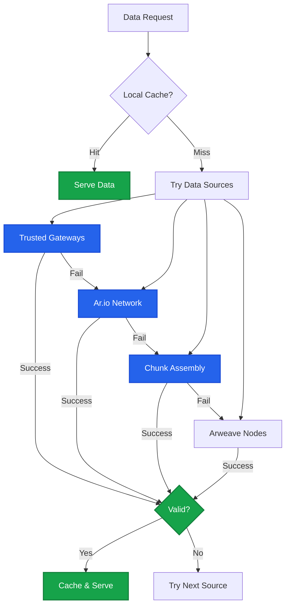
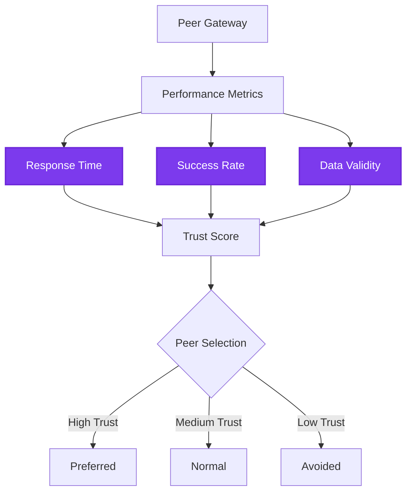

import { Shield, Cpu, Globe, Settings, Gauge } from 'lucide-react';

Ar.io gateways use a sophisticated multi-tier architecture to retrieve and serve Arweave data. This system ensures high availability, fast response times, and data integrity by leveraging multiple data sources with automatic fallback mechanisms.

<Callout type="info">
  Next in the learning flow: [Data Availability](/learn/gateways/data-availability)
  for guarantee levels and access-strategy recommendations, then [Gateway
  Expectations](/build/access/gateway-expectations) for practical production
  limits and scenarios.
</Callout>

## How Gateways Retrieve Data

When a gateway needs to serve data, it follows a hierarchical retrieval pattern, trying each source in order until the data is successfully retrieved:

## Data Sources

Ar.io gateways can retrieve data from multiple sources, each with different characteristics:

### 1. Trusted Gateways
- **Purpose**: Peer-to-peer data sharing between verified ar.io gateways
- **Benefits**: Distributed redundancy, load balancing, network resilience
- **Trust Mechanism**: Performance-based trust scores and reciprocity monitoring
- **Selection**: Prioritized based on established trust relationships

### 2. Ar.io Network (Untrusted Peers)
- **Purpose**: Broader network of ar.io gateways without established trust
- **Benefits**: Geographic distribution, expanded data availability
- **Selection**: Weighted random selection based on performance metrics
- **Validation**: Enhanced verification required due to untrusted nature

### 3. Chunk Assembly
- **Purpose**: Direct reconstruction from Arweave chunks via known offsets
- **Benefits**: Data integrity guarantee, no intermediary trust required
- **Process**: Fetches individual chunks efficiently and assembles them into complete data
- **Optimization**: Uses offset awareness for faster chunk retrieval

### 4. TX Data
- **Purpose**: Direct access to transaction data from Arweave nodes
- **Benefits**: Authoritative data source, complete historical access
- **Trade-off**: Higher latency but guaranteed availability
- **Use Case**: Final fallback when other sources fail

## Retrieval Strategies

Gateways employ different strategies based on the use case:

### On-Demand Retrieval
Optimized for user requests with emphasis on speed:
1. **Priority order**: Trusted Gateways → Untrusted Peers (Ar.io Network) → Chunks Assembly → Arweave
2. **Aggressive timeouts**: Quick fallback to next source
3. **Parallel attempts**: May query multiple sources simultaneously
4. **Response streaming**: Begin serving data as soon as available

### Background Retrieval
Used specifically for unbundling and verification processes:
1. **Unbundling operations**: Extracting individual data items from ANS-104 bundles
2. **Data verification**: Comprehensive validation of retrieved data integrity
3. **Integrity focus**: Prefers authoritative sources for accurate processing
4. **Relaxed timeouts**: Allows for slower but reliable retrieval during verification
5. **Verification priority**: Extensive validation before caching verified data

## Trust and Validation

### Peer Trust Management
Gateways maintain sophisticated trust relationships:

Trust factors include:
- **Response performance**: Latency and throughput metrics
- **Success rates**: Percentage of successful requests
- **Data validity**: Cryptographic verification results
- **Reciprocity**: Mutual data sharing behavior

### Data Validation Process
Every piece of retrieved data undergoes validation:

1. **Hash Verification**: Computed hash must match expected value
2. **Merkle Proof Validation**: Chunks proven against transaction root
3. **Signature Verification**: Transaction signatures validated
4. **Size Confirmation**: Data size matches header declaration

## Why Multi-Source Retrieval Matters

### For Gateway Operators
- **Reduced infrastructure costs**: Leverage peer resources
- **Improved reliability**: Multiple fallback options
- **Better performance**: Optimal source selection
- **Network effects**: Benefit from collective infrastructure

### For Users
- **Faster access**: Data served from optimal source
- **High availability**: Multiple paths to data
- **Geographic optimization**: Nearby sources preferred
- **Consistent experience**: Transparent source selection

---

The data retrieval system is fundamental to ar.io's mission of providing reliable, performant access to the permaweb. This sophisticated architecture ensures that Arweave's permanent data remains accessible through a resilient, distributed gateway network.

## Related Gateway Concepts

<Cards>
  <Card 
    title="Data Verification" 
    description="Learn how gateways ensure data integrity through cryptographic verification"
    href="/learn/gateways/data-verification"
    icon={<Shield className="w-8 h-8" />}
  />
  <Card 
    title="Gateway Architecture" 
    description="Understand the technical architecture and design decisions of ar.io gateways"
    href="/learn/gateways/architecture"
    icon={<Cpu className="w-8 h-8" />}
  />
  <Card 
    title="Access Data" 
    description="Practical guide to retrieving data from Arweave using various methods"
    href="/build/access"
    icon={<Globe className="w-8 h-8" />}
  />
  <Card 
    title="Gateway Expectations" 
    description="Understand production variability, limits, and client handling patterns"
    href="/build/access/gateway-expectations"
    icon={<Gauge className="w-8 h-8" />}
  />
  <Card 
    title="Optimize Your Gateway" 
    description="Configure indexing and filtering to optimize gateway performance"
    href="/build/run-a-gateway/manage/filters"
    icon={<Settings className="w-8 h-8" />}
  />
</Cards>
