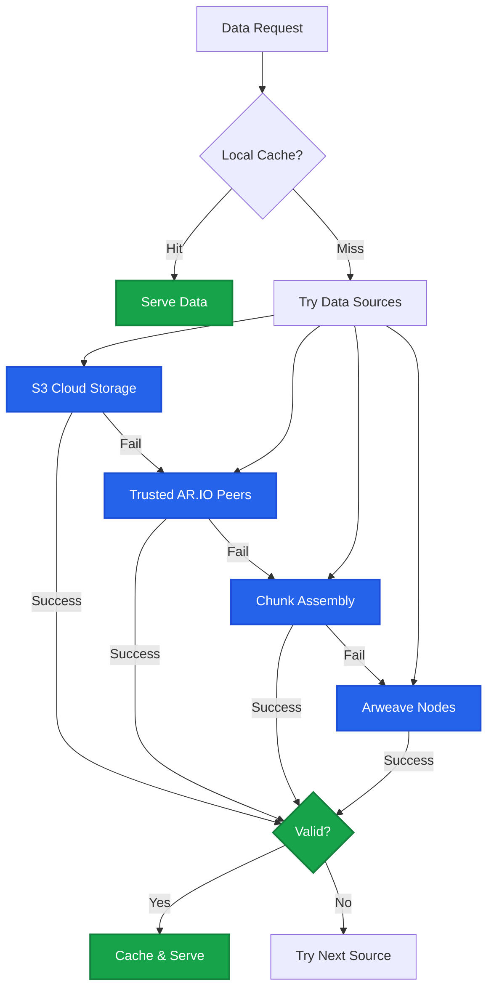
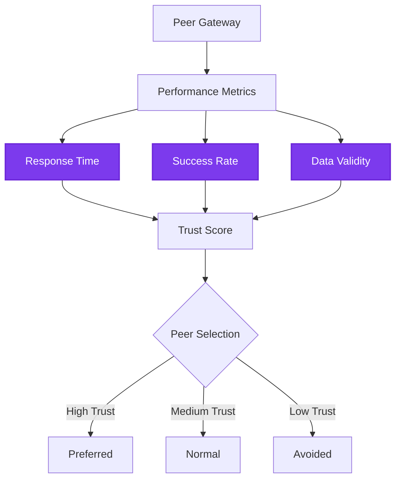

# Data Retrieval

AR.IO gateways use a sophisticated multi-tier architecture to retrieve and serve Arweave data. This system ensures high availability, fast response times, and data integrity by leveraging multiple data sources with automatic fallback mechanisms.

## How Gateways Retrieve Data

When a gateway needs to serve data, it follows a hierarchical retrieval pattern, trying each source in order until the data is successfully retrieved:

## Data Sources

AR.IO gateways can retrieve data from multiple sources, each with different characteristics:

### 1. S3 Cloud Storage
- **Purpose**: Fast, reliable cloud-based caching layer
- **Benefits**: Low latency, high bandwidth, cost-effective for frequently accessed data
- **Use Case**: Popular content and recent data

### 2. Trusted Gateway Networks
- **Purpose**: Peer-to-peer data sharing between AR.IO gateways
- **Benefits**: Distributed redundancy, load balancing, network resilience
- **Trust Mechanism**: Performance-based trust scores and reciprocity monitoring

### 3. Transaction Chunk Assembly
- **Purpose**: Direct reconstruction from Arweave chunks
- **Benefits**: Data integrity guarantee, no intermediary trust required
- **Process**: Fetches individual chunks and assembles them into complete data

### 4. Arweave Nodes
- **Purpose**: Direct access to the blockchain source of truth
- **Benefits**: Authoritative data source, complete historical access
- **Trade-off**: Higher latency but guaranteed availability

### 5. AR.IO Peer Network
- **Purpose**: Decentralized network of AR.IO nodes
- **Benefits**: Geographic distribution, community-operated infrastructure
- **Selection**: Weighted random selection based on performance metrics

## Retrieval Strategies

Gateways employ different strategies based on the use case:

### On-Demand Retrieval
Optimized for user requests with emphasis on speed:
1. **Priority order**: Fastest sources first (S3 → Peers → Chunks → Arweave)
2. **Aggressive timeouts**: Quick fallback to next source
3. **Parallel attempts**: May query multiple sources simultaneously
4. **Response streaming**: Begin serving data as soon as available

### Background Retrieval
Optimized for data completeness and archival:
1. **Integrity focus**: Prefers authoritative sources
2. **Relaxed timeouts**: Allows for slower but reliable retrieval
3. **Verification priority**: Extensive validation before caching
4. **Bulk operations**: Efficient batch processing

## Trust and Validation

### Peer Trust Management
Gateways maintain sophisticated trust relationships:

Trust factors include:
- **Response performance**: Latency and throughput metrics
- **Success rates**: Percentage of successful requests
- **Data validity**: Cryptographic verification results
- **Reciprocity**: Mutual data sharing behavior

### Data Validation Process
Every piece of retrieved data undergoes validation:

1. **Hash Verification**: Computed hash must match expected value
2. **Merkle Proof Validation**: Chunks proven against transaction root
3. **Signature Verification**: Transaction signatures validated
4. **Size Confirmation**: Data size matches header declaration

## Why Multi-Source Retrieval Matters

### For Gateway Operators
- **Reduced infrastructure costs**: Leverage peer resources
- **Improved reliability**: Multiple fallback options
- **Better performance**: Optimal source selection
- **Network effects**: Benefit from collective infrastructure

### For Users
- **Faster access**: Data served from optimal source
- **High availability**: Multiple paths to data
- **Geographic optimization**: Nearby sources preferred
- **Consistent experience**: Transparent source selection

---

The data retrieval system is fundamental to AR.IO's mission of providing reliable, performant access to the permaweb. This sophisticated architecture ensures that Arweave's permanent data remains accessible through a resilient, distributed gateway network.

Learn more about related gateway capabilities: [Data Indexing](/learn/gateways/data-indexing) and [Data Verification](/learn/gateways/data-verification).