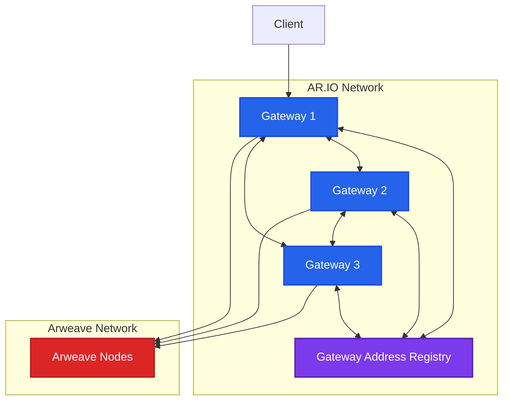

## Data Sharing

A key advantage and incentive for networked AR.IO gateways over standalone gateways is their ability to preferentially share various kinds of Arweave data among one another.
Each gateway advertises its registered Arweave wallet address, so other network participants know who they are.

Gateways can identify AR.IO Network peers by evaluating the Gateway Address Registry (GAR) within the AR.IO smart contract.
They utilize that peer list to request as-yet-uncached data on behalf of their requesting clients or in service of their internal workflows.
This can include requests for transaction header data, data items, and chunks. The Arweave Network shall act as the backstop for all block data, transaction header data, and chunk data.

Additionally, gateways that receive requests for cache-missed data from other gateways can provide a higher quality of service to other AR.IO gateways than that which is provided to general users, apps, and infrastructure.
However, gateways are not forced to share data with one another and can choose not to share their data if the intended recipient is acting maliciously.
Such behaviors might include failure to reciprocate in data sharing, engaging in dishonest activities / observation, or distributing invalid data.

## Gateway Data Sharing Architecture

## Shared Data Types

Gateways cooperatively share multiple types of data to improve network performance:

### Transaction Header Data
- **Metadata** about Arweave transactions
- **Block information** and confirmations
- **Tag indexes** for efficient querying

### Data Items
- **ANS-104 bundled items** cached across gateways
- **Content data** for frequently accessed items
- **Manifest information** for bundle navigation

### Chunk Data
- **Raw data chunks** from Arweave transactions
- **Reconstructed data** for faster delivery
- **Partial content** for streaming applications

## Quality of Service Prioritization

AR.IO gateways provide differentiated service levels:

### Gateway-to-Gateway Requests
- **Higher bandwidth allocation** for peer requests
- **Priority queuing** over general user requests
- **Extended timeout tolerances** for large data transfers

### General User Requests
- **Standard service levels** for public access
- **Rate limiting** to prevent abuse
- **Fair sharing** of available resources

## Malicious Behavior Detection

Gateways monitor peer behavior and can refuse service to bad actors:

### Reciprocity Monitoring
- **Data sharing ratios** tracked over time
- **Request/response patterns** analyzed for fairness
- **Blacklisting** of non-reciprocating gateways

### Data Integrity Checks
- **Hash verification** of shared data
- **Consistency validation** across multiple sources
- **Reporting** of invalid data distribution

Learn more about how gateways ensure data integrity in [Data Verification](/learn/gateways/data-verification).
