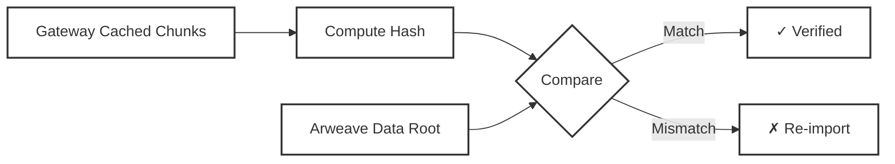

# Data Verification

AR.IO gateways continuously verify that data chunks are correctly stored and retrievable from Arweave. This ensures users receive authentic, uncorrupted data with cryptographic proof of integrity.

## How Gateways Verify Data

Gateways verify data integrity by checking that cached chunks can reconstruct the original data payload and match what was stored on Arweave:

**The Verification Process:**

**1. Identify Data to Verify**
- Recently cached data that hasn't been verified
- Scheduled re-verification of existing data
- Data flagged by network monitoring

**2. Fetch and Reconstruct Data**
- Retrieve all data chunks from gateway storage
- Reconstruct the complete data payload
- Apply cryptographic hashing (SHA-256)

**3. Compute Data Root**
- Build Merkle trees for verification
- Calculate the final data root hash
- Generate cryptographic proofs

**4. Compare Against Arweave**
- Compare computed hash with the original transaction's data root
- Verify chunks match what was stored on Arweave
- Ensure data integrity is maintained

## Verification for L1 and L2 Data

### Layer 1 (L1) Transactions
For native Arweave transactions:
- **Direct verification** against transaction data roots
- **Chunk reconstruction** to ensure complete data availability
- **Hash comparison** with blockchain-recorded values

### Layer 2 (L2) ANS-104 Bundles
For bundled data items:
- **Bundle validation** to verify the container transaction
- **Individual item verification** for each bundled data item
- **Merkle proof generation** linking items to verified bundles
- **Nested verification** for bundles within bundles

## Verification Results

### When Verification Succeeds
- Data is marked as verified and becomes available to users
- Verification timestamp is recorded for audit trails
- Status is shared with other gateways in the network

### When Verification Fails
- Discrepancy is logged with computed vs. expected hash values
- Data is queued for re-import from Arweave
- Retry attempts are tracked and managed
- Consistently failing data may be quarantined
- Network monitoring is notified of persistent issues

## Chunk-Level Verification

Gateways verify data integrity at the chunk level:

### Ensuring Complete Reconstruction
- All required chunks are available and uncorrupted
- Chunks can be properly reassembled into the original data
- Missing chunks are identified and re-fetched from Arweave

### Cryptographic Validation
- Individual chunk hashes match expected values
- Chunk sequences produce the correct final data hash
- Merkle proofs link chunks to their transaction roots

### Performance Benefits
- Parallel verification of multiple chunks
- Cached verification results avoid repeated computation
- Incremental verification as new chunks become available

## Why Verification Matters

### Network Trust
- Multiple gateways independently verify the same data
- Cross-validation between network participants ensures accuracy
- Distributed verification creates consensus on data integrity

### Proactive Quality Assurance
- Early detection of storage or transmission issues
- Automatic remediation of corrupted data
- Continuous monitoring of network data health

### User Confidence
- Cryptographic proof that served data is authentic
- Transparency through verification timestamps and status
- Reliable access to verified permanent data

Data verification works with other gateway functions to ensure reliable access to permanent data. Learn more about [Data Indexing](/learn/gateways/data-indexing) and [Data Sharing](/learn/gateways/data-sharing) capabilities.
