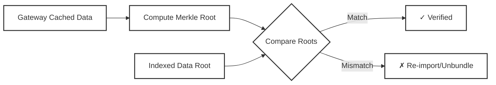

# Data Verification

AR.IO gateways continuously verify that data chunks are correctly stored and retrievable from Arweave. This ensures users receive authentic, uncorrupted data with cryptographic proof of integrity. The verification system is what makes AR.IO gateways trustworthy data providers for the permaweb.

## How Gateways Verify Data

Data verification is an ongoing process that uses Merkle tree cryptography to provide mathematical proof of data integrity. Gateways verify data by computing cryptographic roots from cached data and comparing them against the roots stored on Arweave:

**The Verification Workflow:**

**1. Discovery Phase**
- Periodically scan for unverified data items
- Priority-based queue management (higher priority items first)
- Track retry attempts for failed verifications

**2. Data Retrieval**
- Fetch data attributes from gateway storage
- Retrieve the complete data stream
- Gather metadata needed for verification

**3. Cryptographic Computation**
- Calculate Merkle data root from actual data stream
- Generate cryptographic proofs using the same algorithm as Arweave
- Create verifiable hash chains

**4. Root Comparison**
- Compare computed root against indexed root in database
- Verify data hasn't been corrupted or altered
- Validate chunk integrity against Merkle proofs

**5. Action Based on Results**
- **Success**: Mark data as verified with timestamp
- **Failure**: Trigger re-import from Arweave or unbundle from parent
- **Error**: Increment retry counter and requeue for later

## Verification Types

AR.IO gateways handle different types of data verification based on the data's origin:

### Transaction Data Verification
For individual Arweave transactions:
- **Direct root validation** against transaction data roots stored on-chain
- **Complete data reconstruction** from chunks to ensure availability
- **Cryptographic proof** that data matches what was originally stored

### Bundle Data Verification
For ANS-104 data bundles (collections of data items):
- **Bundle integrity checks** to verify the container is valid
- **Individual item verification** within each bundle
- **Recursive unbundling** when verification fails to re-extract items
- **Nested bundle support** for bundles containing other bundles

### Chunk-Level Validation
At the most granular level:
- **Merkle proof validation** for individual data chunks
- **Sequential integrity** ensuring chunks form complete data
- **Parallel verification** of multiple chunks for performance

## Verification Results and Recovery

### When Verification Succeeds
- Data is marked as verified with a timestamp
- Verification status is cached to avoid repeated computation
- Data becomes available for serving to users with integrity guarantee
- Success metrics are tracked for monitoring gateway health

### When Verification Fails
- **Immediate Actions:**
  - Log the discrepancy between computed and expected roots
  - Increment retry counter for the failed item
  - Queue for re-verification or data recovery
  
- **Recovery Mechanisms:**
  - **For Transactions**: Re-import data from Arweave network
  - **For Bundles**: Trigger unbundling to re-extract items
  - **For Persistent Failures**: Escalate to manual intervention after retry limit
  
- **Eventual Consistency:**
  - System designed to handle temporary network inconsistencies
  - Continues attempting verification until successful
  - Ensures long-term data integrity across the network

## Performance and Architecture

### Verification System Design
The gateway implements an efficient verification architecture:

- **Data Verification Worker**: Orchestrates the entire verification process
- **Priority Queue System**: Processes high-priority items first
- **Batch Processing**: Verifies multiple items efficiently in batches
- **Modular Components**: Clear interfaces between verification modules

### Performance Optimizations

**Efficient Database Queries:**
- Indexed lookups on verification status
- Optimized queries for unverified items
- Priority-based ordering for processing

**Smart Retry Management:**
- Items with fewer retry attempts are prioritized
- Configurable retry limits prevent infinite loops
- Exponential backoff for persistent failures (future enhancement)

**Caching Strategy:**
- Verified items are cached to avoid recomputation
- Merkle proofs stored for quick re-validation
- Parallel processing of independent verifications

### Configurable Verification Profiles
Gateways can adjust verification behavior based on use case:
- **High-throughput mode**: Batch verification for efficiency
- **High-integrity mode**: Immediate verification of all data
- **Balanced mode**: Priority-based verification with queuing

## Why Verification Matters

### Cryptographic Trust Foundation
- **Mathematical Proof**: Merkle tree cryptography provides irrefutable proof of data integrity
- **Independent Validation**: Multiple gateways verify the same data independently
- **Network Consensus**: Distributed verification creates trust without central authority

### Data Integrity Guarantees
- **Tamper Detection**: Any alteration to data is immediately detectable
- **Corruption Recovery**: Automatic healing of corrupted data through re-import
- **Permanent Storage Validation**: Ensures Arweave's permanence promise is maintained

### Gateway Reliability
- **Continuous Monitoring**: Ongoing verification catches issues before users encounter them
- **Self-Healing System**: Automatic recovery mechanisms maintain data availability
- **Transparent Operations**: Verification status and timestamps provide audit trails

### Building Trust in the Permaweb
The verification system is fundamental to AR.IO's mission of providing reliable access to permanent data. By ensuring every piece of data served has been cryptographically verified against its original form on Arweave, gateways become trustworthy bridges between users and the permaweb.

## Future Enhancements

The verification system is designed for extensibility:
- **External Validators**: Plugin support for custom verification logic
- **Selective Re-verification**: Targeted verification of specific data sets
- **Enhanced Monitoring**: Real-time dashboards and alerts for verification status
- **Cross-Gateway Validation**: Shared verification results across the network

## Recap

Data verification is the cornerstone of trust in the AR.IO network. Key takeaways:

- **Continuous Process**: Gateways constantly verify data integrity using Merkle tree cryptography
- **Multi-Stage Workflow**: Discovery → Retrieval → Computation → Comparison → Action
- **Automatic Recovery**: Failed verifications trigger re-import or unbundling
- **Performance Optimized**: Priority queues, batch processing, and smart caching
- **Future-Ready**: Extensible architecture supports plugins and network-wide validation

By ensuring every piece of data has been cryptographically verified, AR.IO gateways maintain the integrity promise of Arweave's permanent storage.

---

Data verification works seamlessly with other gateway functions to ensure reliable access to permanent data. Learn more about [Data Indexing](/learn/gateways/data-indexing) and [Data Retrieval](/learn/gateways/data-retrieval) capabilities.
