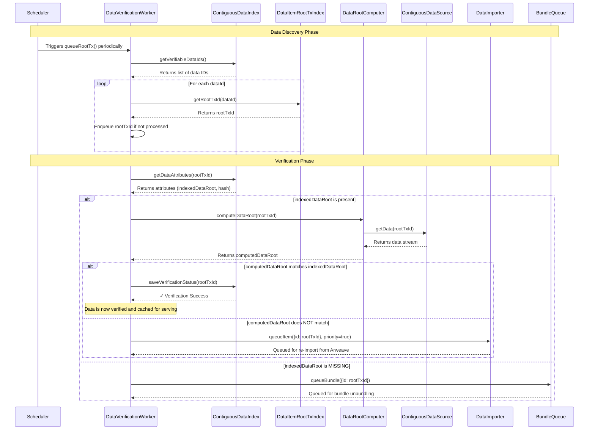

import { Database, Cpu, Server, Cog } from 'lucide-react';

Ar.io gateways verify that retrieved and cached data matches what was committed to Arweave. Verification helps users receive authentic, uncorrupted data without trusting a single gateway operator.

Gateway data verification is one layer of ar.io's broader verification architecture. For how gateway verification composes with signed response claims, client-side verification, and OIP accountability, see [Verification and Accountability](/learn/verification).

## How Gateways Verify Data

Data verification uses Arweave data roots, hashes, and Merkle proofs to check that cached data matches what was originally stored. A gateway can verify data before serving it or re-import data when verification fails:

```mermaid
sequenceDiagram
    participant Scheduler
    participant Worker as DataVerificationWorker
    participant ContigIndex as ContiguousDataIndex
    participant RootTxIndex as DataItemRootTxIndex
    participant DataRootComp as DataRootComputer
    participant DataSource as ContiguousDataSource
    participant Importer as DataImporter
    participant Bundler as BundleQueue

    Note over Scheduler,Bundler: Data Discovery Phase
    Scheduler->>Worker: Triggers queueRootTx() periodically
    Worker->>ContigIndex: getVerifiableDataIds()
    ContigIndex-->>Worker: Returns list of data IDs
    
    loop For each dataId
        Worker->>RootTxIndex: getRootTxId(dataId)
        RootTxIndex-->>Worker: Returns rootTxId
        Worker->>Worker: Enqueue rootTxId if not processed
    end

    Note over Scheduler,Bundler: Verification Phase
    Worker->>ContigIndex: getDataAttributes(rootTxId)
    ContigIndex-->>Worker: Returns attributes (indexedDataRoot, hash)

    alt indexedDataRoot is present
        Worker->>DataRootComp: computeDataRoot(rootTxId)
        DataRootComp->>DataSource: getData(rootTxId)
        DataSource-->>DataRootComp: Returns data stream
        DataRootComp-->>Worker: Returns computedDataRoot

        alt computedDataRoot matches indexedDataRoot
            Worker->>ContigIndex: saveVerificationStatus(rootTxId)
            ContigIndex-->>Worker: ✓ Verification Success
            Note over Worker: Data is now verified and cached for serving
        else computedDataRoot does NOT match
            Worker->>Importer: queueItem({id: rootTxId}, priority=true)
            Importer-->>Worker: Queued for re-import from Arweave
        end
    else indexedDataRoot is MISSING
        Worker->>Bundler: queueBundle({id: rootTxId})
        Bundler-->>Worker: Queued for bundle unbundling
    end
```

**The Verification Workflow:**

At a high level, verification moves through discovery, retrieval, cryptographic computation, comparison, and recovery:

**1. Discovery Phase**
- Periodically scan for unverified data items
- Priority-based queue management (higher priority items first)
- Track retry attempts for failed verifications

**2. Data Retrieval**
- Fetch data attributes from gateway storage
- Retrieve the complete data stream
- Gather metadata needed for verification

**3. Cryptographic Computation**
- Calculate Merkle data root from actual data stream
- Generate cryptographic proofs using the same algorithm as Arweave
- Create verifiable hash chains

**4. Root Comparison**
- Compare computed root against indexed root in database
- Verify data hasn't been corrupted or altered
- Validate chunk integrity against Merkle proofs

**5. Action Based on Results**
- **Success**: Mark data as verified with timestamp
- **Failure**: Trigger re-import from Arweave or unbundle from parent
- **Error**: Increment retry counter and requeue for later

## Verification Types

Ar.io gateways handle different types of data verification based on the data's origin:

### Transaction Data Verification
For individual Arweave transactions:
- **Direct root validation** against transaction data roots stored onchain
- **Complete data reconstruction** from chunks to ensure availability
- **Cryptographic proof** that data matches what was originally stored

### Bundle Data Verification
For ANS-104 data bundles (collections of data items):
- **Bundle integrity checks** to verify the container is valid
- **Individual item verification** within each bundle
- **Recursive unbundling** when verification fails to re-extract items
- **Nested bundle support** for bundles containing other bundles

### Chunk-Level Validation
At the most granular level:
- **Merkle proof validation** for individual data chunks
- **Sequential integrity** ensuring chunks form complete data
- **Parallel verification** of multiple chunks for performance

## Why Verification Matters

### Cryptographic Trust Foundation
- **Mathematical Proof**: Merkle tree cryptography provides irrefutable proof of data integrity
- **Independent Validation**: Multiple gateways verify the same data independently

### Data Integrity Guarantees
- **Tamper Detection**: Any alteration to data is immediately detectable
- **Corruption Recovery**: Automatic healing of corrupted data through re-import

### Gateway Reliability
- **Continuous Monitoring**: Ongoing verification catches issues before users encounter them
- **Self-Healing System**: Automatic recovery mechanisms maintain data availability
- **Transparent Operations**: Verification status and timestamps provide audit trails

## Explore Gateway Systems

<Cards>
  <Card 
    title="Data Retrieval" 
    description="Learn how gateways fetch data from multiple sources with verification"
    href="/learn/gateways/data-retrieval"
    icon={<Database className="w-8 h-8" />}
  />
  <Card 
    title="Gateway Architecture" 
    description="Understand the technical architecture behind verification systems"
    href="/learn/gateways/architecture"
    icon={<Cpu className="w-8 h-8" />}
  />
  <Card 
    title="Run Your Own Gateway" 
    description="Set up a gateway with built-in verification capabilities"
    href="/build/run-a-gateway/quick-start"
    icon={<Server className="w-8 h-8" />}
  />
  <Card 
    title="Gateway Configuration" 
    description="Configure verification settings and optimization options"
    href="/build/run-a-gateway/manage/filters"
    icon={<Cog className="w-8 h-8" />}
  />
</Cards>
