AR.IO gateways continuously verify that data chunks are correctly stored and retrievable from Arweave. This ensures users receive authentic, uncorrupted data with cryptographic proof of integrity. The verification system is what makes AR.IO gateways trustworthy data providers for the permaweb.

## How Gateways Verify Data

Data verification is an ongoing process that uses Merkle tree cryptography to provide mathematical proof of data integrity. The process involves multiple specialized components working together to ensure cached data matches what's stored on Arweave:

```mermaid
sequenceDiagram
    participant Scheduler
    participant Worker as DataVerificationWorker
    participant ContigIndex as ContiguousDataIndex
    participant RootTxIndex as DataItemRootTxIndex
    participant DataRootComp as DataRootComputer
    participant DataSource as ContiguousDataSource
    participant Importer as DataImporter
    participant Bundler as BundleQueue

    Note over Scheduler,Bundler: Data Discovery Phase
    Scheduler->>Worker: Triggers queueRootTx() periodically
    Worker->>ContigIndex: getVerifiableDataIds()
    ContigIndex-->>Worker: Returns list of data IDs
    
    loop For each dataId
        Worker->>RootTxIndex: getRootTxId(dataId)
        RootTxIndex-->>Worker: Returns rootTxId
        Worker->>Worker: Enqueue rootTxId if not processed
    end

    Note over Scheduler,Bundler: Verification Phase
    Worker->>ContigIndex: getDataAttributes(rootTxId)
    ContigIndex-->>Worker: Returns attributes (indexedDataRoot, hash)

    alt indexedDataRoot is present
        Worker->>DataRootComp: computeDataRoot(rootTxId)
        DataRootComp->>DataSource: getData(rootTxId)
        DataSource-->>DataRootComp: Returns data stream
        DataRootComp-->>Worker: Returns computedDataRoot

        alt computedDataRoot matches indexedDataRoot
            Worker->>ContigIndex: saveVerificationStatus(rootTxId)
            ContigIndex-->>Worker: ✓ Verification Success
            Note over Worker: Data is now verified and cached for serving
        else computedDataRoot does NOT match
            Worker->>Importer: queueItem({id: rootTxId}, priority=true)
            Importer-->>Worker: Queued for re-import from Arweave
        end
    else indexedDataRoot is MISSING
        Worker->>Bundler: queueBundle({id: rootTxId})
        Bundler-->>Worker: Queued for bundle unbundling
    end
```

**The Verification Workflow:**

Gateways achieve verification through a systematic five-phase process orchestrated by the DataVerificationWorker. This process ensures that every piece of cached data cryptographically matches its original form on Arweave, providing mathematical proof of integrity before serving data to users.

**1. Discovery Phase**
- Periodically scan for unverified data items
- Priority-based queue management (higher priority items first)
- Track retry attempts for failed verifications

**2. Data Retrieval**
- Fetch data attributes from gateway storage
- Retrieve the complete data stream
- Gather metadata needed for verification

**3. Cryptographic Computation**
- Calculate Merkle data root from actual data stream
- Generate cryptographic proofs using the same algorithm as Arweave
- Create verifiable hash chains

**4. Root Comparison**
- Compare computed root against indexed root in database
- Verify data hasn't been corrupted or altered
- Validate chunk integrity against Merkle proofs

**5. Action Based on Results**
- **Success**: Mark data as verified with timestamp
- **Failure**: Trigger re-import from Arweave or unbundle from parent
- **Error**: Increment retry counter and requeue for later

## Verification Types

AR.IO gateways handle different types of data verification based on the data's origin:

### Transaction Data Verification
For individual Arweave transactions:
- **Direct root validation** against transaction data roots stored on-chain
- **Complete data reconstruction** from chunks to ensure availability
- **Cryptographic proof** that data matches what was originally stored

### Bundle Data Verification
For ANS-104 data bundles (collections of data items):
- **Bundle integrity checks** to verify the container is valid
- **Individual item verification** within each bundle
- **Recursive unbundling** when verification fails to re-extract items
- **Nested bundle support** for bundles containing other bundles

### Chunk-Level Validation
At the most granular level:
- **Merkle proof validation** for individual data chunks
- **Sequential integrity** ensuring chunks form complete data
- **Parallel verification** of multiple chunks for performance

## Why Verification Matters

### Cryptographic Trust Foundation
- **Mathematical Proof**: Merkle tree cryptography provides irrefutable proof of data integrity
- **Independent Validation**: Multiple gateways verify the same data independently
- **Network Consensus**: Distributed verification creates trust without central authority

### Data Integrity Guarantees
- **Tamper Detection**: Any alteration to data is immediately detectable
- **Corruption Recovery**: Automatic healing of corrupted data through re-import
- **Permanent Storage Validation**: Ensures Arweave's permanence promise is maintained

### Gateway Reliability
- **Continuous Monitoring**: Ongoing verification catches issues before users encounter them
- **Self-Healing System**: Automatic recovery mechanisms maintain data availability
- **Transparent Operations**: Verification status and timestamps provide audit trails

### Building Trust in the Permaweb
The verification system is fundamental to AR.IO's mission of providing reliable access to permanent data. By ensuring every piece of data served has been cryptographically verified against its original form on Arweave, gateways become trustworthy bridges between users and the permaweb.

## Future Enhancements

The verification system is designed for extensibility:
- **External Validators**: Plugin support for custom verification logic
- **Selective Re-verification**: Targeted verification of specific data sets
- **Enhanced Monitoring**: Real-time dashboards and alerts for verification status
- **Cross-Gateway Validation**: Shared verification results across the network

---

Data verification works seamlessly with other gateway functions to ensure reliable access to permanent data. Learn more about [Data Indexing](/learn/gateways/data-indexing) and [Data Retrieval](/learn/gateways/data-retrieval) capabilities.
