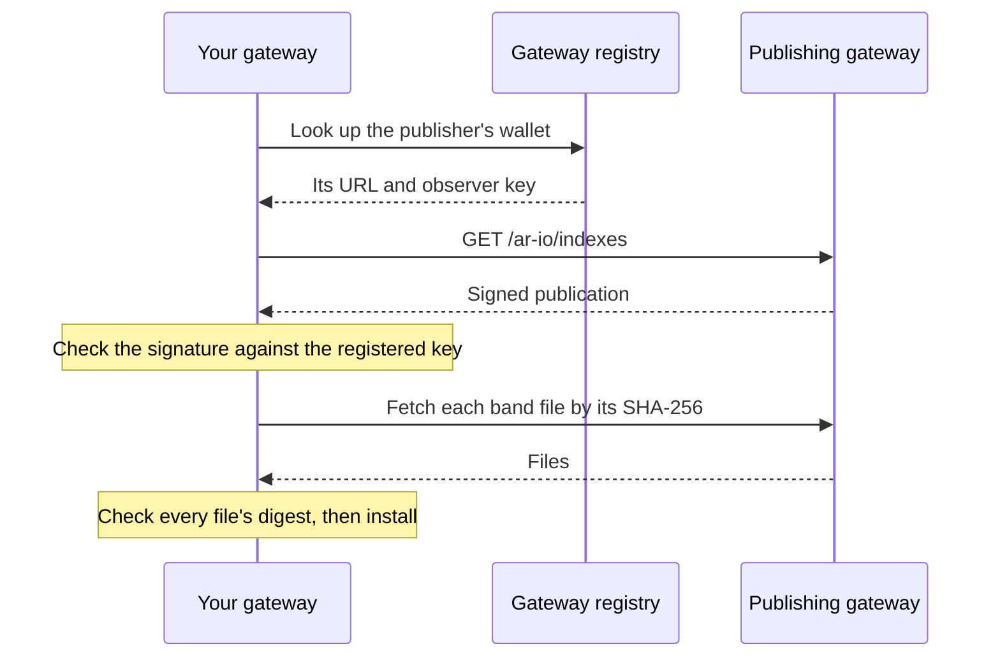

import { Card, Cards } from "fumadocs-ui/components/card";
import { Server, Code, ShieldCheck } from "lucide-react";

Most data on Arweave today is uploaded as **data items**, packed many at a time into bundles. To serve one, a gateway first has to answer a question: *which Arweave transaction holds this item, and where inside it?* A gateway that can't answer locally has to ask other gateways or search the network, which is slow and often fails.

**Index Sharing** lets gateways share the answer. A gateway that has built a good index publishes it; other gateways download it and answer lookups in milliseconds. Because every piece is signed and hashed, a gateway can use another gateway's index without trusting that gateway's server.

## How it works

### Bands

An index is split into **bands**, each covering a range of block heights: older bands rarely change, while the band at the chain tip is rebuilt as new data arrives. A subscriber downloads only the bands it doesn't have, installs the newest first (most lookups are for recent data), and replaces a band without ever pausing lookups.

### The publication

A publisher serves one signed document at `/ar-io/indexes`, listing every band and every file in it, with each file's size and SHA-256. The document is signed with the gateway's **registered observer key**, the same key it uses for [observation](/learn/oip), so anyone can check who signed it against the [gateway registry](/learn/gateways/gateway-registry).

### What a subscriber checks

Before a single byte is used, a subscriber confirms that:

1. The publication is signed by the key the registry lists for that publisher's wallet
2. It names that same publisher
3. It isn't older than one already seen, so a cache or mirror can't roll it back
4. Every file matches the SHA-256 the signed publication names
5. Every band is a well-formed index

A server in between, whether a mirror, a CDN or a cache, can delay or withhold files, but it can't change them without being caught.

### Files are content-addressed

Each band file can be fetched by its SHA-256 (`/ar-io/indexes/blob/<sha256>`). The address can never change meaning, so those responses are safe for any cache to keep, and the same file can come from any server that has it.

## What Index Sharing is not

- **It doesn't replace data verification.** An index says where an item lives; the gateway still [verifies the data itself](/learn/gateways/data-verification) when it serves it.
- **It isn't storage.** Bands are indexes, about 20 GB for the whole chain, not the data they point to.
- **It isn't one provider.** Any registered gateway can publish. turbo-gateway.com publishes a complete root transaction index today, and subscribers can follow more than one publisher.

## Where to next

<Cards>
  <Card
    title="Set up Index Sharing"
    href="/build/run-a-gateway/manage/index-sharing"
    icon={<Server className="w-6 h-6" />}
  >
    Subscribe your gateway to a publisher, or publish your own indexes.
  </Card>
  <Card
    title="Reading shared indexes"
    href="/build/advanced/index-publications"
    icon={<Code className="w-6 h-6" />}
  >
    Verify a publication and look up an ID from any client, step by step.
  </Card>
  <Card
    title="Data Verification"
    href="/learn/gateways/data-verification"
    icon={<ShieldCheck className="w-6 h-6" />}
  >
    How gateways verify the data they serve.
  </Card>
</Cards>
