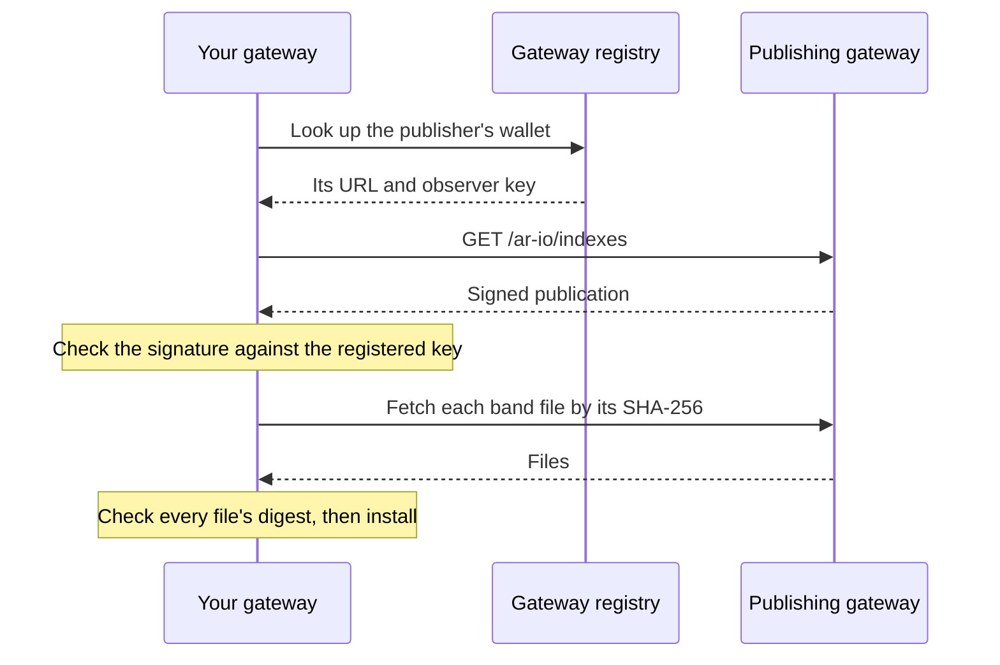
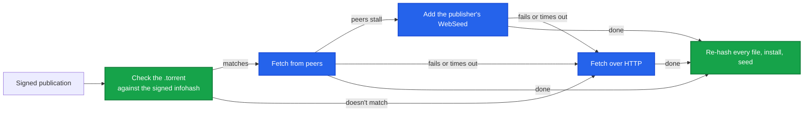

import { Card, Cards } from "fumadocs-ui/components/card";
import { Server, Code, Download, ShieldCheck } from "lucide-react";

Most data on Arweave today is uploaded as **data items**, packed many at a time into bundles. To serve one, a gateway first has to answer a question: *which Arweave transaction holds this item, and where inside it?*

A gateway that can't answer locally has to ask other gateways or search the network, which is slow and often fails.

**Index Sharing** lets gateways share the answer. A gateway that has built a good index publishes it; other gateways download it and answer lookups in milliseconds. Because every piece is signed and hashed, a gateway can use another gateway's index without trusting that gateway's server.

For an operator, that means data items resolve from local disk instead of a round trip to other gateways or GraphQL. The answer often includes the item's byte offsets, which lets the gateway fetch and verify just that item. It is optional and off by default: a gateway turns it on with one setup script, for about 21 GB of disk.

## How It Works

```mermaid
sequenceDiagram
    participant Sub as Your gateway
    participant Reg as Gateway registry
    participant Pub as Publishing gateway

    Sub->>Reg: Look up the publisher's wallet
    Reg-->>Sub: Its URL and observer key
    Sub->>Pub: GET /ar-io/indexes
    Pub-->>Sub: Signed publication
    Note over Sub: Check the signature against the registered key
    Sub->>Pub: Fetch each band file by its SHA-256
    Pub-->>Sub: Files
    Note over Sub: Check every file's digest, then install
```

### Bands

An index is split into **bands**, each covering a range of block heights: older bands rarely change, while the band at the chain tip is rebuilt as new data arrives. A subscriber downloads only the bands it doesn't have, installs the newest first (most lookups are for recent data), and replaces a band without ever pausing lookups.

There are two kinds of band. A **root-TX band** is a [CDB64 index](/build/run-a-gateway/manage/cdb64) that maps a data item to the transaction holding it; this is the kind a gateway loads and answers lookups from. From Release 85, which is not released yet, a publisher can also offer **L1 bands**: the Arweave base layer (blocks, transactions, tags and wallets) in Parquet. A gateway doesn't serve from them. A new gateway imports its L1 index from them instead of indexing the chain block by block, and apps query them in place for analytics.

### The Publication

A publisher serves one signed **publication** at `/ar-io/indexes`, listing every band and every file in it, with each file's size and SHA-256. It is signed with the gateway's **registered observer key**, the same key it uses for [observation](/learn/oip), so anyone can check who signed it against the [gateway registry](/learn/gateways/gateway-registry).

### What a Subscriber Checks

Before a single byte is used, a subscriber confirms that:

1. The publication is signed by the key the registry lists for that publisher's wallet
2. It names that same publisher
3. It isn't older than one already seen, so a cache or mirror can't roll it back
4. Every file matches the SHA-256 the signed publication names
5. Every band is a well-formed index

A server in between, whether a mirror, a CDN or a cache, can delay or withhold files, but it can't change them without being caught.

### Files Are Content-Addressed

Each band file can be fetched by its SHA-256 (`/ar-io/indexes/blob/<sha256>`). The address can never change meaning, so those responses are safe for any cache to keep, and the same file can come from any server that has it.

## Bands over BitTorrent

Because every file is checked against the signed publication, it doesn't matter who delivers the bytes. That makes peer-to-peer delivery safe, and gateways that run the optional torrent engine move bands over **BitTorrent**. Without the engine, everything moves over HTTP as shown above.

### Why BitTorrent

Over HTTP, every subscriber downloads every band from the publisher, so the publisher's upload grows with each gateway that subscribes, and publishers rate-limit and charge ([x402](/learn/gateways/x402-payments)) for those downloads like any data. Over BitTorrent, subscribers also serve each other. A new band reaches the network once from the publisher and then spreads between peers, so the publisher's cost stays roughly flat as more gateways subscribe, and subscribers download from peers for free. That is what lets a large index be shared across the network without one gateway carrying all of it.

### How a Band Moves

```mermaid
flowchart LR
    A[Signed publication] --> T[Check the .torrent<br/>against the signed infohash]
    T -- matches --> B[Fetch from peers]
    T -- doesn't match --> D
    B -- peers stall --> C[Add the publisher's WebSeed]
    B -- fails or times out --> D[Fetch over HTTP]
    C -- fails or times out --> D
    B -- done --> E[Re-hash every file, install, seed]
    C -- done --> E
    D -- done --> E

    classDef source fill:#2563eb,stroke:#1d4ed8,stroke-width:2px,color:#fff
    classDef process fill:#16a34a,stroke:#15803d,stroke-width:2px,color:#fff

    class B,C,D source
    class T,E process
```

1. **Peers first.** A publisher offers each band as a torrent and seeds it. A subscriber downloads the band from whichever gateways already hold it. Nobody charges for peer transfers.
2. **The WebSeed, only when peers stall.** If nothing arrives for a while, the subscriber also turns on the publisher's **WebSeed**, an HTTP address that serves the same bytes to a torrent client. It is subject to the publisher's rate limits and payments, so it is used only when peers are not delivering.
3. **HTTP as the fallback.** If the engine is down, errors, or makes no progress for too long, the band is fetched over HTTP instead, in the same poll.
4. **Every subscriber seeds.** Once a band is installed, the subscriber seeds it too, however it arrived. The more gateways subscribe, the less any one publisher has to upload.

Seeding is part of turning the engine on, and it costs the seeder upload bandwidth, so every node bounds it: by default 10 MB/s and 100 GB a day. A gateway that would rather not upload at all subscribes over HTTP only.

### Publishers of the Same Bytes Share One Swarm

A band's torrent is built only from its files: their names, sizes and digests. Nothing about the publisher goes in, not even the band's id. So two gateways publishing the same bytes produce the same torrent, with the same **infohash** (the torrent's identifier), and their subscribers all join one swarm.

### What a Subscriber Trusts

A `.torrent` file isn't signed, so a subscriber trusts only the infohashes in the signed publication and re-hashes every file against its signed SHA-256, exactly as over HTTP. [Bands as Torrents](/build/advanced/index-publications#bands-as-torrents) shows these checks.

The torrent engine runs isolated from the rest of the gateway: it can't reach the gateway's other services, and it can't change the bands the gateway serves. A publisher also runs a **closed tracker** that helps peers find each other and answers only for the bands it offers. Peers find one another without it too, through the BitTorrent DHT and peer exchange.

## What Index Sharing Is Not

- **It doesn't replace data verification.** An index says where an item lives; the gateway still [verifies the data itself](/learn/gateways/data-verification) when it serves it.
- **It isn't storage.** Bands are indexes, not the data they point to: about 21 GB for the root-TX index turbo-gateway.com publishes.
- **It isn't complete.** An index answers only for the bundles its publisher indexed, and the band at the chain tip is rebuilt periodically, so the newest items aren't in it yet. A miss costs nothing: the gateway falls back to its usual lookup.
- **It isn't one provider.** Any registered gateway can publish. The turbo-gateway.com gateway publishes a root transaction index today, and subscribers can follow more than one publisher.
- **BitTorrent isn't required.** It is an optional transport. A gateway without the torrent engine publishes and subscribes over HTTP.

## Explore Index Sharing

<Cards>
  <Card
    title="Set Up Index Sharing"
    description="Subscribe your gateway to a publisher, or publish your own indexes, over HTTP or BitTorrent"
    href="/build/run-a-gateway/manage/index-sharing"
    icon={<Server className="w-8 h-8" />}
  />
  <Card
    title="Reading Shared Indexes"
    description="Verify a publication and look up an ID from any client, step by step"
    href="/build/advanced/index-publications"
    icon={<Code className="w-8 h-8" />}
  />
  <Card
    title="Downloading Indexes with BitTorrent"
    description="Take a copy of a band with qBittorrent or aria2 and check it against the signature"
    href="/build/advanced/bittorrent-indexes"
    icon={<Download className="w-8 h-8" />}
  />
  <Card
    title="Data Verification"
    description="How gateways verify the data they serve"
    href="/learn/gateways/data-verification"
    icon={<ShieldCheck className="w-8 h-8" />}
  />
</Cards>
