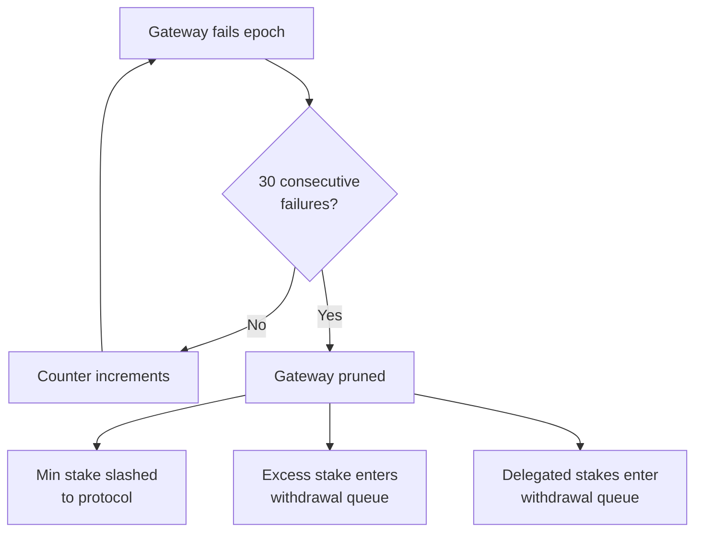

## Overview

The ar.io network uses an automated pruning mechanism to remove gateways that consistently fail to meet performance standards. This ensures network quality by removing unreliable infrastructure and returning slashed stake to the protocol balance.

## How Pruning Works

A gateway is pruned when it **fails observation for 30 consecutive epochs** (approximately 30 days). When pruned:

1. **100% of minimum stake is slashed** — the minimum 10,000 ARIO stake is returned to the protocol balance
2. **Gateway is removed** from the GatewayRegistry
3. **Excess operator stake** enters the standard withdrawal process (90-day delay)
4. **Delegated stakes** enter the standard withdrawal process — delegators can claim after the delay or use expedited withdrawal

## Failure Tracking

Each gateway's consecutive failure count is tracked on-chain in the Gateway PDA:

- **Pass**: Counter resets to 0
- **Fail**: Counter increments by 1
- **30 consecutive failures**: Triggers automatic pruning via the `prune_gateway` instruction

The `prune_gateway` instruction is permissionless — anyone can call it once the failure threshold is reached.

## Impact on Delegators

When a gateway is pruned, delegators' stakes are not slashed — only the operator's minimum stake is affected. Delegated stakes enter the standard 90-day withdrawal process, and delegators can:

- **Wait for withdrawal**: Tokens are released after the 90-day delay
- **Expedited withdrawal**: Pay a fee (50% → 10% linear decay over 90 days) to receive tokens immediately
- **Claim from leaving gateway**: Use the `claim_delegate_from_leaving_gateway` instruction

## Prevention

Gateway operators can avoid pruning by:

- **Maintaining uptime**: Ensure the gateway is accessible and responding to health checks
- **Correct ArNS resolution**: Verify that the gateway correctly resolves ArNS names
- **Observer wallet**: Ensure the observer wallet is funded with SOL and submitting observations
- **Monitoring**: Use the [Gateway Portal](https://gateways.ar.io) to track performance metrics and consecutive failure count
