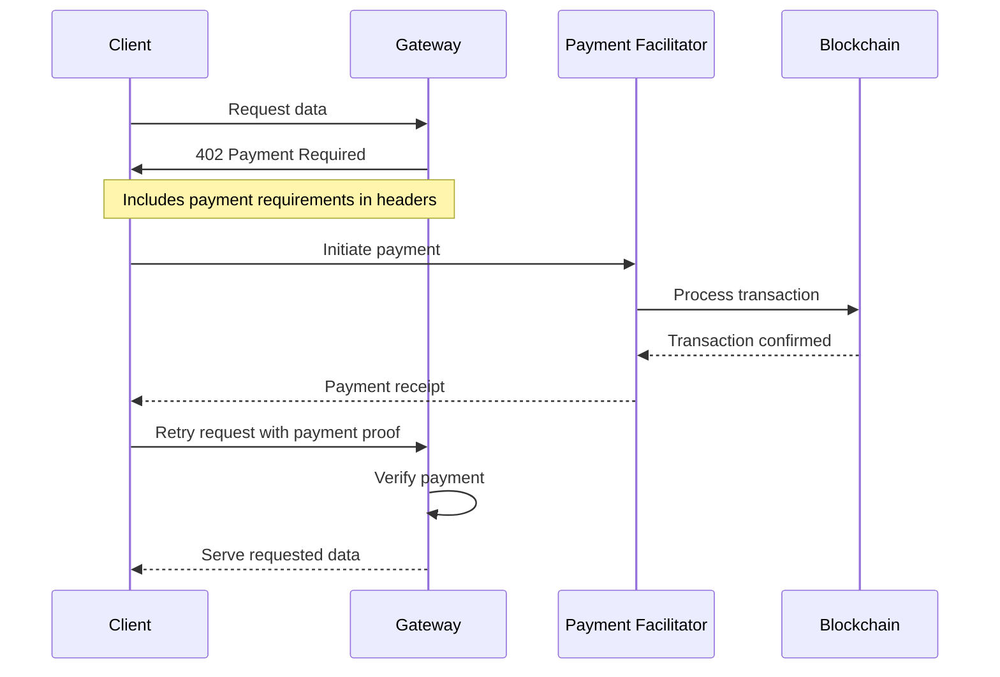

import { CreditCard, Shield, Zap, Globe } from "lucide-react";

Ar.io gateways integrate the x402 payment protocol to enable frictionless cryptocurrency payments for data access. This creates a sustainable monetization model that allows gateways to cover infrastructure costs while providing premium access tiers for users who need higher bandwidth or priority service.

## What is x402?

**x402** is an open-source payment protocol built by Coinbase that leverages the HTTP 402 "Payment Required" status code to enable frictionless cryptocurrency payments for web APIs. The protocol is designed to eliminate traditional friction points in web payments:

### Key Features

- **Zero protocol fees**: No intermediaries or payment processing costs
- **Fast settlement**: Payments settle in approximately 2 seconds
- **Minimal integration**: Simple HTTP status codes and headers
- **Privacy-focused**: No account creation or personal information required
- **Chain-agnostic**: Works with multiple blockchain networks
- **Token-agnostic**: Supports various cryptocurrencies

### How x402 Works

The x402 protocol uses a simple HTTP-based flow:

## ar.io Gateway Integration

Ar.io gateways implement x402 using **USDC (USD Coin) on the Base blockchain** to monetize data egress with per-byte pricing. This integration works seamlessly with the gateway's rate limiting system to provide a complete traffic management and monetization solution.

### Payment Flow in ar.io Gateways

1. **Free Tier Access**: Users consume regular tokens from their rate limit buckets
2. **Rate Limit Exceeded**: When limits are reached, gateway sends 402 Payment Required response
3. **Payment Processing**: Users can make USDC payments to continue access
4. **Premium Access**: Payments add paid tokens with configurable multiplier (default 10x capacity)
5. **Priority Consumption**: Regular tokens consumed first, then paid tokens
6. **Resource Bypass**: Paid requests bypass per-resource limits (only IP limits apply)

### Browser Paywall & Onramp Integration

For mainnet deployments, gateways can integrate Coinbase Onramp to enable easy USDC purchases directly in the browser paywall. This requires Coinbase Developer Platform (CDP) API keys, which are separate from payment facilitator authentication. The Onramp integration allows users to purchase USDC without leaving the gateway interface, creating a seamless payment experience.

**Note**: CDP keys are optional for testnet but required for mainnet when using Coinbase facilitators. These keys enable the browser-based purchasing experience and are not related to payment verification or settlement.

## Network Options

Ar.io gateways support two Base blockchain networks for x402 payments:

| Feature                 | Base Sepolia (Testnet)            | Base (Mainnet)                    |
| ----------------------- | --------------------------------- | --------------------------------- |
| **USDC**                | Free testnet USDC (faucet)        | Real USDC (costs money)           |
| **CDP API Key**         | Not required                      | Required for official facilitator |
| **Default Facilitator** | https://x402.org/facilitator      | Must configure                    |
| **Use Case**            | Development, testing              | Production monetization           |
| **Configuration**       | `X_402_USDC_NETWORK=base-sepolia` | `X_402_USDC_NETWORK=base`         |

## Rate Limited Endpoints

The x402 payment system applies to data egress endpoints where gateways serve actual content:

### Data Serving Endpoints

- **Transaction/Data Item requests**: `/:txid` and `/:txid/path`
- **Raw data requests**: `/raw/:txid`
- **ArNS resolved content**: All requests resolved through ArNS names
- **Farcaster frames**: `/local/farcaster/frame/:txid`
- **Chunk requests**: `GET /chunk/:offset` (uses fixed size pricing)

### Not Rate Limited

- GraphQL queries (`/graphql`)
- Chunk POST requests (`POST /chunk`)
- Administrative endpoints (`/ar-io/*`)

## Benefits for Gateway Operators

### Sustainable Infrastructure

- **Cost Recovery**: Monetize data egress to cover operational expenses
- **Premium Services**: Offer higher bandwidth tiers for power users
- **Flexible Pricing**: Per-byte pricing scales with actual usage
- **Revenue Generation**: Create sustainable business models

### Traffic Management

- **Fair Access**: Free tier for casual users with reasonable limits
- **Premium Access**: Power users can pay for additional capacity
- **DDoS Protection**: Rate limiting prevents abuse while allowing legitimate paid access
- **Resource Optimization**: Paid requests bypass resource limits for better performance

## Benefits for Users

### Frictionless Payments

- **No Account Required**: Payments work without registration or OAuth
- **Fast Settlement**: 2-second payment confirmation
- **Privacy Preserved**: No personal information collection
- **Transparent Pricing**: Clear per-byte costs with minimum/maximum limits

### Flexible Access

- **Free Tier**: Reasonable free access for casual users
- **Pay-as-you-go**: Only pay when you need additional capacity
- **Predictable Costs**: Clear pricing structure with configurable limits
- **Multiple Payment Methods**: Browser-based and programmatic payment options

## Use Cases

### Content Delivery Networks

- **Media Streaming**: Monetize high-bandwidth video and audio content
- **File Downloads**: Charge for large file transfers
- **API Access**: Premium API tiers with higher rate limits

### Developer Platforms

- **Data APIs**: Monetize access to indexed blockchain data
- **Archive Services**: Charge for historical data retrieval
- **Real-time Feeds**: Premium access to live data streams

### Enterprise Services

- **Bulk Data Access**: Corporate clients paying for high-volume access
- **Priority Support**: Premium service tiers with guaranteed performance
- **Custom Limits**: Tailored rate limits for specific use cases

## Explore Gateway Monetization

<Cards>
  <Card
    title="Gateway Architecture"
    description="Understand the technical foundation that enables payment integration"
    href="/learn/gateways/architecture"
    icon={<Shield className="w-8 h-8" />}
  />
  <Card
    title="Data Retrieval"
    description="Learn how gateways serve data that can be monetized"
    href="/learn/gateways/data-retrieval"
    icon={<Globe className="w-8 h-8" />}
  />
  <Card
    title="Run a Gateway"
    description="Deploy your own gateway with payment capabilities"
    href="/build/run-a-gateway"
    icon={<Zap className="w-8 h-8" />}
  />
  <Card
    title="Gateway Registry"
    description="Join the network and participate in the gateway ecosystem"
    href="/learn/gateways/gateway-registry"
    icon={<CreditCard className="w-8 h-8" />}
  />
</Cards>
