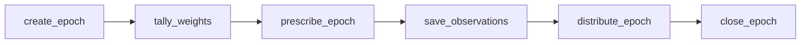

## Overview

On Solana, the ar.io epoch lifecycle is broken into 6 discrete, permissionless steps. Unlike the previous single atomic `tick()` operation on AO, each step is a separate Solana instruction that can be executed by anyone — no special permissions required.

All steps are **idempotent** (safe to run multiple times) and **permissionless** (anyone can crank them). This design ensures the protocol cannot be halted by a single point of failure.

## Pipeline Steps

### 1. create_epoch

**Initializes the epoch account and computes the reward rate.**

- Creates the Epoch PDA for the new epoch index
- Computes the epoch reward allocation from the protocol balance
- Reward rate follows a linear decay: 0.1% per epoch → 0.05% over epochs 365–547

### 2. tally_weights

**Batched computation of gateway weights for observer selection.**

- Processes up to 15 gateways per transaction
- Computes a 4-factor composite weight for each gateway:
  - **Stake weight**: Based on total stake (operator + delegated)
  - **Tenure weight**: Based on how long the gateway has been in the network
  - **Gateway performance**: Based on pass rate across recent epochs
  - **Observer performance**: Based on observation submission history
- Multiple transactions are needed to tally all gateways

### 3. prescribe_epoch

**Selects observers and prescribed ArNS names via weighted roulette.**

- Selects up to 50 observers using weighted random selection
- Entropy source: `SHA256(slot || epoch_index || timestamp)`
- Collision handling: 10× retry multiplier (up to 500 iterations)
- Selects 2 prescribed ArNS names that all observers must test

### 4. save_observations

**Observers submit their pass/fail observation reports.**

- Each selected observer submits a bitmap of pass/fail results for tested gateways
- This is the only step that requires a specific signer (the selected observer)
- Observations are stored on the Epoch account

### 5. distribute_epoch

**Batched reward distribution to gateways and their delegates.**

- Processes up to 15 gateways per transaction
- Functional gateways receive the Base Gateway Reward (BGR)
- Functional observers receive the Base Observer Reward (BOR)
- Deficient observers who are functional gateways have their reward reduced by 25%
- Operator rewards auto-compound into operator stake
- Delegate rewards are tracked via the reward-per-share accumulator (settled lazily)
- Leaving gateways receive 0 rewards

### 6. close_epoch

**Reclaims rent from old epoch accounts.**

- Can only be called for epochs that are 7+ epochs old
- Recovers the SOL rent from the Epoch PDA account
- Keeps on-chain state lean over time

## Timing

Each epoch lasts **24 hours** (86,400 seconds). The pipeline steps can be executed at any time during or after the epoch:

| Step | When | Batched? |
|------|------|----------|
| create_epoch | After previous epoch ends | No |
| tally_weights | After create_epoch | Yes (15/tx) |
| prescribe_epoch | After all weights tallied | No |
| save_observations | During observation window | No (per observer) |
| distribute_epoch | After observation window | Yes (15/tx) |
| close_epoch | After 7+ epochs | No |

## Cost

Running the full epoch pipeline costs approximately **0.000155 SOL** per epoch (~$0.02), or roughly **$0.70/month** at current SOL prices. This makes it economically trivial for anyone to participate.

## Who Cranks?

See the [Cranker](/learn/oip/cranker) documentation for details on the permissionless cranker bot that automates the epoch pipeline.
