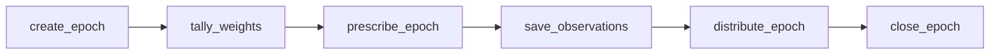

## Overview

On Solana, the ar.io epoch lifecycle is broken into six discrete, permissionless steps. Each step is a separate instruction that can be executed by anyone.

All steps are **idempotent** (safe to run multiple times) and **permissionless** (anyone can crank them). This design ensures the protocol cannot be halted by a single point of failure.

## Pipeline Steps



### 1. create_epoch

**Initializes the epoch account and computes the reward rate.**

- Creates the epoch account
- Computes the epoch reward allocation from the protocol balance

### 2. tally_weights

**Batched computation of gateway weights for observer selection.**

- Computes composite weights for gateways:
  - **Stake weight**: Based on total stake (operator + delegated)
  - **Tenure weight**: Based on how long the gateway has been in the network
  - **Gateway performance**: Based on pass rate across recent epochs
  - **Observer performance**: Based on observation submission history
- Batches work so large gateway sets can be processed safely on Solana

### 3. prescribe_epoch

**Selects observers and prescribed ArNS names via weighted roulette.**

- Selects observers using weighted random selection
- Selects prescribed ArNS names that observers use as common test targets

### 4. save_observations

**Observers submit their pass/fail observation reports.**

- Each selected observer submits compact pass/fail results for tested gateways
- This is the only step that requires a specific signer (the selected observer)
- Observations are stored on the Epoch account

### 5. distribute_epoch

**Batched reward distribution to gateways and their delegates.**

- Functional gateways receive the Base Gateway Reward (BGR)
- Functional observers receive the Base Observer Reward (BOR)
- Deficient observers do not receive observer rewards
- Operator rewards auto-compound into operator stake
- Delegate rewards are tracked via the reward-per-share accumulator (settled lazily)
- Leaving gateways receive 0 rewards

### 6. close_epoch

**Reclaims rent from completed epoch accounts.**

- Recovers SOL rent from completed epoch accounts
- Keeps onchain state lean over time

## Timing

The pipeline steps can be executed as the epoch progresses:

| Step | When | Batched? |
|------|------|----------|
| create_epoch | After previous epoch ends | No |
| tally_weights | After create_epoch | Yes |
| prescribe_epoch | After all weights tallied | No |
| save_observations | During observation window | No (per observer) |
| distribute_epoch | After observation window | Yes |
| close_epoch | After epoch state is no longer needed | No |

## Who Cranks?

A cranker is a permissionless actor that executes the epoch pipeline on Solana. Since Solana programs cannot execute on a timer, an external wallet must call each instruction to advance the epoch lifecycle.

The key property is that cranking is **permissionless**: any wallet with SOL for transaction fees can run it. No ARIO tokens, gateway registration, or special authorization is required.

Without crankers, the epoch pipeline would stall. Observations would not be prescribed, rewards would not be distributed, and completed epoch state would not be closed. Multiple independent crankers provide redundancy so the network is not dependent on a single operator.

Cranking can run as a standalone bot that watches epoch state and submits whichever pipeline instruction is needed next. It can also be embedded directly in ar.io observers:

```bash
# In your observer's .env file
ENABLE_EPOCH_CRANKING=true
```

Multiple crankers can run at the same time without coordination. The first successful transaction advances the pipeline, and later attempts see that the step is already complete. Because the instructions are idempotent, duplicate calls do not double-distribute rewards or corrupt epoch state.
