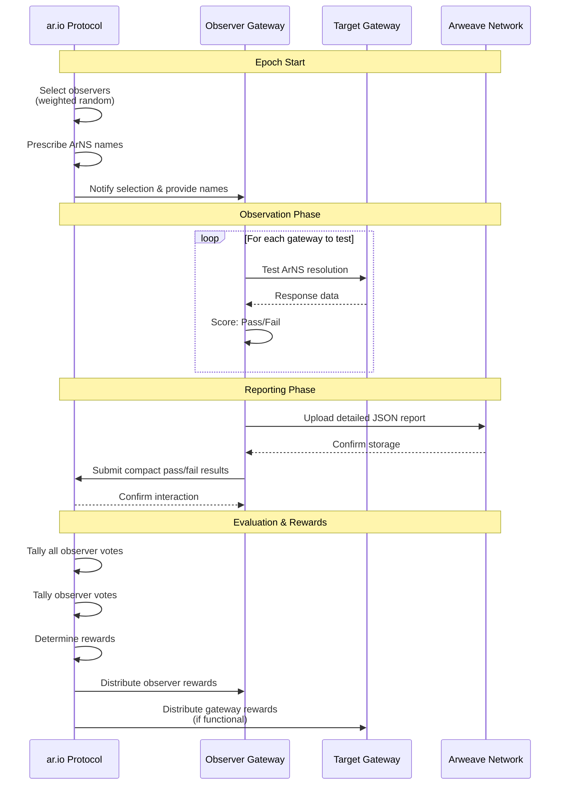

import { Card, Cards } from "fumadocs-ui/components/card";
import { Target, BarChart, FileText, Coins } from "lucide-react";

## Overview

The Observation and Incentive Protocol (OIP) helps maintain gateway quality through peer monitoring and performance-based rewards. Gateways are incentivized to serve data reliably while also acting as observers that evaluate their peers.

The protocol runs in epochs. During each epoch, selected gateways observe other gateways, submit reports, and participate in an onchain pass/fail voting process. Functional gateways and observers become eligible for ARIO rewards, while deficient gateways and observers miss rewards and can lose future selection weight.

## Architecture Overview

The protocol follows a repeatable flow:

```mermaid
sequenceDiagram
    participant SC as ar.io Protocol
    participant OBS as Observer Gateway
    participant GW as Target Gateway
    participant AR as Arweave Network

    Note over SC,AR: Epoch Start
    SC->>SC: Select observers<br/>(weighted random)
    SC->>SC: Prescribe ArNS names
    SC->>OBS: Notify selection & provide names

    Note over SC,AR: Observation Phase
    loop For each gateway to test
        OBS->>GW: Test ArNS resolution
        GW-->>OBS: Response data
        OBS->>OBS: Score: Pass/Fail
    end
    Note over SC,AR: Reporting Phase
    OBS->>AR: Upload detailed JSON report
    AR-->>OBS: Confirm storage
    OBS->>SC: Submit compact pass/fail results
    SC-->>OBS: Confirm interaction

    Note over SC,AR: Evaluation & Rewards
    SC->>SC: Tally all observer votes
    SC->>SC: Tally observer votes
    SC->>SC: Determine rewards
    SC->>OBS: Distribute observer rewards
    SC->>GW: Distribute gateway rewards<br/>(if functional)
```

## Epoch Cycle

Each epoch follows a structured process with specific responsibilities for gateways and observers:

### Epoch Start

- **ar.io protocol**: Selects observers using weighted random selection
- **ar.io protocol**: Prescribes common ArNS names for observers to test
- **Selected Observers**: Receive notification of selection and prescribed names

### Observation Phase

- **Observers**: Test assigned gateways for ArNS resolution and response quality
- **Observers**: Document pass/fail findings and failure reasons
- **Target Gateways**: Respond to resolution requests and serve the requested content

### Reporting Phase

- **Observers**: Upload detailed JSON reports to Arweave for transparency
- **Observers**: Submit compact onchain pass/fail results for consensus voting

### Evaluation and Distribution

- **ar.io protocol**: Tallies observer votes to classify gateways
- **ar.io protocol**: Distributes rewards based on performance
- **Functional Gateways/Observers**: Become eligible for ARIO rewards

## Key Features

- **Decentralized Monitoring**: Peer-to-peer evaluation ensures no single point of failure
- **Consensus-Based Scoring**: Observer submissions determine gateway functionality
- **Performance Incentives**: Only functional gateways and observers receive ARIO token rewards
- **Transparent Accountability**: All reports permanently stored on Arweave and viewable at [gateways.ar.io](https://gateways.ar.io)
- **Sustainable Funding**: Protocol balance funded by ArNS name purchases, aligning rewards with network usage

## What Observers Evaluate

Observer criteria can evolve over time without requiring every detail to live in the protocol itself. At a high level, observers evaluate whether gateways can:

- Resolve prescribed ArNS names correctly
- Return expected transaction IDs and response data
- Serve data with acceptable availability and responsiveness
- Produce reports that can be independently inspected by users and applications

---

**View Live Data**: See current observers and performance metrics at [gateways.ar.io](https://gateways.ar.io)

## Explore the Protocol

<Cards>
  <Card
    title="Observer Selection"
    description="Learn how gateways are chosen as observers using weighted criteria"
    href="/learn/oip/observer-selection"
    icon={<Target className="w-8 h-8" />}
  />
  <Card
    title="Performance Evaluation"
    description="Understand how observer results affect gateway standing"
    href="/learn/oip/performance-evaluation"
    icon={<BarChart className="w-8 h-8" />}
  />
  <Card
    title="Reporting System"
    description="Explore observer responsibilities and report submission"
    href="/learn/oip/reporting"
    icon={<FileText className="w-8 h-8" />}
  />
  <Card
    title="Reward Distribution"
    description="Learn how rewards flow to functional gateways and observers"
    href="/learn/oip/reward-distribution"
    icon={<Coins className="w-8 h-8" />}
  />
</Cards>
