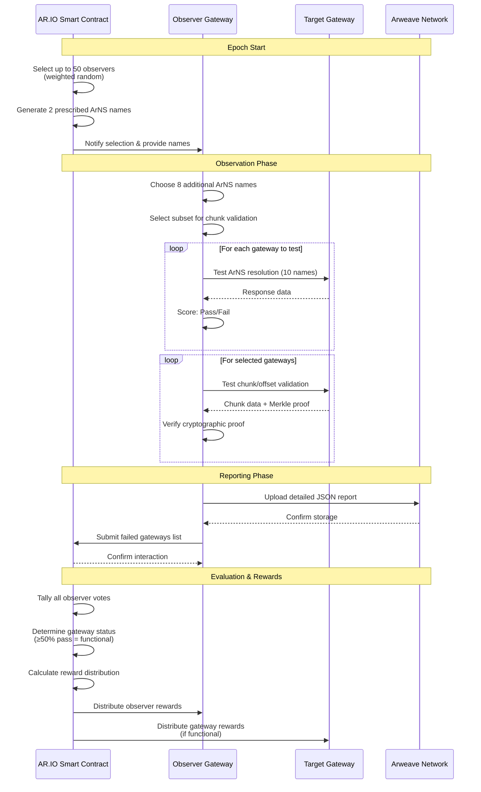

import { Card, Cards } from "fumadocs-ui/components/card";
import { Target, BarChart, FileText, Coins } from "lucide-react";

## Overview

The Observation and Incentive Protocol ensures network quality through peer monitoring and performance-based rewards. Gateways are incentivized to maintain high performance while also serving as "observers" that evaluate their peers' ArNS resolution capabilities and data integrity verification.

The protocol operates on **24-hour epochs** where up to 50 gateways are selected as observers to test other gateways against ArNS name resolution criteria and chunk/offset validation. This creates a self-regulating ecosystem with transparent, consensus-based performance evaluation.

## Architecture Overview

The Observer Protocol operates through a systematic process where selected gateways monitor their peers and report findings to maintain network quality:

## Epoch Cycle and Responsibilities

Each 24-hour epoch follows a structured process with specific responsibilities for gateways and observers:

### Epoch Start

- **Smart Contract**: Selects up to 50 observers using weighted random selection
- **Smart Contract**: Generates 2 prescribed ArNS names for all observers to test
- **Selected Observers**: Receive notification of selection and prescribed names

### Observation Phase

- **Observers**: Choose 8 additional ArNS names to test (total of 10 names per gateway)
- **Observers**: Select subset of gateways for chunk/offset validation based on sampling rate
- **Observers**: Test assigned gateways for ArNS resolution, wallet ownership, content hashes, and response times
- **Observers**: Validate chunk/offset data integrity using cryptographic Merkle proofs
- **Target Gateways**: Respond to resolution requests, serve content, and provide chunk data with proofs

### Reporting Phase

- **Observers**: Upload detailed JSON reports to Arweave for transparency
- **Observers**: Submit failed gateway lists to the AR.IO Smart Contract for consensus voting

### Evaluation and Distribution

- **Smart Contract**: Tallies all observer votes (≥50% pass = functional gateway)
- **Smart Contract**: Distributes rewards at epoch end based on performance
- **Functional Gateways/Observers**: Receive ARIO token rewards automatically

## Key Features

- **Decentralized Monitoring**: Peer-to-peer evaluation ensures no single point of failure
- **Consensus-Based Scoring**: Majority rule (≥50% pass votes) determines gateway functionality
- **Performance Incentives**: Only functional gateways and observers receive ARIO token rewards
- **Data Integrity Validation**: Cryptographic verification of chunk/offset data using Merkle proofs
- **Transparent Accountability**: All reports permanently stored on Arweave and viewable at [gateways.ar.io](https://gateways.ar.io)
- **Sustainable Funding**: Protocol balance funded by ArNS name purchases, aligning rewards with network usage

## Chunk/Offset Validation

The protocol includes advanced data integrity verification through chunk/offset observation. Observers validate that gateways can correctly serve and verify Arweave data chunks using cryptographic proofs:

### Validation Process

- **Sampling**: A subset of gateways is selected for chunk validation each epoch
- **Offset Testing**: Random offsets within the stable weave range are tested
- **Merkle Proof Verification**: Cryptographic validation ensures chunk authenticity
- **Binary Search Optimization**: Efficient transaction lookup using cached metadata

### Technical Implementation

- **Chunk Retrieval**: `GET /chunk/{offset}` returns chunk data and Merkle proof
- **Proof Validation**: Uses Arweave's `validatePath()` function for cryptographic verification
- **Performance Optimization**: LRU caching for blocks, transactions, and metadata
- **Early Stopping**: Tests stop immediately upon first successful validation

---

**View Live Data**: See current observers and performance metrics at [gateways.ar.io](https://gateways.ar.io)

## Explore the Protocol

<Cards>
  <Card
    title="Observer Selection"
    description="Learn how gateways are chosen as observers using weighted criteria and entropy"
    href="/learn/oip/observer-selection"
    icon={<Target className="w-8 h-8" />}
  />
  <Card
    title="Performance Evaluation"
    description="Understand vote tallying, consensus mechanisms, and weight calculations"
    href="/learn/oip/performance-evaluation"
    icon={<BarChart className="w-8 h-8" />}
  />
  <Card
    title="Reporting System"
    description="Explore observer responsibilities for dual-channel submission to Arweave"
    href="/learn/oip/reporting"
    icon={<FileText className="w-8 h-8" />}
  />
  <Card
    title="Reward Distribution"
    description="Learn about reward formulas, funding mechanisms, and penalty structures"
    href="/learn/oip/reward-distribution"
    icon={<Coins className="w-8 h-8" />}
  />
</Cards>
