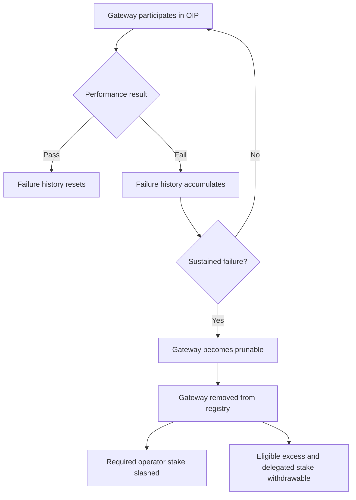

## Overview

Gateway pruning is the mechanism that removes gateways that continue to fail network performance checks. It helps keep the Gateway Address Registry focused on infrastructure that is reachable, useful, and aligned with the network's quality expectations.

Pruning is based on OIP performance results. A gateway is not removed for a single bad result, but sustained failure can make it eligible for removal.

## How Pruning Works

When a gateway remains deficient for a sustained period:

1. **The gateway becomes prunable** after repeated failed observations.
2. **A permissionless instruction can remove it** from the Gateway Address Registry.
3. **The operator's required network-join stake is slashed** to the protocol balance.
4. **Eligible excess and delegated stake follow the normal withdrawal process** instead of being slashed.

## Impact on Operators

Pruning is designed to make gateway operation economically accountable. Operators are expected to keep their gateways online, correctly configured, able to resolve ArNS names, and able to participate in observation duties when selected.

When a gateway is pruned, the operator loses the required stake associated with joining the network. Any eligible excess stake follows the normal withdrawal flow.

## Impact on Delegators

Delegated stake is not the target of pruning slashing. If a gateway is pruned, delegated stake follows the normal withdrawal process for leaving gateways. Delegators should still monitor gateway performance because pruning can interrupt reward eligibility and require withdrawal or redelegation decisions.

## Prevention

Gateway operators can reduce pruning risk by:

- Maintaining reliable uptime and public reachability
- Keeping ArNS resolution working correctly
- Monitoring OIP performance results and gateway health
- Funding the observer wallet with SOL for required transaction fees
- Reviewing gateway status in [gateways.ar.io](https://gateways.ar.io)

## Related Concepts

- [Gateway Registry](/learn/gateways/gateway-registry)
- [Observation and Incentive Protocol](/learn/oip)
- [Staking](/learn/oip/staking)
