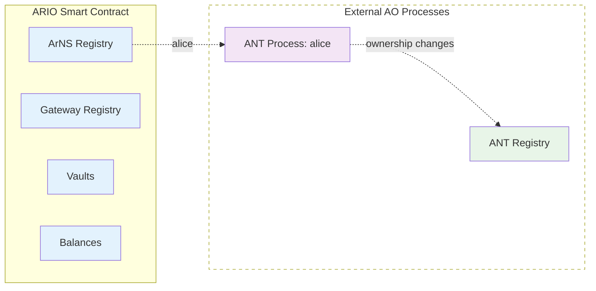

## ARIO Contract Architecture

The $ARIO token operates through a smart contract built on AO Computer. The system is composed of several interconnected components that work together to provide a comprehensive network infrastructure.

## Core Components

### Balances
The Balances component manages the fundamental token accounting for the ARIO ecosystem:

- **Token Holdings**: Tracks ARIO token balances for all network participants
- **Transfer Logic**: Handles secure token transfers between addresses
- **Paginated Queries**: Provides efficient balance lookups with cursor-based pagination
- **Integration Layer**: Connects with all other components for balance updates

### Gateway Registry
The Gateway Registry manages the network's infrastructure providers and all delegation relationships:

- **Gateway Management**: Handles gateway registration, settings updates, and network participation
- **Operator Stakes**: Manages gateway operator stakes and minimum staking requirements
- **Delegated Stakes**: Coordinates delegated stake from token holders to gateway operators
- **Performance Tracking**: Monitors gateway performance metrics and eligibility for rewards

### ArNS Registry
The ArNS (Arweave Name System) Registry provides decentralized domain name services:

- **Name Registration**: Manages the purchase and registration of friendly names
- **Lease Management**: Handles name renewals and lease extensions
- **Primary Names**: Allows users to set primary names for their addresses
- **ANT Integration**: Links registered names to their corresponding ANT processes

### Vaults
The Vaults component implements token time-locking mechanisms for various ecosystem purposes:

- **Multi-Purpose Locking**: Locks tokens for RFPs, bug bounties, investors, and core team members
- **Flexible Terms**: Supports various lock periods and amounts based on purpose and requirements
- **Extension Options**: Allows participants to extend vault lock periods when needed
- **Withdrawal Logic**: Manages secure token release after lock expiration or completion of terms

## System Processes

### ANT Registry Process
A utility process that facilitates ANT discovery and management:

- **Discovery Service**: Makes it easy to find ANTs owned by specific wallet addresses
- **Ownership Tracking**: Provides efficient lookup of ANT ownership relationships
- **Integration Support**: Connects with wallets and dApps for seamless ANT management
- **Query Interface**: Enables paginated queries for ANT discovery

### ArNS Name Tokens (ANTs)
Transferable token processes that represent ownership and control of ArNS names:

- **Name Ownership**: Each ANT process controls a specific ArNS name
- **Record Management**: ANT holders manage DNS-like records for their names
- **Undername Control**: Support for creating and managing subdomains (undernames)
- **Transferable Rights**: ANTs can be bought, sold, and transferred as independent tokens
- **Process-Based**: Each ANT is its own AO process with autonomous functionality

## Security Model

The architecture implements multiple layers of security:

### Economic Security
- **Stake Requirements**: Minimum stakes ensure operator commitment and skin in the game
- **Performance-Based Removal**: Gateways that fail observation for 30 consecutive epochs are removed from the network
- **Complete Stake Slashing**: 100% of stake is returned to the protocol balance when gateways are removed for poor performance
- **Observation Consensus**: Peer-to-peer monitoring ensures no single point of failure in performance evaluation

### Technical Security
- **AO Computer**: Leverages Arweave's permanent and decentralized compute layer
- **Process Isolation**: Separate processes for different system functions
- **Cryptographic Verification**: All transactions and state changes are cryptographically secured

### Governance Security
- **Current Ownership**: Currently owned by a multisig with intentions to make ownership immutable
- **Path to Immutability**: Plans to transition to fully immutable protocol without governance control
- **Transparent Operations**: All system state is publicly verifiable on Arweave
- **Consensus-Based Evaluation**: Gateway performance determined by peer consensus rather than centralized authority
