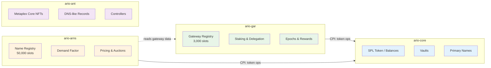

## ARIO Program Architecture

The ARIO protocol operates through four Solana programs (3+1) that work together via cross-program invocation (CPI). This architecture consolidates what was previously spread across separate processes into a coordinated set of programs with clear responsibilities.

```mermaid
graph LR

    subgraph CORE["ario-core"]
        direction TB
        BAL[SPL Token / Balances]
        VAULTS[Vaults]
        PRIMARY[Primary Names]
    end

    subgraph GAR["ario-gar"]
        direction TB
        GW_REG[Gateway Registry<br/>3,000 slots]
        STAKING[Staking & Delegation]
        EPOCHS[Epochs & Rewards]
    end

    subgraph ARNS["ario-arns"]
        direction TB
        NAME_REG[Name Registry<br/>50,000 slots]
        DEMAND[Demand Factor]
        PRICING[Pricing & Auctions]
    end

    subgraph ANT["ario-ant"]
        direction TB
        NFT[Metaplex Core NFTs]
        RECORDS[DNS-like Records]
        CTRL[Controllers]
    end

    GAR -->|CPI: token ops| CORE
    ARNS -->|CPI: token ops| CORE
    ARNS -.->|reads gateway data| GAR

    classDef coreProgram fill:#e3f2fd
    classDef garProgram fill:#e8f5e8
    classDef arnsProgram fill:#fff3e0
    classDef antProgram fill:#f3e5f5

    class BAL,VAULTS,PRIMARY coreProgram
    class GW_REG,STAKING,EPOCHS garProgram
    class NAME_REG,DEMAND,PRICING arnsProgram
    class NFT,RECORDS,CTRL antProgram
```

## Programs

### ario-core

The core program manages the ARIO SPL Token, vaults, and primary names:

- **SPL Token Operations**: ARIO is a standard SPL Token (6 decimals, 1 ARIO = 1,000,000 mARIO). Transfers, balances, and token accounts follow the SPL Token standard.
- **Vaults**: Time-locked token deposits for various purposes — RFPs, bounties, and ecosystem programs. Minimum size: 100 ARIO. Duration: 14 days to 200 years.
- **Primary Names**: Maps a Solana wallet address to a single ArNS name for easy identification. Fee: 0.2 ARIO × demand factor.

Other programs (ario-gar, ario-arns) call into ario-core via CPI for all token operations.

### ario-gar (Gateway Address Registry)

Manages the network's gateway infrastructure, staking, delegation, and the epoch reward pipeline:

- **Gateway Registry**: A zero-copy on-chain registry with up to 3,000 gateway slots. Each gateway is a PDA storing operator address, stake, observer address, settings, and performance stats.
- **Staking & Delegation**: Operator stakes, delegated stakes (separate PDA per gateway-delegator pair), withdrawals, redelegation, and allowlists.
- **Observer Address Uniqueness**: An ObserverLookup PDA enforces that no two gateways share the same observer address.
- **Epoch Pipeline**: A 6-step permissionless pipeline driven by [cranker bots](/learn/oip/cranker):
  1. `create_epoch` — Initialize epoch, compute reward rate
  2. `tally_weights` — Batched weight computation (15 gateways per transaction)
  3. `prescribe_epoch` — Select observers and prescribed names via weighted roulette
  4. `save_observations` — Observers submit pass/fail reports
  5. `distribute_epoch` — Batched reward distribution (15 gateways per transaction)
  6. `close_epoch` — Reclaim rent after 7+ epochs
- **Gateway Pruning**: Gateways that fail 30 consecutive epochs have 100% of their minimum stake slashed and are removed from the network.

### ario-arns (ArNS Registry)

Manages the Ar.io Name System — name registration, leasing, pricing, and returned names:

- **Name Registry**: A zero-copy on-chain registry with up to 50,000 name slots. Each name is an ArnsRecord PDA storing the owner, ANT mint address, lease type, and expiration.
- **Pricing**: Dynamic pricing via a DemandFactor PDA. Fee halving occurs when the demand factor stays at minimum (0.5×) for 7 consecutive periods.
- **Returned Name Auctions**: When a name expires or is released, it enters a Dutch auction: 50× → 1× base price over 14 days, with a 50/50 revenue split between protocol and previous owner.
- **Validation**: 43-character names are prohibited (Arweave TX ID collision prevention). Names must be lowercase at submission.
- **Cost Simulation**: `get_token_cost` view instruction available via `simulateTransaction` for fee estimation.

### ario-ant (Arweave Name Tokens)

ANTs are [Metaplex Core](https://developers.metaplex.com/core) NFTs that represent ownership of ArNS names:

- **NFT Standard**: Each ANT is a Metaplex Core asset — tradeable on Tensor, Magic Eden, and other NFT marketplaces.
- **DNS-like Records**: Each ANT stores routing records (AntRecord PDAs) mapping undernames to Arweave transaction IDs or IPFS CIDs, with configurable TTL values.
- **Controllers**: Up to 10 controllers per ANT can manage records without holding the NFT itself.
- **Lazy Reconciliation**: When an ANT is transferred via a marketplace (outside the ar.io protocol), controllers are cleared on the next write operation, ensuring the new owner has full control.
- **@ Record**: The root (@) record cannot be removed, only updated — ensuring the name always resolves.

## State Model

All protocol state is stored in Solana accounts using Program Derived Addresses (PDAs):

| Account Type | Program | Derivation Seeds | Purpose |
|-------------|---------|-----------------|---------|
| ArioConfig | ario-core | `["config"]` | Global token configuration |
| Vault | ario-core | `["vault", owner, vault_id]` | Time-locked token deposit |
| PrimaryName | ario-core | `["primary_name", name_hash]` | Name → address mapping |
| PrimaryNameReverse | ario-core | `["primary_name_reverse", owner]` | Address → name reverse lookup |
| GatewayRegistry | ario-gar | `["gateway_registry"]` | Zero-copy gateway slot array |
| Gateway | ario-gar | `["gateway", operator]` | Individual gateway state |
| Delegation | ario-gar | `["delegation", gateway, delegator]` | Per-pair delegation |
| Withdrawal | ario-gar | `["withdrawal", owner, id]` | Pending withdrawal |
| ObserverLookup | ario-gar | `["observer_lookup", observer]` | Observer uniqueness check |
| Epoch | ario-gar | `["epoch", epoch_index]` | Epoch state and rewards |
| NameRegistry | ario-arns | `["name_registry"]` | Zero-copy name slot array |
| ArnsRecord | ario-arns | `["arns_record", name_hash]` | Individual name record |
| DemandFactor | ario-arns | `["demand_factor"]` | Current pricing multiplier |
| AntConfig | ario-ant | `["ant_config", mint]` | ANT metadata and settings |
| AntControllers | ario-ant | `["ant_controllers", mint]` | Controller list (max 10) |
| AntRecord | ario-ant | `["ant_record", mint, undername_hash]` | DNS-like routing record |

## Security Model

The architecture implements multiple layers of security:

### Economic Security
- **Stake Requirements**: Minimum 10,000 ARIO to join as a gateway operator
- **Performance-Based Pruning**: Gateways that fail observation for 30 consecutive epochs are removed with 100% of minimum stake slashed
- **Observation Consensus**: Peer-to-peer monitoring ensures no single point of failure

### Technical Security
- **Solana Runtime**: Enforces signer authentication, account ownership, and rent exemption
- **PDA Isolation**: Each account type has deterministic seeds preventing collision or unauthorized access
- **Audited Code**: Independent security audit with all findings addressed
- **CPI Guards**: Cross-program invocations validate calling program identity

### Governance Security
- **Current Ownership**: Managed by a Squads v4 multisig
- **Path to Immutability**: Plans to transition to fully immutable protocol
- **Transparent State**: All on-chain state is publicly verifiable via any Solana RPC or explorer
