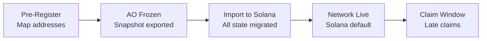

## AO to Solana Migration

The ar.io network has migrated protocol execution from AO (Arweave compute) to Solana. This guide explains how the migration works and what actions you need to take.

<Callout type="info">
Specific dates, claim app URLs, and final program addresses will be updated as the migration progresses. Check back for the latest information.
</Callout>

## Overview

The migration follows an **import-then-claim** approach:

1. **Pre-registration**: Users map their Arweave/Ethereum addresses to Solana wallet addresses before cutover
2. **Snapshot**: AO state is frozen and exported
3. **Import**: All state (balances, stakes, names, gateways, ANTs) is imported to Solana programs
4. **Claim**: Users who didn't pre-register can claim their tokens via a claim app within the claim window

## What Happens to Your Assets

### ARIO Token Balances
- If you pre-registered your Solana address, your ARIO balance is imported directly to your Solana wallet as SPL Tokens
- If you didn't pre-register, your tokens are held in escrow and can be claimed via the claim app

### ArNS Names
- All registered ArNS names are migrated to the Solana NameRegistry
- ANTs become Metaplex Core NFTs on Solana
- Name routing (pointing to Arweave Transaction IDs) is preserved
- Records and undernames are migrated to AntRecord PDAs

### Gateway Registrations
- Gateway operator registrations are imported to the Solana GatewayRegistry
- Stake amounts are preserved
- Delegated stakes are migrated as individual Delegation PDAs
- Observer addresses must be updated to Solana pubkeys

### Vaults
- All active vaults are imported to Solana with their lock periods preserved

## Address Mapping

To map your existing address to a Solana wallet:

<Steps>
  <Step>
    ### Create a Solana Wallet

    Set up a Solana wallet using [Phantom](https://phantom.app), [Solflare](https://solflare.com), or [Backpack](https://backpack.app). See our [Wallet Setup Guide](/learn/token/wallets).
  </Step>

  <Step>
    ### Sign an Attestation

    Sign a data item with your Arweave or Ethereum key that maps to your Solana public key. This creates an immutable proof on Arweave that you control both addresses.
  </Step>

  <Step>
    ### Verify Mapping

    Your address mapping will be included in the migration import. Verify your mapping is registered before the cutover date.
  </Step>
</Steps>

## What Changes

| Aspect | Before (AO) | After (Solana) |
|--------|-------------|----------------|
| **Token** | In-process Lua balance | SPL Token |
| **Wallets** | Arweave (RSA), Ethereum (ECDSA) | Solana (Ed25519) — Phantom, Solflare, Backpack |
| **Gas fees** | Abstracted | SOL required for Solana transaction fees |
| **ANTs** | Separate AO process per name | Metaplex Core NFTs (one program, many assets) |
| **Epochs** | Atomic `tick()` message | 6-step permissionless cranker pipeline |
| **State reads** | AO Compute Unit (CU) | Solana RPC + indexer |
| **SDK default** | AO backend | Solana backend (v3.23+) |

## What Stays the Same

- **ARIO supply**: 1 billion tokens, non-inflationary
- **Token decimals**: 6 (1 ARIO = 1,000,000 mARIO)
- **Minimum operator stake**: 10,000 ARIO
- **ArNS name routing**: Names still point to Arweave Transaction IDs
- **Gateway data serving**: Gateways still serve Arweave data
- **SDK API surface**: Same method names, Solana underneath

## Timeline

{/* TODO: Update with final dates */}

| Phase | Description |
|-------|-------------|
| **Pre-migration** | Claim app opens, users pre-register Solana addresses |
| **Cutover** | AO frozen, state exported and imported to Solana |
| **Network live** | Solana programs active, gateways and epochs operational |
| **Claim window** | Late claims accepted for unregistered users |

## FAQ

**Do I need to do anything if I pre-registered?**
No. Your balances, names, and stakes are automatically available in your Solana wallet after import.

**What if I miss the pre-registration window?**
You can still claim your tokens via the claim app during the claim window. Your assets are held in escrow until claimed.

**Do I need SOL?**
Yes. All Solana transactions require a small amount of SOL for fees. This is a new requirement — on AO, fees were abstracted.

**Will my ArNS names still work?**
Yes. Names continue to resolve through ar.io gateways. The routing records (pointing to Arweave data) are preserved exactly as they were.

**Can I still use the AO backend?**
The SDK supports an `--ao` flag for legacy AO backend access during the transition period.
