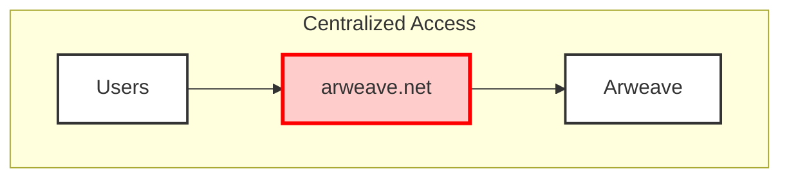
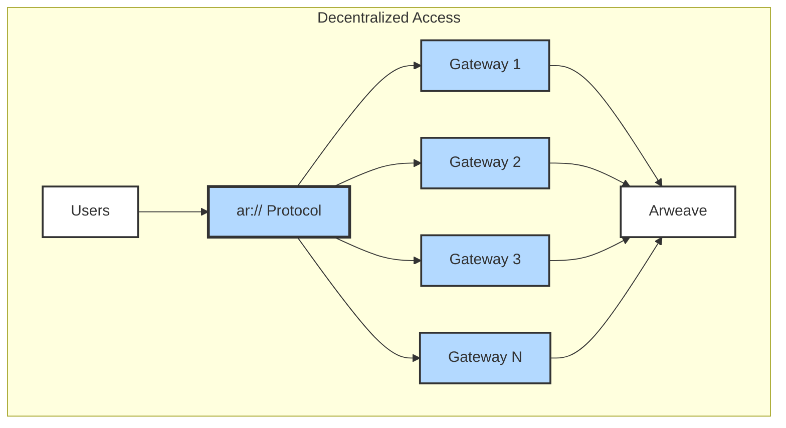
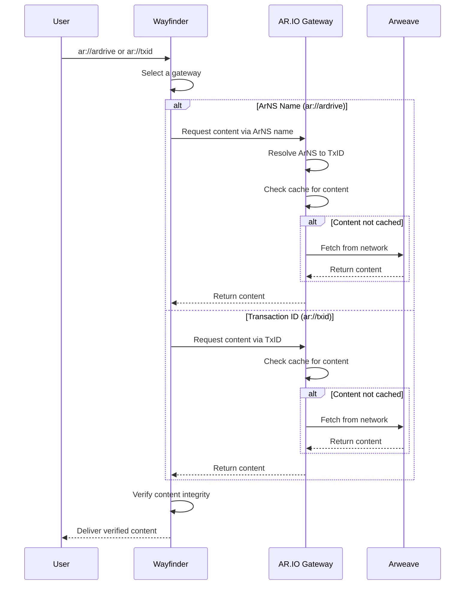

import { Card, Cards } from 'fumadocs-ui/components/card';
import { Code, Lightbulb, Network, Globe } from 'lucide-react';

## The Problem: Centralized Gateway Reliance

Today, most Arweave content is accessed through a single gateway: `arweave.net`. This creates a critical centralization risk:

- **Single point of failure** - If arweave.net goes down, content becomes inaccessible
- **Censorship vulnerability** - A single gateway can block or filter content
- **Performance bottlenecks** - All traffic flows through one gateway
- **No content verification** - Users must trust the gateway to serve authentic content

## What is Wayfinder?

The Wayfinder protocol solves these problems by enabling **decentralized access** to Arweave content through any gateway in the AR.IO network. It's a [URI scheme](https://wikipedia.org/wiki/Uniform_Resource_Identifier) that transforms centralized URLs like `https://arweave.net/txid` into decentralized `ar://` URLs that can be resolved by any participating gateway.

Key capabilities:
- **Multi-gateway routing** - Access content through any AR.IO gateway
- **Built-in verification** - Verify content authenticity regardless of which gateway serves it
- **Automatic failover** - If one gateway is down, requests route to another
- **User control** - Choose routing strategies based on speed, trust, or randomization

## How Wayfinder Works

The Wayfinder protocol consists of three core components that work together to resolve and serve Arweave content:



<div className="w-full text-center">vs.</div>



Wayfinder enables:
1. **Decentralized Routing**: Select from multiple gateways instead of relying on arweave.net
2. **Redundant Retrieval**: If one gateway fails, automatically failover to another
3. **Trust-minimized Verification**: Verify content authenticity regardless of which gateway serves it

### Transaction ID Resolution

To access content tied to an Arweave Transaction ID (TxId), simply append the TxId to `ar://`:

```
ar://qI19W6spw-kzOGl4qUMNp2gwFH2EBfDXOFsjkcNyK9A
```

Inputting this into a WayFinder-equipped browser will route your request through the right AR.IO Gateway, translating it as per your `Routing Method` settings.

### ArNS Name Resolution

Fetching content via an Arweave Name System (ArNS) name is straightforward. Attach the ArNS name to `ar://`:

```
ar://good-morning
```

The Wayfinder protocol, along with the WayFinder App, discerns between TxIds and ArNS names. Once the suitable `https://` request is formulated, the chosen gateway translates the ArNS name based on the ArNS aoComputer contract.

## Detailed Flow



## Why Decentralized Access Matters

### Resilience Against Censorship
With centralized gateways like arweave.net, content can be blocked or filtered at a single point. Wayfinder distributes access across multiple independent gateways, making censorship significantly more difficult.

### Always-Available Content
When arweave.net experiences downtime or congestion, all content becomes inaccessible. Wayfinder automatically routes around failed gateways, ensuring your content remains available.

### Trust Through Verification
Centralized gateways require blind trust - you can't verify if the content served matches what's stored on Arweave. Wayfinder includes built-in verification capabilities, allowing clients to cryptographically verify content authenticity from any gateway.

### Performance Through Competition
Multiple gateways create a competitive ecosystem where gateways optimize for speed and reliability. Users benefit from automatic routing to the fastest available gateway.

## Verification: Trust but Verify

Wayfinder supports content verification at multiple levels:

1. **Transaction verification** - Verify that content matches the requested transaction ID
2. **Data integrity checks** - Ensure content hasn't been tampered with during transmission
3. **Manifest validation** - For bundled content, verify all components are authentic
4. **ArNS resolution verification** - Confirm ArNS names resolve to the correct transaction IDs

This verification happens transparently, giving users confidence that they're receiving authentic Arweave content regardless of which gateway serves it.


## Explore Wayfinder

<Cards>
  <Card 
    title="Integration Methods" 
    description="Learn how to integrate Wayfinder in browsers and applications"
    href="/learn/wayfinder/integration"
    icon={<Code className="w-8 h-8" />}
  />
  <Card 
    title="Use Cases" 
    description="Discover practical applications and implementation examples"
    href="/learn/wayfinder/use-cases"
    icon={<Lightbulb className="w-8 h-8" />}
  />
  <Card 
    title="Gateway Registry" 
    description="Understand how gateways participate in the decentralized network"
    href="/learn/gateways/gateway-registry"
    icon={<Network className="w-8 h-8" />}
  />
  <Card 
    title="Access Data" 
    description="Start accessing Arweave content through multiple gateways"
    href="/build/access"
    icon={<Globe className="w-8 h-8" />}
  />
</Cards>
