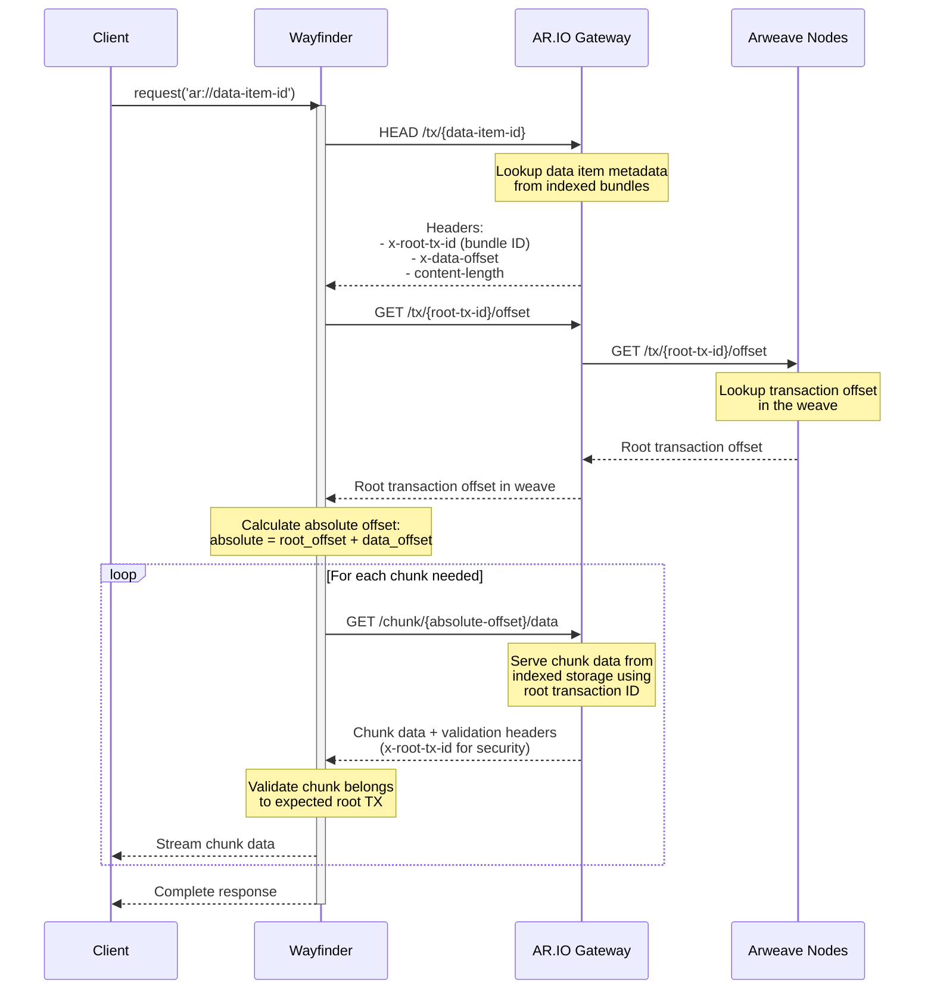

Wayfinder supports multiple data retrieval strategies to fetch transaction data from AR.IO gateways. These strategies determine how data is requested and assembled from the underlying storage layer.

| Strategy                          | Use Case                                    | Requirements                           |
| --------------------------------- | ------------------------------------------- | -------------------------------------- |
| `ContiguousDataRetrievalStrategy`| Standard data fetching via direct GET      | Gateway has the data cached or able to fetch from trusted peers         |
| `ChunkDataRetrievalStrategy`     | Chunk-based data assembly  | Gateway supports `/chunk/\<offset\>/data` endpoint (r58) and has requested transactions indexed |

#### ContiguousDataRetrievalStrategy

The default strategy that fetches data using a direct GET request to the gateway. This is the most straightforward approach and works for most use cases.

```javascript
import { Wayfinder, ContiguousDataRetrievalStrategy } from '@ar.io/wayfinder-core';

const wayfinder = new Wayfinder({
  dataRetrievalStrategy: new ContiguousDataRetrievalStrategy(),
});
```

#### ChunkDataRetrievalStrategy

An advanced strategy that provides the easiest way to load chunks stored on Arweave nodes via the robust chunk API provided by AR.IO gateways. This approach is particularly useful for:

- **Direct chunk access**: Efficiently retrieves data directly from the underlying chunk storage layer
- **Bundled data items**: Seamlessly fetches data items from within ANS-104 bundles using calculated offsets
- **x402 payment compatibility**: Both strategies support custom fetch clients for payment-enabled requests
- **Large file handling**: More reliable for large transactions that may time out with direct requests

**Requirements:**

- Gateway must support the `/chunk/\<offset\>/data` endpoint (added in [r58](https://github.com/ar-io/ar-io-node/releases/tag/r58))
- Gateway must have the requested transaction indexed (offsets are needed to fetch directly from chunks)

```javascript
import { Wayfinder, ChunkDataRetrievalStrategy } from '@ar.io/wayfinder-core';

const wayfinder = new Wayfinder({
  dataRetrievalStrategy: new ChunkDataRetrievalStrategy(),
});
```

**How it works:**

1. Makes a HEAD request to get transaction metadata (root transaction ID, data offset, content length)
2. Queries `/tx/{root-tx-id}/offset` to get the root transaction's absolute offset in the weave
3. Calculates the absolute offset for the requested data item
4. Fetches data in chunks using `/chunk/\<offset\>/data` and assembles the complete data stream
5. Validates that chunks belong to the expected root transaction for security

**Sequence Diagram:**



**Example with createWayfinderClient:**

```javascript
import { createWayfinderClient, ChunkDataRetrievalStrategy } from '@ar.io/wayfinder-core';

const wayfinder = createWayfinderClient({
  dataRetrievalStrategy: new ChunkDataRetrievalStrategy(),
});

// Fetch a data item from within an ANS-104 bundle
const response = await wayfinder.request('ar://data-item-id');
```

#### x402 Support

Both data retrieval strategies support custom fetch implementations, allowing you to use x402-enabled fetch clients for paid gateway requests.

```javascript
import { createWayfinderClient, ChunkDataRetrievalStrategy } from '@ar.io/wayfinder-core';
import { createX402Fetch } from '@ar.io/wayfinder-x402-fetch';

const x402Fetch = createX402Fetch({ /* payment config */ });

const wayfinder = createWayfinderClient({
  fetch: x402Fetch,
  dataRetrievalStrategy: new ChunkDataRetrievalStrategy({
    fetch: x402Fetch,
  }),
});
```