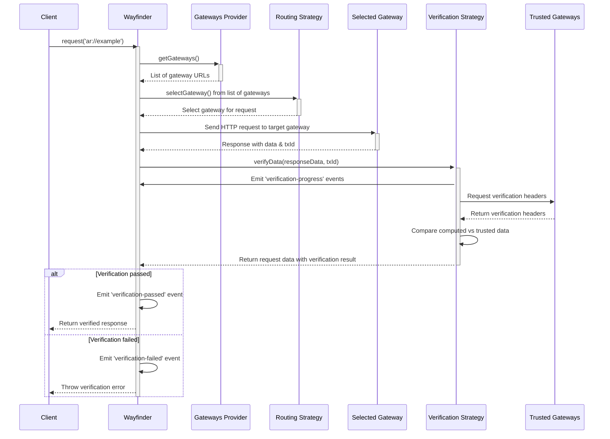

# Request Flow

The following sequence diagram illustrates how Wayfinder processes requests:

```mermaid
sequenceDiagram
    participant Client
    participant Wayfinder
    participant Gateways Provider
    participant Routing Strategy
    participant Selected Gateway
    participant Verification Strategy
    participant Trusted Gateways

    Client->>Wayfinder: request('ar://example')
    activate Wayfinder

    Wayfinder->>+Gateways Provider: getGateways()
    Gateways Provider-->>-Wayfinder: List of gateway URLs

    Wayfinder->>+Routing Strategy: selectGateway() from list of gateways
    Routing Strategy-->>-Wayfinder: Select gateway for request

    Wayfinder->>+Selected Gateway: Send HTTP request to target gateway
    Selected Gateway-->>-Wayfinder: Response with data & txId

    activate Verification Strategy
    Wayfinder->>+Verification Strategy: verifyData(responseData, txId)
    Verification Strategy->>Wayfinder: Emit 'verification-progress' events
    Verification Strategy->>Trusted Gateways: Request verification headers
    Trusted Gateways-->>Verification Strategy: Return verification headers
    Verification Strategy->>Verification Strategy: Compare computed vs trusted data
    Verification Strategy-->>-Wayfinder: Return request data with verification result

    alt Verification passed
        Wayfinder->>Wayfinder: Emit 'verification-passed' event
        Wayfinder-->>Client: Return verified response
    else Verification failed
        Wayfinder->>Wayfinder: Emit 'verification-failed' event
        Wayfinder-->>Client: Throw verification error
    end

    deactivate Wayfinder
```