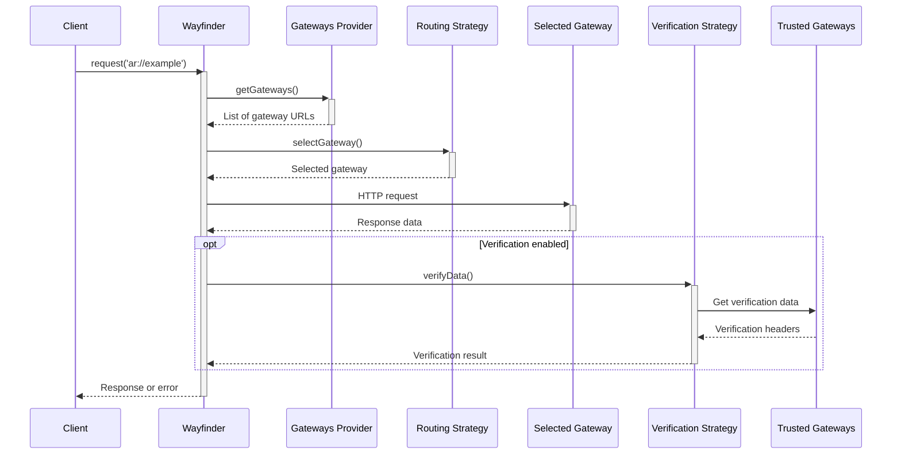

```mermaid
sequenceDiagram
    participant Client
    participant Wayfinder
    participant Gateways Provider
    participant Routing Strategy
    participant Selected Gateway
    participant Verification Strategy
    participant Trusted Gateways

    Client->>Wayfinder: request('ar://example')
    activate Wayfinder

    Wayfinder->>+Gateways Provider: getGateways()
    Gateways Provider-->>-Wayfinder: List of gateway URLs

    Wayfinder->>+Routing Strategy: selectGateway()
    Routing Strategy-->>-Wayfinder: Selected gateway

    Wayfinder->>+Selected Gateway: HTTP request
    Selected Gateway-->>-Wayfinder: Response data

    opt Verification enabled
        Wayfinder->>+Verification Strategy: verifyData()
        Verification Strategy->>Trusted Gateways: Get verification data
        Trusted Gateways-->>Verification Strategy: Verification headers
        Verification Strategy-->>-Wayfinder: Verification result
    end

    Wayfinder-->>Client: Response or error
    deactivate Wayfinder
```